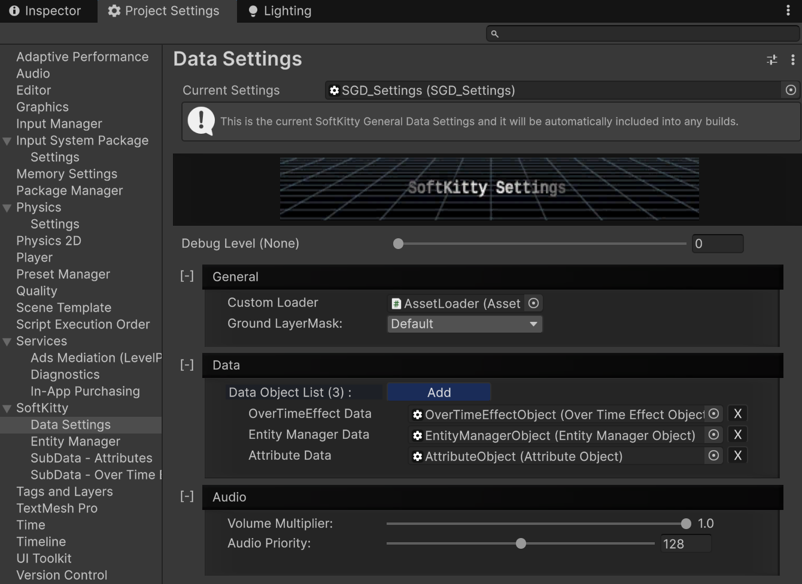
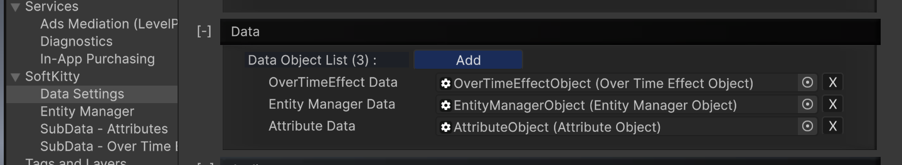

```csharp
class SoftKitty.SGD_Settings : ScriptableObject
```

This is the core data object of the system, handling system-wide configuration settings.

You can create this object via the context menu in any Project folder:
`Create → SoftKitty → Data Objects → General Settings Data`

You can access the settings interface in:
`Project Settings → SoftKitty`



---

### Properties

#### `public static SGD_Settings Instance`
> readonly

Returns the singleton instance assigned in ProjectSettings > SoftKitty > Data Settings. Access this to get global system setting.

---

#### `public static bool isRuntime` 
> readonly

Returns whether the system is currently in runtime mode (true or false). Useful for checking if the game is running or if you’re in the editor.

---

#### `public LayerMask GroundLayer`
The ground LayerMask in the General Settings, GroundLayer is used to identify ground, walls, roofs, and terrain in the project.

_Example_:
```csharp
LayerMask _mask = SGD_Settings.Instance.GroundLayer; //Get
SGD_Settings.Instance.GroundLayer = mMask; //Set
```

---

#### `public` [AssetLoader] `CustomLoader`
The custom AssetLoader in the General Settings, custom AssetLoader is used to load resources from Asset Bundles or Unity Addressables..

_Example_:
```csharp
AssetLoader _loader = SGD_Settings.Instance.CustomLoader; //Get
SGD_Settings.Instance.CustomLoader = mLoader; //Set
```

---

#### `public float VolumeMultiplier`
The global volume multiplier for sounds played by SoftKitty packages.(0F~1F)

_Example_:
```csharp
float _volumeMultiplier = SGD_Settings.Instance.VolumeMultiplier; //Get
SGD_Settings.Instance.VolumeMultiplier = 0.5F; //Set
```

---

#### `public int AudioPriority`
The audio priority for sounds played by SoftKitty packages. Lower values indicate higher priority.(0~256)

_Example_:
```csharp
int _audioPriority = SGD_Settings.Instance.AudioPriority; //Get
SGD_Settings.Instance.AudioPriority = 100; //Set
```

---

### Methods

#### `public T GetData<T>() where T` : [DataObject]

Retrieves [DataObject] like [EntityManagerObject], [AttributeObject], and [OverTimeEffectObject]. These objects are defined in :
`ProjectSettings > SoftKitty > Data Settings > Data`



_Example_:
```csharp
EntityManagerObject _entityManager = SGD_Settings.Instance.GetData<EntityManagerObject>();
AttributeObject _attributeSetting = SGD_Settings.Instance.GetData<AttributeObject>();
OverTimeEffectObject _overTimeEffectSetting = SGD_Settings.Instance.GetData<OverTimeEffectObject>();
```

---

#### `public void RefreshDatabase()`

Refresh the sub-data objects like EntityManager, Attributes, and OverTimeEffects. This is required if you manually assigned them via script to the database.

---


<!-- API LINKS -->
[Loot Pack]:/docs/master-inventory-engine/item-class/loot-pack
[Item Database Settings]:/docs/master-inventory-engine/settings
[ItemChangeCallback]:/docs/master-inventory-engine/callbacks
[ItemDropCallback]:/docs/master-inventory-engine/callbacks
[ItemUseCallback]:/docs/master-inventory-engine/callbacks
[Callbacks]:/docs/master-inventory-engine/callbacks
[LinkIcon]:/docs/master-inventory-engine/ui/item-icon
[InventoryItem]:/docs/master-inventory-engine/ui/item-icon
[ItemIcon]:/docs/master-inventory-engine/ui/item-icon
[WindowsManager]:/docs/master-inventory-engine/ui/windows-manager
[Enchantment]: /docs/master-inventory-engine/item-class/enchantment
[InventoryStack]: /docs/master-inventory-engine/item-class/inventory-stack
[InventoryData]: /docs/master-inventory-engine/item-class/item-data
[Item]: /docs/master-inventory-engine/item-class/item
[ItemObject]: /docs/master-inventory-engine/item-class/item-object
[Attribute]: /docs/core/attributes/Attribute
[AttributeData]: /docs/core/attributes/AttributeData
[AttributeObject]: /docs/core/attributes/AttributeObject
[TempAttribute]: /docs/core/attributes/TempAttribute
[Entity]: /docs/core/entities/Entity
[Entities]: /docs/core/entities/Entity
[EntityComponent]: /docs/core/entities/EntityComponent
[EntityManagerObject]: /docs/core/entities/EntityManagerObject
[OverTimeEffect]: /docs/core/over-time-effects/OverTimeEffect
[OverTimeEffectData]: /docs/core/over-time-effects/OverTimeEffectData
[OverTimeEffectObject]: /docs/core/over-time-effects/OverTimeEffectObject
[DataObject]: /docs/core/general/DataObject
[GameManager]: /docs/core/general/game-manager
[AssetLoader]: /docs/core/general/AssetLoader
[SGD_Settings]: /docs/core/general/SGD_Settings
[GraphInstance]: /docs/master-combat-core/damage-component/graphinstance
[Dynamic Variables]: /docs/master-combat-core/graph-system/dynamic-variables
[DynamicFloat]: /docs/master-combat-core/graph-system/dynamic-variables
[OverTimeEffectInstance]: /docs/master-combat-core/damage-component/over-time-effect-instance
[CombatDamage]: /docs/master-combat-core/damage-component/combat-damage
[GraphObject]: /docs/master-combat-core/graph-system/GraphObject
[CustomData]:/docs/core/CustomData
[AttributeChangeEvent]: /docs/core/attributes/AttributeData
[OverTimeEffectChangeEvent]:/docs/core/over-time-effects/OverTimeEffectData
[EntityEvent]:/docs/core/entities/Entity
[IntList]:/docs/core/CustomData
[IdIntList]:/docs/core/CustomData
[IdFloatList]:/docs/core/CustomData
[Action Node]:/docs/master-combat-core/nodes/action
[Branch Node]:/docs/master-combat-core/nodes/branch
[Condition Node]:/docs/master-combat-core/nodes/condition
[Condition Group Node]:/docs/master-combat-core/nodes/condition
[Entity Node]:/docs/master-combat-core/nodes/entity
[Trigger Node]:/docs/master-combat-core/nodes/trigger
[Variable Node]:/docs/master-combat-core/nodes/variable-math
[Math Node]:/docs/master-combat-core/nodes/variable-math
<!-- API LINKS -->