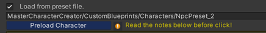

---

### INTEGRATING WITH OTHER CHARACTER CONTROLLERS

The characters in the Master Character Creator (MCC) system function like standard Unity humanoid characters, making integration straightforward. To use MCC characters with your custom character controller, follow these steps:

---

1. **Add Your Character Control Script**: Attach your character control script to the player prefab at the same `GameObject` level as the [CharacterEntity] component.
2. **Assign the Mecanim Controller**: In the [CharacterEntity] component, assign the appropriate `Mecanim` controller to both the male and female slots. This will allow the character to animate correctly based on your controller.
3. If the character control system you’re using requires reference of the character bone transform or `SkinnedMeshRenderer`, click on **`Preload Character`** button to load the character in the `Editor`,  then you can reference the bone and mesh `GameObjects` as needed.
   

---

By following these steps, you can seamlessly integrate MCC characters with other character control scripts or systems in your game.

---

<!-- API LINKS -->
[Accessories Models]: /docs/master-character-creator/implementing-your-models/accessories-models
[Customization Textures]: /docs/master-character-creator/implementing-your-models/customization-textures
[Outfits Models]: /docs/master-character-creator/implementing-your-models/outfits-models
[CharacterAppearance]: /docs/master-character-creator/system/appearance-data
[CharacterCustomizationModule]: /docs/master-character-creator/system/character-customization-module
[CharacterCustomizationObject]: /docs/master-character-creator/system/character-customization-object
[CharacterEntity]: /docs/master-character-creator/system/character-entity
[InventoryModule]: /docs/master-inventory-engine/inventory-module
[EntityModule]: /docs/core/entities/EntityModule
[Loot Pack]:/docs/master-inventory-engine/item-class/loot-pack
[Item Database Settings]:/docs/master-inventory-engine/settings
[ItemChangeCallback]:/docs/master-inventory-engine/callbacks
[ItemDropCallback]:/docs/master-inventory-engine/callbacks
[ItemUseCallback]:/docs/master-inventory-engine/callbacks
[Callbacks]:/docs/master-inventory-engine/callbacks
[LinkIcon]:/docs/master-inventory-engine/ui/item-icon
[InventoryItem]:/docs/master-inventory-engine/ui/item-icon
[ItemIcon]:/docs/master-inventory-engine/ui/item-icon
[WindowsManager]:/docs/master-inventory-engine/ui/windows-manager
[Enchantment]: /docs/master-inventory-engine/item-class/enchantment
[InventoryStack]: /docs/master-inventory-engine/item-class/inventory-stack
[InventoryData]: /docs/master-inventory-engine/item-class/item-data
[Item]: /docs/master-inventory-engine/item-class/item
[ItemObject]: /docs/master-inventory-engine/item-class/item-object
[Attribute]: /docs/core/attributes/Attribute
[AttributeData]: /docs/core/attributes/AttributeData
[AttributeObject]: /docs/core/attributes/AttributeObject
[TempAttribute]: /docs/core/attributes/TempAttribute
[Entity]: /docs/core/entities/Entity
[Entities]: /docs/core/entities/Entity
[EntityComponent]: /docs/core/entities/EntityComponent
[EntityManagerObject]: /docs/core/entities/EntityManagerObject
[OverTimeEffect]: /docs/core/over-time-effects/OverTimeEffect
[OverTimeEffectData]: /docs/core/over-time-effects/OverTimeEffectData
[OverTimeEffectObject]: /docs/core/over-time-effects/OverTimeEffectObject
[DataObject]: /docs/core/general/DataObject
[GameManager]: /docs/core/general/game-manager
[AssetLoader]: /docs/core/general/AssetLoader
[SGD_Settings]: /docs/core/general/SGD_Settings
[GraphInstance]: /docs/master-combat-core/damage-component/graphinstance
[Dynamic Variables]: /docs/master-combat-core/graph-system/dynamic-variables
[DynamicFloat]: /docs/master-combat-core/graph-system/dynamic-variables
[OverTimeEffectInstance]: /docs/master-combat-core/damage-component/over-time-effect-instance
[CombatDamage]: /docs/master-combat-core/damage-component/combat-damage
[GraphObject]: /docs/master-combat-core/graph-system/GraphObject
[CustomData]:/docs/core/CustomData
[AttributeChangeEvent]: /docs/core/attributes/AttributeData
[OverTimeEffectChangeEvent]:/docs/core/over-time-effects/OverTimeEffectData
[EntityEvent]:/docs/core/entities/Entity
[IntList]:/docs/core/CustomData
[IdIntList]:/docs/core/CustomData
[IdFloatList]:/docs/core/CustomData
[Action Node]:/docs/master-combat-core/nodes/action
[Branch Node]:/docs/master-combat-core/nodes/branch
[Condition Node]:/docs/master-combat-core/nodes/condition
[Condition Group Node]:/docs/master-combat-core/nodes/condition
[Entity Node]:/docs/master-combat-core/nodes/entity
[Trigger Node]:/docs/master-combat-core/nodes/trigger
[Variable Node]:/docs/master-combat-core/nodes/variable-math
[Math Node]:/docs/master-combat-core/nodes/variable-math
<!-- API LINKS -->