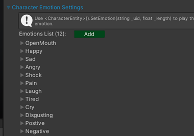
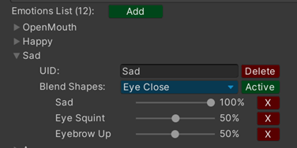

---

Master Character Creator allows you to create and customize unique character emotions, which can then be triggered in your game using their `unique identifier` (UID).

---

1. Locate the [Character Customization Settings] in :
`Project Settings/SoftKitty/SubData - Character Customization` 
and expand the `Character Emotion` Settings section.

   
2. Expand an emotion entry in the list. You will see a field labeled `UID`. This string is the unique key you'll use to play this specific emotion in your game.

   
3. To trigger an emotion in your scripts, call the function `<CharacterEntity>().SetEmotion(string _uid, float _length)`, replacing _uid with the `UID` of the desired emotion and `_length` with the `duration` (in seconds) you want the emotion to play.
4. The `blend shapes` dropdown allows you to activate multiple facial `blend shapes` on your character's head simultaneously. Use the percentage sliders next to each `blend shape` to control the intensity and create nuanced emotional expressions.

---

[Character Customization Settings]: /docs/master-character-creator/settings
<!-- API LINKS -->
[Accessories Models]: /docs/master-character-creator/implementing-your-models/accessories-models
[Customization Textures]: /docs/master-character-creator/implementing-your-models/customization-textures
[Outfits Models]: /docs/master-character-creator/implementing-your-models/outfits-models
[CharacterAppearance]: /docs/master-character-creator/system/appearance-data
[CharacterCustomizationModule]: /docs/master-character-creator/system/character-customization-module
[CharacterCustomizationObject]: /docs/master-character-creator/system/character-customization-object
[CharacterEntity]: /docs/master-character-creator/system/character-entity
[InventoryModule]: /docs/master-inventory-engine/inventory-module
[EntityModule]: /docs/core/entities/EntityModule
[Loot Pack]:/docs/master-inventory-engine/item-class/loot-pack
[Item Database Settings]:/docs/master-inventory-engine/settings
[ItemChangeCallback]:/docs/master-inventory-engine/callbacks
[ItemDropCallback]:/docs/master-inventory-engine/callbacks
[ItemUseCallback]:/docs/master-inventory-engine/callbacks
[Callbacks]:/docs/master-inventory-engine/callbacks
[LinkIcon]:/docs/master-inventory-engine/ui/item-icon
[InventoryItem]:/docs/master-inventory-engine/ui/item-icon
[ItemIcon]:/docs/master-inventory-engine/ui/item-icon
[WindowsManager]:/docs/master-inventory-engine/ui/windows-manager
[Enchantment]: /docs/master-inventory-engine/item-class/enchantment
[InventoryStack]: /docs/master-inventory-engine/item-class/inventory-stack
[InventoryData]: /docs/master-inventory-engine/item-class/item-data
[Item]: /docs/master-inventory-engine/item-class/item
[ItemObject]: /docs/master-inventory-engine/item-class/item-object
[Attribute]: /docs/core/attributes/Attribute
[AttributeData]: /docs/core/attributes/AttributeData
[AttributeObject]: /docs/core/attributes/AttributeObject
[TempAttribute]: /docs/core/attributes/TempAttribute
[Entity]: /docs/core/entities/Entity
[Entities]: /docs/core/entities/Entity
[EntityComponent]: /docs/core/entities/EntityComponent
[EntityManagerObject]: /docs/core/entities/EntityManagerObject
[OverTimeEffect]: /docs/core/over-time-effects/OverTimeEffect
[OverTimeEffectData]: /docs/core/over-time-effects/OverTimeEffectData
[OverTimeEffectObject]: /docs/core/over-time-effects/OverTimeEffectObject
[DataObject]: /docs/core/general/DataObject
[GameManager]: /docs/core/general/game-manager
[AssetLoader]: /docs/core/general/AssetLoader
[SGD_Settings]: /docs/core/general/SGD_Settings
[GraphInstance]: /docs/master-combat-core/damage-component/graphinstance
[Dynamic Variables]: /docs/master-combat-core/graph-system/dynamic-variables
[DynamicFloat]: /docs/master-combat-core/graph-system/dynamic-variables
[OverTimeEffectInstance]: /docs/master-combat-core/damage-component/over-time-effect-instance
[CombatDamage]: /docs/master-combat-core/damage-component/combat-damage
[GraphObject]: /docs/master-combat-core/graph-system/GraphObject
[CustomData]:/docs/core/CustomData
[AttributeChangeEvent]: /docs/core/attributes/AttributeData
[OverTimeEffectChangeEvent]:/docs/core/over-time-effects/OverTimeEffectData
[EntityEvent]:/docs/core/entities/Entity
[IntList]:/docs/core/CustomData
[IdIntList]:/docs/core/CustomData
[IdFloatList]:/docs/core/CustomData
[Action Node]:/docs/master-combat-core/nodes/action
[Branch Node]:/docs/master-combat-core/nodes/branch
[Condition Node]:/docs/master-combat-core/nodes/condition
[Condition Group Node]:/docs/master-combat-core/nodes/condition
[Entity Node]:/docs/master-combat-core/nodes/entity
[Trigger Node]:/docs/master-combat-core/nodes/trigger
[Variable Node]:/docs/master-combat-core/nodes/variable-math
[Math Node]:/docs/master-combat-core/nodes/variable-math
<!-- API LINKS -->