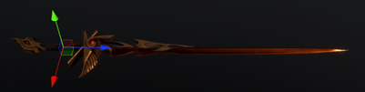
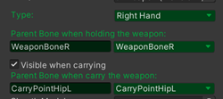
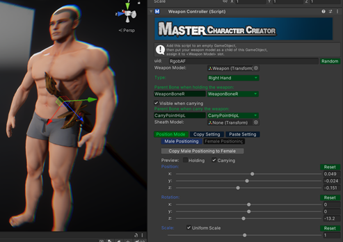
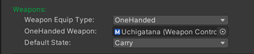
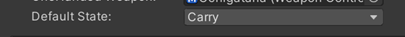

---

MCC provides user-friendly tools and APIs to manage weapons efficiently. Follow the steps below to integrate your weapon models:

---

#### Set Up the Weapon GameObject

Create an empty GameObject and add the `WeaponController` component to it.
Drag your weapon model as a child of this `GameObject` and adjust its position so the weapon's handle aligns with the pivot of the empty `GameObject`.
Ensure the tip of the weapon points along the Z-axis of the empty `GameObject`.



---

#### Weapon Settings in `WeaponController`

- **Select Weapon Type**: 
Specify how the weapon is held by selecting one of the options: 
  - `LeftHand`
  - `RightHand`
  - `TwoHanded`
  - `Custom#`
If the weapon is not designed to held by hands, for example, a cross bow equipped on the forearm, you can select the `Custom#` type. 

- **Set Root Bone for Holding**:
Assign the bone used for **holding** the weapon. MCC provides:
  - special bones
  - WeaponBoneL
  - WeaponBoneR
Which align with the center of the character’s hand.
Alternatively, you can assign any other bone by entering its name.

- **Set Root Bone for Carrying**:
Assign the bone used for **carrying** the weapon. MCC provides pre-defined bones like `CarryPointXXX`, which are correctly positioned based on the character's body shape. These carry points are **soft-connected**, meaning they dynamically swing with the character’s movement.
You can also assign any custom bone by entering its name.

   

---

#### Positioning the Weapon

Click the **`Position Mode`** button in the **`WeaponController`** inspector to preview how the weapon looks with the character.

Adjust the weapon's position, rotation, and scale as needed.

You can switch between Male and Female characters and set separate positioning for each. 
_For example_, you can scale the weapon down for female characters only.

Toggle between **`Holding`** and **`Carrying`** states to ensure both are correctly positioned.




---

#### Copying Settings:
Use the **`Copy XXX Positioning to XXX`** button to copy the current positioning (`Holding` or `Carrying`) between Male and Female characters.

Click **`Copy Setting`** to save the current settings to the clipboard. This allows you to paste the settings to similar weapons by clicking **`Paste Setting`** in another weapon’s `WeaponController`.

---

#### Saving the Weapon:

Name your weapon GameObject and save it as a prefab.

---

#### Equipping Weapons to Characters

**Option 1**: Drag the weapon prefab into the **`Weapons`** slots in the **[CharacterEntity]** component.


**Option 2**: Equip weapons programmatically using the provided API calls. Refer to the [CharacterEntity] API section for details.

_Example Code_:

```csharp
public CharacterEntity Player;

public void SwitchWeapon(int _id)
{
    if (!Player.isEquippedWeapon(Weapons[_id].uid)) //Check if the character is already equipped this weapon.
    {
        Player.EquipWeapon(Weapons[_id], Player.GetWeaponState()); //If not, equip it.
        SoundManager.Play2D("EquipOn");
    }
    else
    {
        Player.UnequipWeapon(Weapons[_id].Type); //If it's already equipped, then unequip it.
        SoundManager.Play2D("EquipOff");
    }
}

```

---

#### Switching Weapon States:

Weapons can transition between three states: `Hold`, `Carry`, and `Hide`.



You can set the state directly in the [CharacterEntity] inspector or change it via API calls. Refer to the [CharacterEntity] API section for details.

_Example Code_:

```csharp
public CharacterEntity Player;

public void SwitchWeaponState(int _state)
{
    Player.SwitchWeaponState((WeaponState)_state);//Switch the state of the equipped weapons
}

```

---

<!-- API LINKS -->
[Accessories Models]: /docs/master-character-creator/implementing-your-models/accessories-models
[Customization Textures]: /docs/master-character-creator/implementing-your-models/customization-textures
[Outfits Models]: /docs/master-character-creator/implementing-your-models/outfits-models
[CharacterAppearance]: /docs/master-character-creator/system/appearance-data
[CharacterCustomizationModule]: /docs/master-character-creator/system/character-customization-module
[CharacterCustomizationObject]: /docs/master-character-creator/system/character-customization-object
[CharacterEntity]: /docs/master-character-creator/system/character-entity
[InventoryModule]: /docs/master-inventory-engine/inventory-module
[EntityModule]: /docs/core/entities/EntityModule
[Loot Pack]:/docs/master-inventory-engine/item-class/loot-pack
[Item Database Settings]:/docs/master-inventory-engine/settings
[ItemChangeCallback]:/docs/master-inventory-engine/callbacks
[ItemDropCallback]:/docs/master-inventory-engine/callbacks
[ItemUseCallback]:/docs/master-inventory-engine/callbacks
[Callbacks]:/docs/master-inventory-engine/callbacks
[LinkIcon]:/docs/master-inventory-engine/ui/item-icon
[InventoryItem]:/docs/master-inventory-engine/ui/item-icon
[ItemIcon]:/docs/master-inventory-engine/ui/item-icon
[WindowsManager]:/docs/master-inventory-engine/ui/windows-manager
[Enchantment]: /docs/master-inventory-engine/item-class/enchantment
[InventoryStack]: /docs/master-inventory-engine/item-class/inventory-stack
[InventoryData]: /docs/master-inventory-engine/item-class/item-data
[Item]: /docs/master-inventory-engine/item-class/item
[ItemObject]: /docs/master-inventory-engine/item-class/item-object
[Attribute]: /docs/core/attributes/Attribute
[AttributeData]: /docs/core/attributes/AttributeData
[AttributeObject]: /docs/core/attributes/AttributeObject
[TempAttribute]: /docs/core/attributes/TempAttribute
[Entity]: /docs/core/entities/Entity
[Entities]: /docs/core/entities/Entity
[EntityComponent]: /docs/core/entities/EntityComponent
[EntityManagerObject]: /docs/core/entities/EntityManagerObject
[OverTimeEffect]: /docs/core/over-time-effects/OverTimeEffect
[OverTimeEffectData]: /docs/core/over-time-effects/OverTimeEffectData
[OverTimeEffectObject]: /docs/core/over-time-effects/OverTimeEffectObject
[DataObject]: /docs/core/general/DataObject
[GameManager]: /docs/core/general/game-manager
[AssetLoader]: /docs/core/general/AssetLoader
[SGD_Settings]: /docs/core/general/SGD_Settings
[GraphInstance]: /docs/master-combat-core/damage-component/graphinstance
[Dynamic Variables]: /docs/master-combat-core/graph-system/dynamic-variables
[DynamicFloat]: /docs/master-combat-core/graph-system/dynamic-variables
[OverTimeEffectInstance]: /docs/master-combat-core/damage-component/over-time-effect-instance
[CombatDamage]: /docs/master-combat-core/damage-component/combat-damage
[GraphObject]: /docs/master-combat-core/graph-system/GraphObject
[CustomData]:/docs/core/CustomData
[AttributeChangeEvent]: /docs/core/attributes/AttributeData
[OverTimeEffectChangeEvent]:/docs/core/over-time-effects/OverTimeEffectData
[EntityEvent]:/docs/core/entities/Entity
[IntList]:/docs/core/CustomData
[IdIntList]:/docs/core/CustomData
[IdFloatList]:/docs/core/CustomData
[Action Node]:/docs/master-combat-core/nodes/action
[Branch Node]:/docs/master-combat-core/nodes/branch
[Condition Node]:/docs/master-combat-core/nodes/condition
[Condition Group Node]:/docs/master-combat-core/nodes/condition
[Entity Node]:/docs/master-combat-core/nodes/entity
[Trigger Node]:/docs/master-combat-core/nodes/trigger
[Variable Node]:/docs/master-combat-core/nodes/variable-math
[Math Node]:/docs/master-combat-core/nodes/variable-math
<!-- API LINKS -->