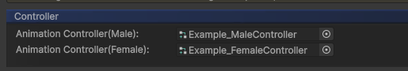
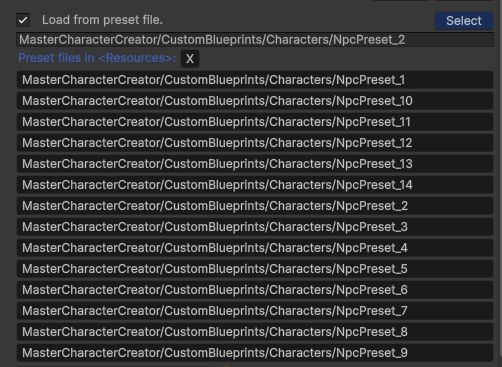
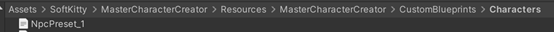

---

#### Create Prefab

- Duplicate the NPC and Player prefab located in: `Assets/SoftKitty/MasterCharacterCreator/Prefabs/` for your player and NPC.
- You can build your own demo or download the pre-made demo using the link below. This allows for a quicker and more streamlined way to create and save appearance files for your player and NPC characters:
[Download Demo (google drive)](https://drive.google.com/file/d/14VotGV2vhYFKdnn-ZXAav_JfiDxDadHv/view?usp=drive_link)
- It is recommnended to use `MCC` with SoftKitty shared system [EntityManagerObject], the [Entity] of [EntityManagerObject] will manage character customization data along with [Attribute]s, tags, [CustomData] and [OverTimeEffect]. To enable this, simply add [EntityComponent] to the character prefab, and select a `UID` from the [EntityManagerObject] database.

---

#### CREATE INITIAL APPEARANCE

- **Pre-designed appearance**: 
Use the `Demo` scene to design your player's initial appearance. Save this data in either the Resources folder or a designated folder within your game’s installation directory (where player save files are stored). Then use the load methods in #5 below to load this appearance data to the player character.
- **Default appearance**: 
   You can leave the player as default appearance , to do that, use the following code to Initialize your player to the default appearance:

```csharp
   GetComponent<CharacterEntity>().Initialize (Sex _sex)
```

   Let player create their character: 
   If you want to begin with character creation interface to let player to create their character before playing, simply call:

```csharp
   GetComponent<CharacterEntity>(). CreateCharacter ()
```

---

#### ADD PLAYER CONTROL SCRIPT

Attach your custom player control script to the root GameObject of the prefab.
View the [Character Controllers] section for more details.

---

#### ASSIGN MECANIM CONTROLLERS

In the [CharacterEntity] component, assign a Mecanim controller to both the Male and Female slots to handle animations.



---

#### UNCHECK 'LOAD FROM PRESET FILE'

In the [CharacterEntity] component, uncheck the `Load from preset file` option to allow loading from save files.



_For example_:
`MasterCharacterCreator/CustomBlueprints/Characters/NpcPreset_1`



---

#### LOAD APPEARANCE IN SCRIPT

skip this if you're using [EntityManagerObject]

In your player control script, use the following code to load the player’s appearance from the `Resources` folder:

```csharp
GetComponent<CharacterEntity>().LoadFromResourceFile()
```

Alternatively, use `LoadFromByteFileFromDisk` or `LoadFromPngFileFromDisk` to load appearance data from a custom save location within your game’s installation path. For example: `Application.dataPath+"/../GameSave/PlayerAppearance.bytes"`

If you want to loads the appearance data with your own save system, you can get the bytes array of player’s appearance data with:

```csharp
GetComponent<CharacterEntity>(). LoadFromBytes(byte[] _bytes)
```

---

#### SAVE APPEARANCE IN SCRIPT

Skip this if you're using [EntityManagerObject]

In your player control script, use:

```csharp
GetComponent<CharacterEntity>().SaveByteFileToDisk () 
```

or use the following code to save the player’s appearance to custom save location within your game’s installation path. For example: `Application.dataPath+"/../GameSave/PlayerAppearance.bytes"`

```csharp
GetComponent<CharacterEntity>(). SavePngFileToDisk()
```

If you want to save the appearance data with your own save system, you can get the bytes array of player’s appearance data with:

```csharp
GetComponent<CharacterEntity>(). GetSaveBytes()
```


---

[Character Controllers]: /docs/master-character-creator/common-use-cases/character-controllers

<!-- API LINKS -->
[Accessories Models]: /docs/master-character-creator/implementing-your-models/accessories-models
[Customization Textures]: /docs/master-character-creator/implementing-your-models/customization-textures
[Outfits Models]: /docs/master-character-creator/implementing-your-models/outfits-models
[CharacterAppearance]: /docs/master-character-creator/system/appearance-data
[CharacterCustomizationModule]: /docs/master-character-creator/system/character-customization-module
[CharacterCustomizationObject]: /docs/master-character-creator/system/character-customization-object
[CharacterEntity]: /docs/master-character-creator/system/character-entity
[InventoryModule]: /docs/master-inventory-engine/inventory-module
[EntityModule]: /docs/core/entities/EntityModule
[Loot Pack]:/docs/master-inventory-engine/item-class/loot-pack
[Item Database Settings]:/docs/master-inventory-engine/settings
[ItemChangeCallback]:/docs/master-inventory-engine/callbacks
[ItemDropCallback]:/docs/master-inventory-engine/callbacks
[ItemUseCallback]:/docs/master-inventory-engine/callbacks
[Callbacks]:/docs/master-inventory-engine/callbacks
[LinkIcon]:/docs/master-inventory-engine/ui/item-icon
[InventoryItem]:/docs/master-inventory-engine/ui/item-icon
[ItemIcon]:/docs/master-inventory-engine/ui/item-icon
[WindowsManager]:/docs/master-inventory-engine/ui/windows-manager
[Enchantment]: /docs/master-inventory-engine/item-class/enchantment
[InventoryStack]: /docs/master-inventory-engine/item-class/inventory-stack
[InventoryData]: /docs/master-inventory-engine/item-class/item-data
[Item]: /docs/master-inventory-engine/item-class/item
[ItemObject]: /docs/master-inventory-engine/item-class/item-object
[Attribute]: /docs/core/attributes/Attribute
[AttributeData]: /docs/core/attributes/AttributeData
[AttributeObject]: /docs/core/attributes/AttributeObject
[TempAttribute]: /docs/core/attributes/TempAttribute
[Entity]: /docs/core/entities/Entity
[Entities]: /docs/core/entities/Entity
[EntityComponent]: /docs/core/entities/EntityComponent
[EntityManagerObject]: /docs/core/entities/EntityManagerObject
[OverTimeEffect]: /docs/core/over-time-effects/OverTimeEffect
[OverTimeEffectData]: /docs/core/over-time-effects/OverTimeEffectData
[OverTimeEffectObject]: /docs/core/over-time-effects/OverTimeEffectObject
[DataObject]: /docs/core/general/DataObject
[GameManager]: /docs/core/general/game-manager
[AssetLoader]: /docs/core/general/AssetLoader
[SGD_Settings]: /docs/core/general/SGD_Settings
[GraphInstance]: /docs/master-combat-core/damage-component/graphinstance
[Dynamic Variables]: /docs/master-combat-core/graph-system/dynamic-variables
[DynamicFloat]: /docs/master-combat-core/graph-system/dynamic-variables
[OverTimeEffectInstance]: /docs/master-combat-core/damage-component/over-time-effect-instance
[CombatDamage]: /docs/master-combat-core/damage-component/combat-damage
[GraphObject]: /docs/master-combat-core/graph-system/GraphObject
[CustomData]:/docs/core/CustomData
[AttributeChangeEvent]: /docs/core/attributes/AttributeData
[OverTimeEffectChangeEvent]:/docs/core/over-time-effects/OverTimeEffectData
[EntityEvent]:/docs/core/entities/Entity
[IntList]:/docs/core/CustomData
[IdIntList]:/docs/core/CustomData
[IdFloatList]:/docs/core/CustomData
[Action Node]:/docs/master-combat-core/nodes/action
[Branch Node]:/docs/master-combat-core/nodes/branch
[Condition Node]:/docs/master-combat-core/nodes/condition
[Condition Group Node]:/docs/master-combat-core/nodes/condition
[Entity Node]:/docs/master-combat-core/nodes/entity
[Trigger Node]:/docs/master-combat-core/nodes/trigger
[Variable Node]:/docs/master-combat-core/nodes/variable-math
[Math Node]:/docs/master-combat-core/nodes/variable-math
<!-- API LINKS -->