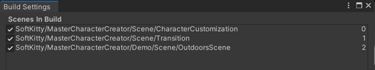
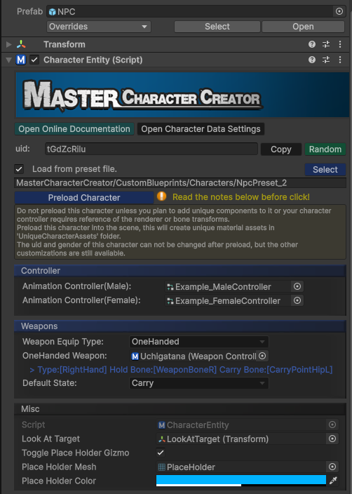
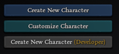
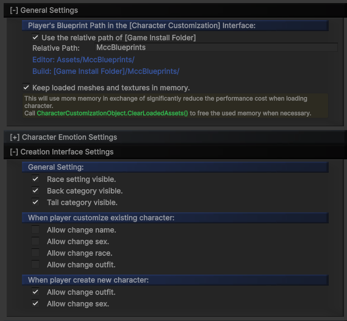
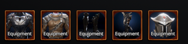
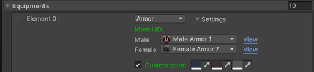

1. First of all, Navigate to **`Project Settings/SoftKitty/Data Settings`** and setup the following databse:
   - [CharacterCustomizationObject], refer to the [Character Customization Settings]
   - [AttributeObject]
   - [EntityManagerObject] 

---
2. Before we get started, please take a look at the demo scene located at :
`SoftKitty/MasterCharacterCreator/Demo/Scene/OutdoorsScene.unity`
To run the demo, make sure to add the following scene to your build settings:

   

---

3. In the demo scene, locate the game object called **NPC**. It contains a [CharacterEntity] component, which you'll add to every NPC and the Player in your game. You can also have your character control script inherit from this component. 

   

---

4. Run the demo scene, and you will notice three buttons on the top left:

   

   - **Create New Character**
     This calls **[CharacterEntity]().CreateCharacter()**, which switches to the character creation interface. When a player creates a new character, you can call this function with the character entity you want to create the appearance for.
   - **Customize Character**
     This calls **[CharacterEntity]().CustomizeCharacter()**, switching to the character customization interface. When a player wants to customize a character, you can call this function with the character entity you want to customize.
   - **Create New Character (Developer)**
     This calls **[CharacterEntity]().CreateCharacterByDeveloper()**, which switches to the character creation interface with all outfits unlocked. This is a useful tool for creating NPCs or character presets.

---

5. To modify the settings of the interfaces mentioned above, locate the [Character Customization Settings] in  `Project Settings/SoftKitty/SubData - Character Customization`.
  
   

   Please note, when a player uses the **save/load** function in the **character customization UI**, the data is saved as a `PNG` image of the character's photo, with the appearance data hidden within the `PNG` file. This file can only be stored in the path defined by the **`Player Blueprint Path`** setting. However, when in the **`CreateCharacterByDeveloper`** mode, the appearance data will be saved as a `byte` file instead of a `PNG`.

---

6. On the bottom left of the screen, you'll see some test buttons that demonstrate how equipment in your game can be linked to character appearance.

   

   Open the `DemoScript.cs` script, and you'll notice it binds the equipment using a class called `EquipmentAppearance`. You can easily add this class to your equipment item data. When a player equips an item, simply call **[CharacterEntity]().Equip()** with the `EquipmentAppearance` data for that item, and the character's appearance will update accordingly.

   

---

7. With the knowledge from the previous steps, you can already use this system to create NPCs and allow players to customize their own characters. If you want to add more models and textures into the system, please refer to the following documentation:

   - [Accessories Models]
   - [Customization Textures]
   - [Outfits Models]

   For more advanced usage of the system, continue reading the following sections of this document.

---

[Character Customization Settings]: /docs/master-character-creator/settings
<!-- API LINKS -->
[Accessories Models]: /docs/master-character-creator/implementing-your-models/accessories-models
[Customization Textures]: /docs/master-character-creator/implementing-your-models/customization-textures
[Outfits Models]: /docs/master-character-creator/implementing-your-models/outfits-models
[CharacterAppearance]: /docs/master-character-creator/system/appearance-data
[CharacterCustomizationModule]: /docs/master-character-creator/system/character-customization-module
[CharacterCustomizationObject]: /docs/master-character-creator/system/character-customization-object
[CharacterEntity]: /docs/master-character-creator/system/character-entity
[InventoryModule]: /docs/master-inventory-engine/inventory-module
[EntityModule]: /docs/core/entities/EntityModule
[Loot Pack]:/docs/master-inventory-engine/item-class/loot-pack
[Item Database Settings]:/docs/master-inventory-engine/settings
[ItemChangeCallback]:/docs/master-inventory-engine/callbacks
[ItemDropCallback]:/docs/master-inventory-engine/callbacks
[ItemUseCallback]:/docs/master-inventory-engine/callbacks
[Callbacks]:/docs/master-inventory-engine/callbacks
[LinkIcon]:/docs/master-inventory-engine/ui/item-icon
[InventoryItem]:/docs/master-inventory-engine/ui/item-icon
[ItemIcon]:/docs/master-inventory-engine/ui/item-icon
[WindowsManager]:/docs/master-inventory-engine/ui/windows-manager
[Enchantment]: /docs/master-inventory-engine/item-class/enchantment
[InventoryStack]: /docs/master-inventory-engine/item-class/inventory-stack
[InventoryData]: /docs/master-inventory-engine/item-class/item-data
[Item]: /docs/master-inventory-engine/item-class/item
[ItemObject]: /docs/master-inventory-engine/item-class/item-object
[Attribute]: /docs/core/attributes/Attribute
[AttributeData]: /docs/core/attributes/AttributeData
[AttributeObject]: /docs/core/attributes/AttributeObject
[TempAttribute]: /docs/core/attributes/TempAttribute
[Entity]: /docs/core/entities/Entity
[Entities]: /docs/core/entities/Entity
[EntityComponent]: /docs/core/entities/EntityComponent
[EntityManagerObject]: /docs/core/entities/EntityManagerObject
[OverTimeEffect]: /docs/core/over-time-effects/OverTimeEffect
[OverTimeEffectData]: /docs/core/over-time-effects/OverTimeEffectData
[OverTimeEffectObject]: /docs/core/over-time-effects/OverTimeEffectObject
[DataObject]: /docs/core/general/DataObject
[GameManager]: /docs/core/general/game-manager
[AssetLoader]: /docs/core/general/AssetLoader
[SGD_Settings]: /docs/core/general/SGD_Settings
[GraphInstance]: /docs/master-combat-core/damage-component/graphinstance
[Dynamic Variables]: /docs/master-combat-core/graph-system/dynamic-variables
[DynamicFloat]: /docs/master-combat-core/graph-system/dynamic-variables
[OverTimeEffectInstance]: /docs/master-combat-core/damage-component/over-time-effect-instance
[CombatDamage]: /docs/master-combat-core/damage-component/combat-damage
[GraphObject]: /docs/master-combat-core/graph-system/GraphObject
[CustomData]:/docs/core/CustomData
[AttributeChangeEvent]: /docs/core/attributes/AttributeData
[OverTimeEffectChangeEvent]:/docs/core/over-time-effects/OverTimeEffectData
[EntityEvent]:/docs/core/entities/Entity
[IntList]:/docs/core/CustomData
[IdIntList]:/docs/core/CustomData
[IdFloatList]:/docs/core/CustomData
[Action Node]:/docs/master-combat-core/nodes/action
[Branch Node]:/docs/master-combat-core/nodes/branch
[Condition Node]:/docs/master-combat-core/nodes/condition
[Condition Group Node]:/docs/master-combat-core/nodes/condition
[Entity Node]:/docs/master-combat-core/nodes/entity
[Trigger Node]:/docs/master-combat-core/nodes/trigger
[Variable Node]:/docs/master-combat-core/nodes/variable-math
[Math Node]:/docs/master-combat-core/nodes/variable-math
<!-- API LINKS -->