Head Accessories can include beards, horns, and hairstyles. To create a new customization item, you will need basic skills in 3D modeling software and a good understanding of 3D model rigging.

---

1. Open the **`MaleNude.max`** or **`FemaleNude.max`** file located in the `SoftKitty/MasterCharacterCreator/ArtSource/3dsMax` folder. Import your new model into `3ds Max` and apply skinning using the biped bones from the file. Please ensure that you only add the necessary bones to the bone list in the Skin Modifier.

   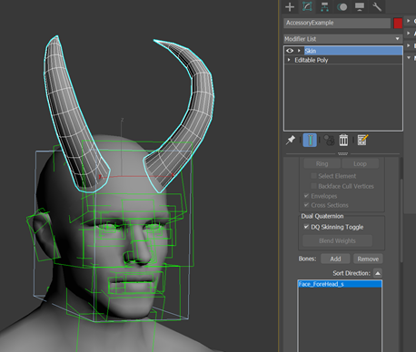

---

2. After completing the skinning, export the mesh along with the entire rig to an `FBX` file in your project folder. In the export panel, ensure that the **Animation** category and the following settings are **checked**.

   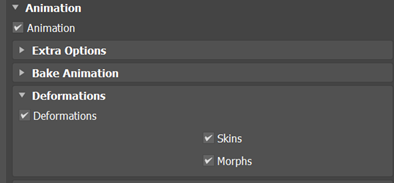

---

3. Create a new **material** for your model, then change the **shader** to **`SoftKitty/CharacterSkin`**. Import your textures and configure the material settings accordingly.

   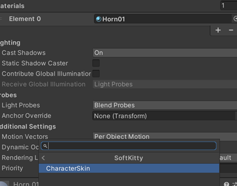

---

4. Drag the `FBX` file into the Hierarchy, assign the material to the `Skinned Mesh Renderer`, and set the root GameObject’s **tag** to **`Skinned`**. Then, drag the GameObject back to the Project Panel to create a prefab.

   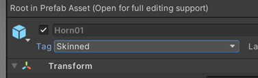

   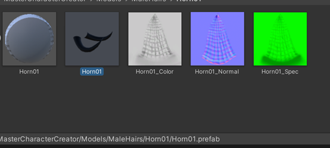

---

5. Create a **thumbnail** for the new item using the **`Icon_template.psd`** file.

   

   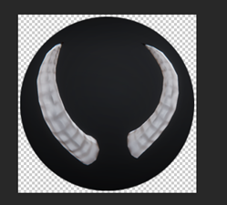

---

6. Navigate to `Project/SoftKitty/SubData - Character Customization`, expand the **`Add new body customizations`** section in the Inspector, and assign both the **prefab** and the **thumbnail texture** to their respective slots. Set the Type to `Hair` if the item belongs in the Hair category of the character creator interface, or set it to `Beard` for the Beard category. Ensure the **correct `Gender`** of the character is selected, then click the **`Add`** button to proceed.

   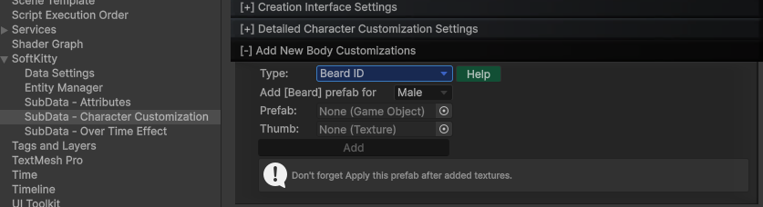

   This system also support Accessory with `SkinnedMeshRenderer`:
   Add **`Skinned`** tag to the prefab GameObject.

   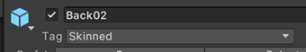

   Make sure the root bone of this Accessory has same name as one of the character bones, for example `Bip001 Spine2`.

   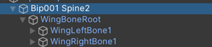

   If you want to add an independent `Animation` component to this Accessory, put it on the first child transform under the root bone, in this example, it will be `WingBoneRoot` under `Bip001 Spine2`

   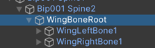

   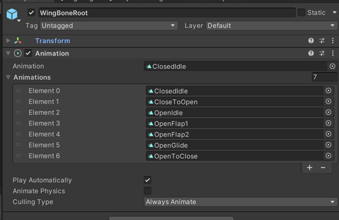

   With this setup, the Accessory will be load on the character while keeping its own `Animation` component.

---

7. It's done! Your new item should now appear in the character creator.
Don't forget to repeat the same process for the other gender's character model if you want this item to be available for both male and female characters.

---
<!-- API LINKS -->
[Accessories Models]: /docs/master-character-creator/implementing-your-models/accessories-models
[Customization Textures]: /docs/master-character-creator/implementing-your-models/customization-textures
[Outfits Models]: /docs/master-character-creator/implementing-your-models/outfits-models
[CharacterAppearance]: /docs/master-character-creator/system/appearance-data
[CharacterCustomizationModule]: /docs/master-character-creator/system/character-customization-module
[CharacterCustomizationObject]: /docs/master-character-creator/system/character-customization-object
[CharacterEntity]: /docs/master-character-creator/system/character-entity
[InventoryModule]: /docs/master-inventory-engine/inventory-module
[EntityModule]: /docs/core/entities/EntityModule
[Loot Pack]:/docs/master-inventory-engine/item-class/loot-pack
[Item Database Settings]:/docs/master-inventory-engine/settings
[ItemChangeCallback]:/docs/master-inventory-engine/callbacks
[ItemDropCallback]:/docs/master-inventory-engine/callbacks
[ItemUseCallback]:/docs/master-inventory-engine/callbacks
[Callbacks]:/docs/master-inventory-engine/callbacks
[LinkIcon]:/docs/master-inventory-engine/ui/item-icon
[InventoryItem]:/docs/master-inventory-engine/ui/item-icon
[ItemIcon]:/docs/master-inventory-engine/ui/item-icon
[WindowsManager]:/docs/master-inventory-engine/ui/windows-manager
[Enchantment]: /docs/master-inventory-engine/item-class/enchantment
[InventoryStack]: /docs/master-inventory-engine/item-class/inventory-stack
[InventoryData]: /docs/master-inventory-engine/item-class/item-data
[Item]: /docs/master-inventory-engine/item-class/item
[ItemObject]: /docs/master-inventory-engine/item-class/item-object
[Attribute]: /docs/core/attributes/Attribute
[AttributeData]: /docs/core/attributes/AttributeData
[AttributeObject]: /docs/core/attributes/AttributeObject
[TempAttribute]: /docs/core/attributes/TempAttribute
[Entity]: /docs/core/entities/Entity
[Entities]: /docs/core/entities/Entity
[EntityComponent]: /docs/core/entities/EntityComponent
[EntityManagerObject]: /docs/core/entities/EntityManagerObject
[OverTimeEffect]: /docs/core/over-time-effects/OverTimeEffect
[OverTimeEffectData]: /docs/core/over-time-effects/OverTimeEffectData
[OverTimeEffectObject]: /docs/core/over-time-effects/OverTimeEffectObject
[DataObject]: /docs/core/general/DataObject
[GameManager]: /docs/core/general/game-manager
[AssetLoader]: /docs/core/general/AssetLoader
[SGD_Settings]: /docs/core/general/SGD_Settings
[GraphInstance]: /docs/master-combat-core/damage-component/graphinstance
[Dynamic Variables]: /docs/master-combat-core/graph-system/dynamic-variables
[DynamicFloat]: /docs/master-combat-core/graph-system/dynamic-variables
[OverTimeEffectInstance]: /docs/master-combat-core/damage-component/over-time-effect-instance
[CombatDamage]: /docs/master-combat-core/damage-component/combat-damage
[GraphObject]: /docs/master-combat-core/graph-system/GraphObject
[CustomData]:/docs/core/CustomData
[AttributeChangeEvent]: /docs/core/attributes/AttributeData
[OverTimeEffectChangeEvent]:/docs/core/over-time-effects/OverTimeEffectData
[EntityEvent]:/docs/core/entities/Entity
[IntList]:/docs/core/CustomData
[IdIntList]:/docs/core/CustomData
[IdFloatList]:/docs/core/CustomData
[Action Node]:/docs/master-combat-core/nodes/action
[Branch Node]:/docs/master-combat-core/nodes/branch
[Condition Node]:/docs/master-combat-core/nodes/condition
[Condition Group Node]:/docs/master-combat-core/nodes/condition
[Entity Node]:/docs/master-combat-core/nodes/entity
[Trigger Node]:/docs/master-combat-core/nodes/trigger
[Variable Node]:/docs/master-combat-core/nodes/variable-math
[Math Node]:/docs/master-combat-core/nodes/variable-math
<!-- API LINKS -->