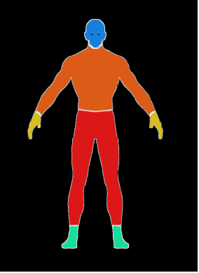
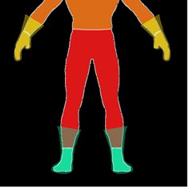
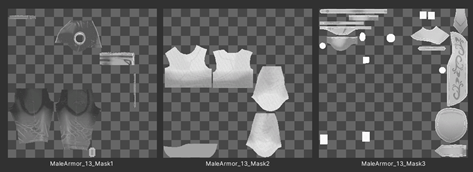
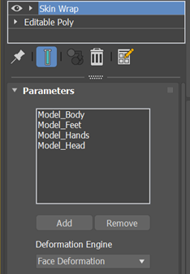
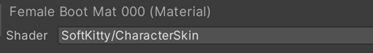
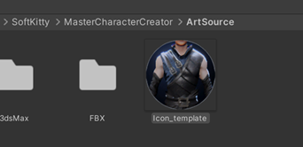
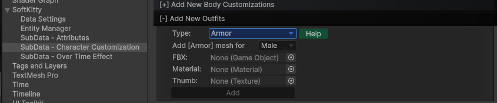

Outfits are divided into 5 slots: `HELMET`, `ARMOR`, `GAUNTLET`, `PANTS` and `BOOT`. To optimize performance and enhance user experience, MCC loads **mesh** data and **materials** directly from disk rather than loading prefabs when switching outfits. The **skin information** is applied using data stored in the [CharacterCustomizationObject].

Although this system might seem complex to set up, we’ve provided a dedicated tool that allows you to configure your created outfits with just a few clicks. 

To create a new customization item, you will need basic skills in 3D modeling software and a good understanding of 3D model rigging.

---

1. Open the **`MaleNude.max`** or **`FemaleNude.max`** file located in the `SoftKitty/MasterCharacterCreator/ArtSource/3dsMax` folder. You’ll notice the nude model is divided into 5 pieces corresponding to the outfit slots: `Helmet`, `Armor`, `Gauntlet`, `Pants`, and `Boot`. When creating your own model, ensure it replaces the nude model and **seamlessly connects with the other parts**. If your design leaves some bare skin exposed, such as half-finger gloves, you can directly cut those parts from the nude model and attach them to your design. Make sure the UV layout of the bare skin parts remains unchanged.

   

   The connecting parts of the outfit can either be **perfectly aligned to the nude model** or **slightly overlap**, as shown in the image. For instance, areas such as gloves or boots may cover parts of the arms or legs to create a smooth transition between the outfit pieces, ensuring there are no visible seams.

   

   There are a few examples in the `3dsMax` source file that you can reference to better understand how the system works. These examples will demonstrate how the outfits connect and integrate seamlessly with the character model.

---

2. After building your model, you'll need to create the textures as part of the standard 3D art process. The base color map should be grayscale, with brightness adjusted as high as possible for optimal results. Next, divide the color texture into three separate `PNG` files, each representing a customizable color area for the player. Each file should only contain the corresponding color area, leaving the rest transparent. This setup will allow players to customize colors individually.

    

    you'll need to create a `normal map` and a `mask map`. The mask texture is a compound texture where each channel serves a specific purpose:

    - the `red` channel represents metallic.
    - the `green` channel represents ambient occlusion (AO).
    - the `blue` channel represents emission.
    - the `alpha` channel represents smoothness.

    This setup ensures all necessary material properties are stored efficiently within a single texture.

---

3. Now that we’ve finished the art process, it's time to start **rigging**. **Skinning** the outfit is simple. Add a `Skin Wrap` modifier to your model, and add the following to the list: `Model_Body`, `Model_Feet`, `Model_Head`, `Model_Pants` and `Model_Hands`. Next, click **`Convert To Skin`**. Once done, **remove** the `Skin Wrap` modifier from the stack.

   

   At this point, your model should be perfectly **skinned**. Drag the time slider to play the test animation and check if there are any weights that need to be adjusted or fixed.

---

4. After completing the skinning, export your mesh along with the entire rig to an **`FBX`** file in your project folder. In the export panel, ensure that the `Animation` category and the following settings are checked.

   

---

5. Create a new `material` for your model, then change the `shader` to `SoftKitty/CharacterSkin`. Import your textures and configure the material settings accordingly.

   

---

6. Create a `thumbnail` for the new item using the **`Icon_template.psd`** file.

   

---

7. Navigate to `Project/SoftKitty/SubData - Character Customization`, expand the **`Add new outfits`** section in the Inspector, and assign the `FBX`, `material`, and `thumbnail texture` to their respective slots. Set the `Type` to match the category of your model. Ensure the correct **`Gender`** of the character is selected, and then click the **`Add`** button to proceed.

   

---

8. It's done! Your new outfit should now appear in the character creator.

---

<!-- API LINKS -->
[Accessories Models]: /docs/master-character-creator/implementing-your-models/accessories-models
[Customization Textures]: /docs/master-character-creator/implementing-your-models/customization-textures
[Outfits Models]: /docs/master-character-creator/implementing-your-models/outfits-models
[CharacterAppearance]: /docs/master-character-creator/system/appearance-data
[CharacterCustomizationModule]: /docs/master-character-creator/system/character-customization-module
[CharacterCustomizationObject]: /docs/master-character-creator/system/character-customization-object
[CharacterEntity]: /docs/master-character-creator/system/character-entity
[InventoryModule]: /docs/master-inventory-engine/inventory-module
[EntityModule]: /docs/core/entities/EntityModule
[Loot Pack]:/docs/master-inventory-engine/item-class/loot-pack
[Item Database Settings]:/docs/master-inventory-engine/settings
[ItemChangeCallback]:/docs/master-inventory-engine/callbacks
[ItemDropCallback]:/docs/master-inventory-engine/callbacks
[ItemUseCallback]:/docs/master-inventory-engine/callbacks
[Callbacks]:/docs/master-inventory-engine/callbacks
[LinkIcon]:/docs/master-inventory-engine/ui/item-icon
[InventoryItem]:/docs/master-inventory-engine/ui/item-icon
[ItemIcon]:/docs/master-inventory-engine/ui/item-icon
[WindowsManager]:/docs/master-inventory-engine/ui/windows-manager
[Enchantment]: /docs/master-inventory-engine/item-class/enchantment
[InventoryStack]: /docs/master-inventory-engine/item-class/inventory-stack
[InventoryData]: /docs/master-inventory-engine/item-class/item-data
[Item]: /docs/master-inventory-engine/item-class/item
[ItemObject]: /docs/master-inventory-engine/item-class/item-object
[Attribute]: /docs/core/attributes/Attribute
[AttributeData]: /docs/core/attributes/AttributeData
[AttributeObject]: /docs/core/attributes/AttributeObject
[TempAttribute]: /docs/core/attributes/TempAttribute
[Entity]: /docs/core/entities/Entity
[Entities]: /docs/core/entities/Entity
[EntityComponent]: /docs/core/entities/EntityComponent
[EntityManagerObject]: /docs/core/entities/EntityManagerObject
[OverTimeEffect]: /docs/core/over-time-effects/OverTimeEffect
[OverTimeEffectData]: /docs/core/over-time-effects/OverTimeEffectData
[OverTimeEffectObject]: /docs/core/over-time-effects/OverTimeEffectObject
[DataObject]: /docs/core/general/DataObject
[GameManager]: /docs/core/general/game-manager
[AssetLoader]: /docs/core/general/AssetLoader
[SGD_Settings]: /docs/core/general/SGD_Settings
[GraphInstance]: /docs/master-combat-core/damage-component/graphinstance
[Dynamic Variables]: /docs/master-combat-core/graph-system/dynamic-variables
[DynamicFloat]: /docs/master-combat-core/graph-system/dynamic-variables
[OverTimeEffectInstance]: /docs/master-combat-core/damage-component/over-time-effect-instance
[CombatDamage]: /docs/master-combat-core/damage-component/combat-damage
[GraphObject]: /docs/master-combat-core/graph-system/GraphObject
[CustomData]:/docs/core/CustomData
[AttributeChangeEvent]: /docs/core/attributes/AttributeData
[OverTimeEffectChangeEvent]:/docs/core/over-time-effects/OverTimeEffectData
[EntityEvent]:/docs/core/entities/Entity
[IntList]:/docs/core/CustomData
[IdIntList]:/docs/core/CustomData
[IdFloatList]:/docs/core/CustomData
[Action Node]:/docs/master-combat-core/nodes/action
[Branch Node]:/docs/master-combat-core/nodes/branch
[Condition Node]:/docs/master-combat-core/nodes/condition
[Condition Group Node]:/docs/master-combat-core/nodes/condition
[Entity Node]:/docs/master-combat-core/nodes/entity
[Trigger Node]:/docs/master-combat-core/nodes/trigger
[Variable Node]:/docs/master-combat-core/nodes/variable-math
[Math Node]:/docs/master-combat-core/nodes/variable-math
<!-- API LINKS -->