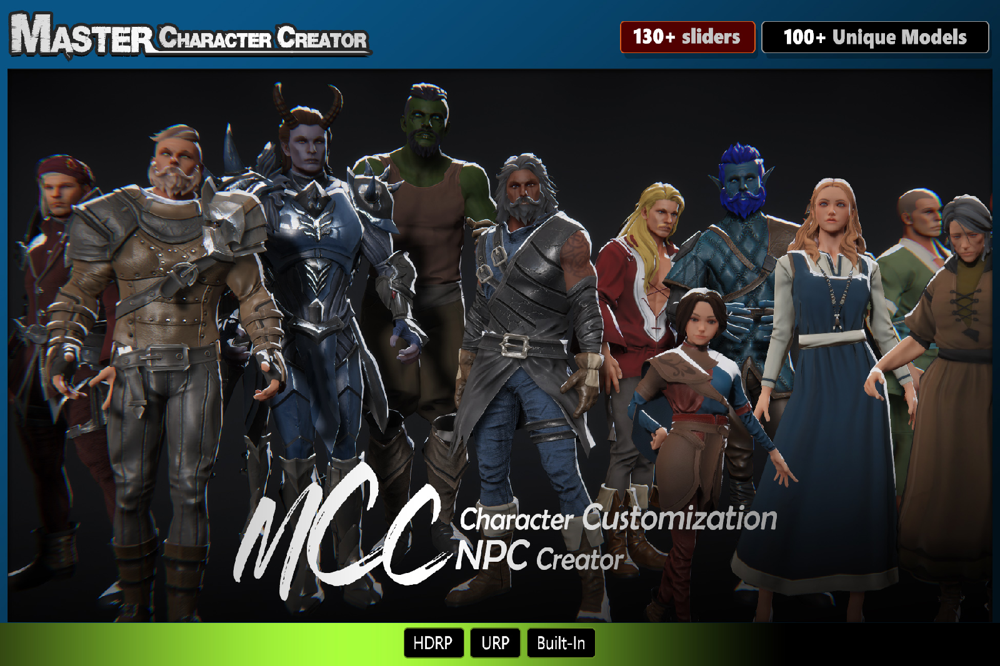

## Master Character Creator: Full Character Customization System

**[Unity AssetStore Page](https://assetstore.unity.com/packages/package/299462)**

Master Character Creator is a powerful, flexible character customization solution for Unity developers, featuring a rich library of art assets and comprehensive customization options. Whether you're creating NPCs or allowing players to customize characters in-game, this system provides everything you need—no coding required!

---

### Rich Art Assets Included:

- #### Unique Outfits Models -

  - 19 Upper body armors for male, 15 Upper body armors for female
  - 19 Pants for male, 15 Pants/Stockings for female
  - 21 Boots for male, 20 Boots for female
  - 19 Gauntlets for both male and female
  - 15 Helmets for both male and female
  - Customize each character with modular armor pieces—Upper body, Lower body, Gauntlets, Boots, and Helmets can be swapped independently for endless combinations and unique looks.

- #### Accessories -

  - 18 Hairstyles, 5 Beards,Ear and Horns, 2 Wings, 1 Tail.

- #### 8 Racess -

  - Vampire, Werewolf, Bunny, Dragonkin, Undead, Orc, and Elf races. Create truly unique NPCs and monsters!

- #### Detailed Customization Textures -

  - 3–5 unique textures for each customization slot (Lips, Eyes, Eyebrows, Makeup, Face Tattoo, Body Tattoo)

---

### Detailed Customization Features:

- #### 130+ Body & Face Sliders -
  - Muscular and Age sliders
  - Breast Size slider.
  - Highly customizable face and body shape, enabling fully unique characters

- #### Color Customization -
  - Each outfit piece has 3 different color areas
  - Freely adjust colors for every body slot, including skin tone, lip color, eye color, makeup color, and more

- #### Emotion Morphs & Eye Tracking -
  - Bring your characters to life with dynamic emotions and realistic eye-tracking behavior
  - Compatible with most LipSync system such as SALSA LipSync Suite.

- #### Weapon Integration System -
  - Equip your characters with ease using the fully customizable weapon system.
  - Supports LeftHand, RightHand, Dual and TwoHanded weapons.
  - Dynamic positioning for holding and carrying states, with separate settings for Male and Female characters.
  - Includes predefined bones like WeaponBoneL/R and CarryPointXXX for precise alignment and dynamic swing during movement.
  - Switch weapon states (Hold, Carry, Hide) via the inspector or API.

- #### Optimized Static NPC Prefabs -
  - Performance Optimization: Significantly improves scene loading and runtime performance by removing the heavy computational load of the customization system for fixed characters. 
  - Asset Integrity: Automatically converts your character preset (.bytes file) into a single, optimized prefab with dedicated, unique material assets. 
  - Export Ready: Includes only the minimal required script (CharacterBoneControlLite.cs) necessary for animation and bone control, ensuring clean package exports and reduced dependency overhead. 
  - Simplified Workflow: Create production-ready background characters using a simple, one-click tool directly from your existing character data.

---

### Flexible Save Options:

- Save the entire character or only specific aspects like body shape or outfits. This allows developers and players to create and load presets for just body shape or clothing, without affecting other character data.
- Character data can be saved as compact byte files (as small as 256 bytes) or as PNG files with character photos (data hidden in the image file).

---

### Additional Features:

- #### Seamless NPC & Player Customization -

  - Developers can quickly create NPCs or allow players to customize their own characters with ease.

- #### Modular Setup -

  - Customize everything from bone structure, accessories, outfits, to materials with a flexible, easy-to-use system.

- #### Advanced Preview Options -

  - View and edit character appearances in real-time with in-editor tools.

- #### Runtime Integration & API Support -

  - Integrate smoothly into your project with detailed API calls for developers needing advanced control.

---

<!-- API LINKS -->
[Accessories Models]: /docs/master-character-creator/implementing-your-models/accessories-models
[Customization Textures]: /docs/master-character-creator/implementing-your-models/customization-textures
[Outfits Models]: /docs/master-character-creator/implementing-your-models/outfits-models
[CharacterAppearance]: /docs/master-character-creator/system/appearance-data
[CharacterCustomizationModule]: /docs/master-character-creator/system/character-customization-module
[CharacterCustomizationObject]: /docs/master-character-creator/system/character-customization-object
[CharacterEntity]: /docs/master-character-creator/system/character-entity
[InventoryModule]: /docs/master-inventory-engine/inventory-module
[EntityModule]: /docs/core/entities/EntityModule
[Loot Pack]:/docs/master-inventory-engine/item-class/loot-pack
[Item Database Settings]:/docs/master-inventory-engine/settings
[ItemChangeCallback]:/docs/master-inventory-engine/callbacks
[ItemDropCallback]:/docs/master-inventory-engine/callbacks
[ItemUseCallback]:/docs/master-inventory-engine/callbacks
[Callbacks]:/docs/master-inventory-engine/callbacks
[LinkIcon]:/docs/master-inventory-engine/ui/item-icon
[InventoryItem]:/docs/master-inventory-engine/ui/item-icon
[ItemIcon]:/docs/master-inventory-engine/ui/item-icon
[WindowsManager]:/docs/master-inventory-engine/ui/windows-manager
[Enchantment]: /docs/master-inventory-engine/item-class/enchantment
[InventoryStack]: /docs/master-inventory-engine/item-class/inventory-stack
[InventoryData]: /docs/master-inventory-engine/item-class/item-data
[Item]: /docs/master-inventory-engine/item-class/item
[ItemObject]: /docs/master-inventory-engine/item-class/item-object
[Attribute]: /docs/core/attributes/Attribute
[AttributeData]: /docs/core/attributes/AttributeData
[AttributeObject]: /docs/core/attributes/AttributeObject
[TempAttribute]: /docs/core/attributes/TempAttribute
[Entity]: /docs/core/entities/Entity
[Entities]: /docs/core/entities/Entity
[EntityComponent]: /docs/core/entities/EntityComponent
[EntityManagerObject]: /docs/core/entities/EntityManagerObject
[OverTimeEffect]: /docs/core/over-time-effects/OverTimeEffect
[OverTimeEffectData]: /docs/core/over-time-effects/OverTimeEffectData
[OverTimeEffectObject]: /docs/core/over-time-effects/OverTimeEffectObject
[DataObject]: /docs/core/general/DataObject
[GameManager]: /docs/core/general/game-manager
[AssetLoader]: /docs/core/general/AssetLoader
[SGD_Settings]: /docs/core/general/SGD_Settings
[GraphInstance]: /docs/master-combat-core/damage-component/graphinstance
[Dynamic Variables]: /docs/master-combat-core/graph-system/dynamic-variables
[DynamicFloat]: /docs/master-combat-core/graph-system/dynamic-variables
[OverTimeEffectInstance]: /docs/master-combat-core/damage-component/over-time-effect-instance
[CombatDamage]: /docs/master-combat-core/damage-component/combat-damage
[GraphObject]: /docs/master-combat-core/graph-system/GraphObject
[CustomData]:/docs/core/CustomData
[AttributeChangeEvent]: /docs/core/attributes/AttributeData
[OverTimeEffectChangeEvent]:/docs/core/over-time-effects/OverTimeEffectData
[EntityEvent]:/docs/core/entities/Entity
[IntList]:/docs/core/CustomData
[IdIntList]:/docs/core/CustomData
[IdFloatList]:/docs/core/CustomData
[Action Node]:/docs/master-combat-core/nodes/action
[Branch Node]:/docs/master-combat-core/nodes/branch
[Condition Node]:/docs/master-combat-core/nodes/condition
[Condition Group Node]:/docs/master-combat-core/nodes/condition
[Entity Node]:/docs/master-combat-core/nodes/entity
[Trigger Node]:/docs/master-combat-core/nodes/trigger
[Variable Node]:/docs/master-combat-core/nodes/variable-math
[Math Node]:/docs/master-combat-core/nodes/variable-math
<!-- API LINKS -->