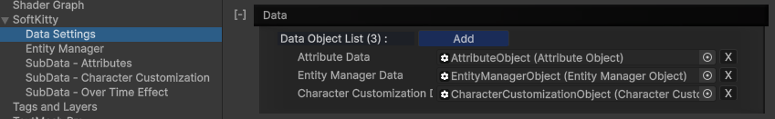

```csharp
class SoftKitty.CharacterCustomizationObject : DataObject
```

`CharacterCustomizationObject` is a  **[DataObject]** that manages character customization settings and [CharacterAppearance] runtime data within the system.

You can create this object via the context menu in any Project folder:

`Create → SoftKitty → Data Objects → Character Customization Data`

You can assign the created asset to the database in:
`Project Settings → SoftKitty → Data Settings → Data`



After assigned the data object, a editor interface can be found at: 

`Project Settings → SoftKitty → SubData - Character Customization`

Where you can easily manage character customization settings with convenient editor interface.

This database manages all aspects of a character's appearance, storing the appearance data in a Dictionary using the character | [Entity]'s UID as the key. Typically, you don't need to manually update the character's appearance as it is automatically handled by [CharacterEntity] component. However, if you need to modify the character's appearance independently from [CharacterEntity] component, you can access this class.
Additionally, this database allows save/load a character's appearance from a byte file or a PNG file.

---

### Functions For Managing Appearance Data

The following functions provided in `CharacterCustomizationObject` allow you to efficiently manage the appearance data of your characters without directly relying on [CharacterEntity] component:

#### `public static void UpdateCharacterAppearance(string _uid, CharacterAppearance _data)`

Updates the appearance data of a character identified by the provided UID. Use this function if you need to modify a character's appearance independently of [CharacterEntity] component

#### `public static bool isCharacterAppearanceExist(string _uid)`

Checks if the appearance data for a character with the specified UID exists in the internal Dictionary.

#### `public static CharacterAppearance GetAppearanceData(string _uid)`

Retrieves the appearance data of a character using the provided UID.
These functions allow for flexible appearance management, enabling you to control or modify the visual data of characters even outside the typical workflow of the [CharacterEntity] component.

---

### Functions For Saving/Loading Appearance Data

The following functions allow developers to save and load character appearance data efficiently, whether from disk or resources, in both byte and PNG formats. These functions provide flexibility when handling character appearance data, allowing you to choose between different formats and storage locations. Additionally, developers can manage different parts of the character's appearance data through the `BlurPrintType` parameter.

#### `public static CharacterAppearance LoadCharacterDataFromResources(string _resourcePath, CharacterAppearance _data)`

Load appearance data from a byte file located in the resources folder.

#### `public static CharacterAppearance LoadCharacterDataFromFile(CharacterAppearance _data, string _path)`

Load appearance data from a byte file stored on disk.

#### `public static Texture2D LoadCharacterDataWithPhoto(ref CharacterAppearance _data, string _path)`

Load appearance data from a PNG file on disk, with the appearance data hidden inside the image.

#### `public static void SaveCharacterData(CharacterBoneControl _character, string _path, BlurPrintType _type= BlurPrintType.AllAppearance)`

Save appearance data to a byte file. Use BlurPrintType to specify if you want to save the entire appearance data or just specific parts.

#### `public static void SaveCharacterDataWithPhoto(CharacterBoneControl _character, Texture2D _photo, string _path, BlurPrintType _type = BlurPrintType.AllAppearance)`

Save appearance data to a PNG file. The data is embedded within the image file, with the option to limit saved data to certain parts using BlurPrintType.

#### `public static void SaveCharacterDataToResources(CharacterBoneControl _character, string _resourcePath, BlurPrintType _type = BlurPrintType.AllAppearance)`

[FOR DEVELOPERS] Save appearance data to a byte file in the resources folder. Use BlurPrintType if you intend to save only specific sections of the data.

---

### Managing Preview Characters

These functions allow you to manage preview characters, which is useful for displaying a character’s current appearance within various UI interfaces (e.g., rendering the player’s appearance to a RenderTexture for display in an equipment or customization interface). These functions allow for dynamic management of preview characters, making it easy to display and update a character’s appearance in interfaces like equipment or character creation screens.

#### `public CharacterBoneControl CreatePreviewCharacter(string _key, Sex _sex, Vector3 _position, float _angle)`

Creates a preview character at a specified position and angle. The key is used to identify this character for further operations.

#### `public CharacterBoneControl GetPreviewCharacter(string _key)`

Retrieves a preview character using the provided key. Once retrieved, you can call : `CharacterBoneControl().Initialize(CharacterAppearance _data)` to apply appearance data to the preview character.

#### `public void RemovePreviewCharacter(string _key)`

Removes the preview character identified by the provided key.

---

<!-- API LINKS -->
[Accessories Models]: /docs/master-character-creator/implementing-your-models/accessories-models
[Customization Textures]: /docs/master-character-creator/implementing-your-models/customization-textures
[Outfits Models]: /docs/master-character-creator/implementing-your-models/outfits-models
[CharacterAppearance]: /docs/master-character-creator/system/appearance-data
[CharacterCustomizationModule]: /docs/master-character-creator/system/character-customization-module
[CharacterCustomizationObject]: /docs/master-character-creator/system/character-customization-object
[CharacterEntity]: /docs/master-character-creator/system/character-entity
[InventoryModule]: /docs/master-inventory-engine/inventory-module
[EntityModule]: /docs/core/entities/EntityModule
[Loot Pack]:/docs/master-inventory-engine/item-class/loot-pack
[Item Database Settings]:/docs/master-inventory-engine/settings
[ItemChangeCallback]:/docs/master-inventory-engine/callbacks
[ItemDropCallback]:/docs/master-inventory-engine/callbacks
[ItemUseCallback]:/docs/master-inventory-engine/callbacks
[Callbacks]:/docs/master-inventory-engine/callbacks
[LinkIcon]:/docs/master-inventory-engine/ui/item-icon
[InventoryItem]:/docs/master-inventory-engine/ui/item-icon
[ItemIcon]:/docs/master-inventory-engine/ui/item-icon
[WindowsManager]:/docs/master-inventory-engine/ui/windows-manager
[Enchantment]: /docs/master-inventory-engine/item-class/enchantment
[InventoryStack]: /docs/master-inventory-engine/item-class/inventory-stack
[InventoryData]: /docs/master-inventory-engine/item-class/item-data
[Item]: /docs/master-inventory-engine/item-class/item
[ItemObject]: /docs/master-inventory-engine/item-class/item-object
[Attribute]: /docs/core/attributes/Attribute
[AttributeData]: /docs/core/attributes/AttributeData
[AttributeObject]: /docs/core/attributes/AttributeObject
[TempAttribute]: /docs/core/attributes/TempAttribute
[Entity]: /docs/core/entities/Entity
[Entities]: /docs/core/entities/Entity
[EntityComponent]: /docs/core/entities/EntityComponent
[EntityManagerObject]: /docs/core/entities/EntityManagerObject
[OverTimeEffect]: /docs/core/over-time-effects/OverTimeEffect
[OverTimeEffectData]: /docs/core/over-time-effects/OverTimeEffectData
[OverTimeEffectObject]: /docs/core/over-time-effects/OverTimeEffectObject
[DataObject]: /docs/core/general/DataObject
[GameManager]: /docs/core/general/game-manager
[AssetLoader]: /docs/core/general/AssetLoader
[SGD_Settings]: /docs/core/general/SGD_Settings
[GraphInstance]: /docs/master-combat-core/damage-component/graphinstance
[Dynamic Variables]: /docs/master-combat-core/graph-system/dynamic-variables
[DynamicFloat]: /docs/master-combat-core/graph-system/dynamic-variables
[OverTimeEffectInstance]: /docs/master-combat-core/damage-component/over-time-effect-instance
[CombatDamage]: /docs/master-combat-core/damage-component/combat-damage
[GraphObject]: /docs/master-combat-core/graph-system/GraphObject
[CustomData]:/docs/core/CustomData
[AttributeChangeEvent]: /docs/core/attributes/AttributeData
[OverTimeEffectChangeEvent]:/docs/core/over-time-effects/OverTimeEffectData
[EntityEvent]:/docs/core/entities/Entity
[IntList]:/docs/core/CustomData
[IdIntList]:/docs/core/CustomData
[IdFloatList]:/docs/core/CustomData
[Action Node]:/docs/master-combat-core/nodes/action
[Branch Node]:/docs/master-combat-core/nodes/branch
[Condition Node]:/docs/master-combat-core/nodes/condition
[Condition Group Node]:/docs/master-combat-core/nodes/condition
[Entity Node]:/docs/master-combat-core/nodes/entity
[Trigger Node]:/docs/master-combat-core/nodes/trigger
[Variable Node]:/docs/master-combat-core/nodes/variable-math
[Math Node]:/docs/master-combat-core/nodes/variable-math
<!-- API LINKS -->