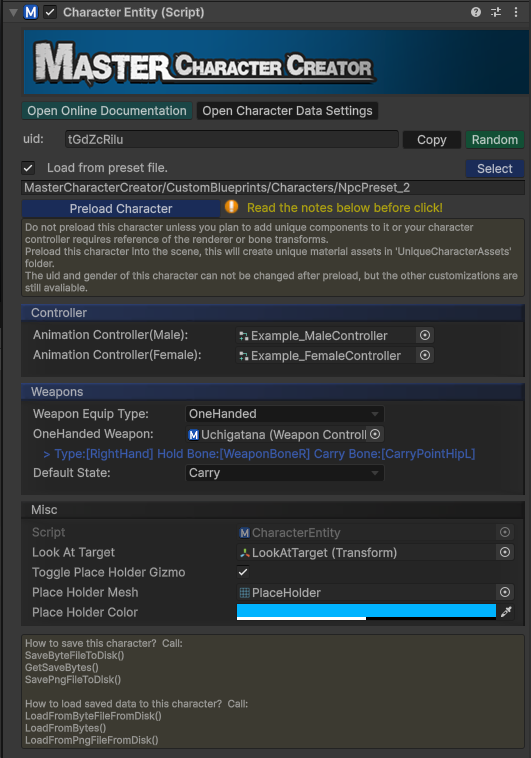

```csharp
class SoftKitty.MasterCharacterCreator.CharacterEntity : MonoBehaviour
```

The `CharacterEntity` component is the key element of the Master Character Creator system, allowing you to control and manipulate the character’s appearance and interactions. 



Below are the essential API calls that give you control over character customization, equipment, and more.

---

### Properties

### `public CharacterAppearance mCharacterAppearance`

Stores the current appearance data of the character.

---

### `public string uid`

The unique string id of this character.

---

### `public Sex sex`

Returns the gender of this character.

---

### Methods

### `public void RandomUid()`

Assigns a random unique ID for this character.

---

### `public Texture2D GetCharacterPhoto(Vector2 _imageSize, Color _bgColor, float _cameraAngle=0F,bool _cameraLight=true)`

Take a photo of the character and return the photo as Texture2D.

---

### `public void Initialize(CharacterAppearance _data)`

Initializes the character with a specified appearance data.

---

### `public void Initialize(Sex_sex)`

Initializes the character with a specified gender.

---

### `public void LoadFromResourceFile(string _resourcePath)`

Initializes the character with a `*.bytes` file in your `Resources` folder, please use relative path without extension from resources folder. _Example_:
`MasterCharacterCreator/CustomBlueprints/Characters/NpcPreset_1`

---

### `public void LoadFromByteFileFromDisk(string _absolutePath)`

Initializes the character with a `*.bytes` file from disk, please use absolute full path and with extension. _Example_: `E:/NpcPreset_1.bytes`

---

### `public void LoadFromPngFileFromDisk(string _absolutePath)`

Initializes the character with a `*.png` file from disk, please use absolute full path and with extension. _Example_: `E:/NpcPreset_1.png`

---

### `public void LoadFromBytes (byte_[] _bytes)`

Initializes the character with the bytes array loaded from your own save system.

---

### `public void SaveByteFileToDisk(string _absolutePath, BlurPrintType _filter)`

Save the character to a `*.bytes` file on disk,  please use absolute full path and with extension. _Example_:`E:/Player.bytes`

---

### `public void SavePngFileToDisk(string _absolutePath, Texture2D _photo, BlurPrintType _filter)`

Save the character to a `*.png` file on disk,  please use absolute full path and with extension. _Example_:`E:/Player.png`

---

### `public void GetSaveBytes (BlurPrintType _filter)`

Get the save data of the character as `bytes` array, so you can save it with your own save system.

---

### `public Transform GetBoneByName(string _name)`

Get the bone transform of the character by the name of the bone. You can find the name of bones by checking the prefab of characters in:
`Assets/SoftKitty/MasterCharacterCreator/Resources/MasterCharacterCreator/Player/CharacterMale.prefab` & `CharacterFemale.prefab`

---

### `public void Equip(EquipmentAppearance _equipment)`

Equips an item with `EquipmentAppearance` data and updates the character's appearance accordingly.

---

### `public void Equip(OutfitSlots _slot, int _id)`

Equips an item with its slot and id and updates the character's appearance accordingly.

```csharp
enum SoftKitty.MasterCharacterCreator.OutfitSlots
{
    Armor, //0
    Helmet, //1
    Gauntlet, //2
    Boot, //3
    Pants, //4
    Back, //5
    Tail //6
}
```

---

### `public void Equip(OutfitSlots _slot, int _id, Color _color1,Color _color2,Color _color3)`

Equips an item with its slot, id and custom colors, then updates the character's appearance accordingly.

```csharp
enum SoftKitty.MasterCharacterCreator.OutfitSlots
{
    Armor, //0
    Helmet, //1
    Gauntlet, //2
    Boot, //3
    Pants, //4
    Back, //5
    Tail //6
}
```

---

### `public void Unequip(OutfitSlots _slot)`

Unequips a specific outfit slot (e.g., helmet, armor).

```csharp
enum SoftKitty.MasterCharacterCreator.OutfitSlots
{
    Armor, //0
    Helmet, //1
    Gauntlet, //2
    Boot, //3
    Pants, //4
    Back, //5
    Tail //6
}
```

---

### `public bool isEquipped(EquipmentAppearance _equipment)`

Returns whether a specific piece of equipment is equipped.

---

### `public bool isEquipped(OutfitSlots _slot, int _id)`

Returns whether a specific equipment with provided slot and id is equipped.

```csharp
enum SoftKitty.MasterCharacterCreator.OutfitSlots
{
    Armor, //0
    Helmet, //1
    Gauntlet, //2
    Boot, //3
    Pants, //4
    Back, //5
    Tail //6
}
```

---

### `public int GetEquippedId(OutfitSlots _slot)`

Retrieves the mesh ID of the currently equipped item in the specified slot.

```csharp
enum SoftKitty.MasterCharacterCreator.OutfitSlots
{
    Armor, //0
    Helmet, //1
    Gauntlet, //2
    Boot, //3
    Pants, //4
    Back, //5
    Tail //6
}
```

---

### `public void SetEmotion(string _uid, float _length = 3F)`

Sets the character's emotion by its UID and specifies how long the emotion will last.

---

### `public void SetEyeOpen(float _openPercentage)`

Sets the percentage of the character’s eye openness (1~100).

---

### `public void Blink()`

Forces the character to blink immediately.

---

### `public void SetLookAt(Transform _target)`

Makes the character look at a specified transform target.

---

### `public void SetRimColor(Color _color, float _intensity)`

Set the rim effect color, this could be useful for highlight the character or when the character gets hit.

---

### `public Color GetRimColor()`

Get the rim effect color, this could be useful for highlight the character or when the character gets hit.

---

### `public void ResetCharacter()`

Resets the character’s appearance back to its default state.

---

### `public void CustomizeCharacter()`

Switches to the Character Customization UI with this character (for player use)

---

### `public void CreateCharacter()`

Switches to the Character Creation UI (for player use)

---

### `public void CreateCharacterByDeveloper()`

Switches to the Character Creation UI (for developer use, with more options)

---

### `public void LoadDefaultWeapon()`

Load the weapons set in the inspector.

---

### `public void EquipWeapon(WeaponController _weapon, WeaponState _state= WeaponState.Carry)`

Equip a weapon and set its default state.

---

### `public void UnequipWeapon(WeaponType _slot)`

Unequip a weapon with specified slot.

---

### `public void UnequipAllWeapons()`

Unequip all weapons

---

### `public void SwitchWeaponState(WeaponState _state, WeaponType _slot)`

Switch the state of the weapon with specified slot.

---

### `public void SwitchWeaponState(WeaponState _state)`

Switch the state of all weapons.

---

### `public WeaponState GetWeaponState()`

Get the current weapon state.

---

### `public bool isEquippedWeapon(string _uid)`

Return bool value for whether a weapon with specified uid is equipped.

---

### `public WeaponController GetEquippedWeaponByType(WeaponType _slot)`

Get a equipped weapon with specified slot.

---

### `public WeaponController GetEquippedWeaponByUid(string _uid)`

Get a equipped weapon with specified uid, return null if no match found.

---

### `public List<WeaponController> GetAllEquippedWeapon()`

Get a list of all equipped weapon

---

<!-- API LINKS -->
[Accessories Models]: /docs/master-character-creator/implementing-your-models/accessories-models
[Customization Textures]: /docs/master-character-creator/implementing-your-models/customization-textures
[Outfits Models]: /docs/master-character-creator/implementing-your-models/outfits-models
[CharacterAppearance]: /docs/master-character-creator/system/appearance-data
[CharacterCustomizationModule]: /docs/master-character-creator/system/character-customization-module
[CharacterCustomizationObject]: /docs/master-character-creator/system/character-customization-object
[CharacterEntity]: /docs/master-character-creator/system/character-entity
[InventoryModule]: /docs/master-inventory-engine/inventory-module
[EntityModule]: /docs/core/entities/EntityModule
[Loot Pack]:/docs/master-inventory-engine/item-class/loot-pack
[Item Database Settings]:/docs/master-inventory-engine/settings
[ItemChangeCallback]:/docs/master-inventory-engine/callbacks
[ItemDropCallback]:/docs/master-inventory-engine/callbacks
[ItemUseCallback]:/docs/master-inventory-engine/callbacks
[Callbacks]:/docs/master-inventory-engine/callbacks
[LinkIcon]:/docs/master-inventory-engine/ui/item-icon
[InventoryItem]:/docs/master-inventory-engine/ui/item-icon
[ItemIcon]:/docs/master-inventory-engine/ui/item-icon
[WindowsManager]:/docs/master-inventory-engine/ui/windows-manager
[Enchantment]: /docs/master-inventory-engine/item-class/enchantment
[InventoryStack]: /docs/master-inventory-engine/item-class/inventory-stack
[InventoryData]: /docs/master-inventory-engine/item-class/item-data
[Item]: /docs/master-inventory-engine/item-class/item
[ItemObject]: /docs/master-inventory-engine/item-class/item-object
[Attribute]: /docs/core/attributes/Attribute
[AttributeData]: /docs/core/attributes/AttributeData
[AttributeObject]: /docs/core/attributes/AttributeObject
[TempAttribute]: /docs/core/attributes/TempAttribute
[Entity]: /docs/core/entities/Entity
[Entities]: /docs/core/entities/Entity
[EntityComponent]: /docs/core/entities/EntityComponent
[EntityManagerObject]: /docs/core/entities/EntityManagerObject
[OverTimeEffect]: /docs/core/over-time-effects/OverTimeEffect
[OverTimeEffectData]: /docs/core/over-time-effects/OverTimeEffectData
[OverTimeEffectObject]: /docs/core/over-time-effects/OverTimeEffectObject
[DataObject]: /docs/core/general/DataObject
[GameManager]: /docs/core/general/game-manager
[AssetLoader]: /docs/core/general/AssetLoader
[SGD_Settings]: /docs/core/general/SGD_Settings
[GraphInstance]: /docs/master-combat-core/damage-component/graphinstance
[Dynamic Variables]: /docs/master-combat-core/graph-system/dynamic-variables
[DynamicFloat]: /docs/master-combat-core/graph-system/dynamic-variables
[OverTimeEffectInstance]: /docs/master-combat-core/damage-component/over-time-effect-instance
[CombatDamage]: /docs/master-combat-core/damage-component/combat-damage
[GraphObject]: /docs/master-combat-core/graph-system/GraphObject
[CustomData]:/docs/core/CustomData
[AttributeChangeEvent]: /docs/core/attributes/AttributeData
[OverTimeEffectChangeEvent]:/docs/core/over-time-effects/OverTimeEffectData
[EntityEvent]:/docs/core/entities/Entity
[IntList]:/docs/core/CustomData
[IdIntList]:/docs/core/CustomData
[IdFloatList]:/docs/core/CustomData
[Action Node]:/docs/master-combat-core/nodes/action
[Branch Node]:/docs/master-combat-core/nodes/branch
[Condition Node]:/docs/master-combat-core/nodes/condition
[Condition Group Node]:/docs/master-combat-core/nodes/condition
[Entity Node]:/docs/master-combat-core/nodes/entity
[Trigger Node]:/docs/master-combat-core/nodes/trigger
[Variable Node]:/docs/master-combat-core/nodes/variable-math
[Math Node]:/docs/master-combat-core/nodes/variable-math
<!-- API LINKS -->