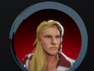

---

#### Taking Character Photos

Capture character portraits at runtime with the `GetCharacterPhoto()` function.



```csharp
Texture2D photoTexture = characterEntity.GetCharacterPhoto(Vector2 _imageSize, Color _bgColor, float _cameraAngle = 0F, bool _cameraLight = true);
```

- **`_imageSize`**: A `Vector2` specifying the width and height (in pixels) of the generated portrait texture.
- **`_bgColor`**: The `Color` of the background of the portrait.
- **`_cameraAngle`**: An optional `float` value (default: 0F) representing the offset angle around the Y-axis for the camera capturing the portrait.
- **`_cameraLight`**: An optional `bool` value (default: true) to toggle an additional light source on during capture, useful if the character is in a dark environment.

**Return Value**: A `Texture2D` containing the character's portrait.

---

#### Animating Accessories (Back, Tail, Ears)

If your character's `back`, `tail`, or `ear` accessories have their own `Animation` components, you can directly access these components using the following functions:

```csharp
Animation backAnimator = characterEntity.GetBackAnimationComponent();
Animation tailAnimator = characterEntity.GetTailAnimationComponent();
Animation headAccessoryAnimator = characterEntity.GetHeadAccessoryAnimationComponent();
```

Example (Playing a back accessory `animation`):

```csharp
if (Player.GetBackAnimationComponent() != null){
    Player.GetBackAnimationComponent().CrossFade("OpenFlap1", 0.25F);
}
```

Ensure you check if the component exists before attempting to access it to avoid potential null reference errors.

---

#### Managing Character Eyes

Control your character's gaze and eye expressions using these functions:

**Look At Target**:

```csharp
characterEntity.SetLookAt(Transform _target); // Make the character look at the specified Transform.
characterEntity.SetLookAt(null);  // Stop the character from looking at any target.
```

**Blinking**:

```csharp
characterEntity.Blink(); // Trigger a blink animation.
```

**Eye Openness**:

```csharp
characterEntity.SetEyeOpen(float _openPercentage); // Set the eye openness percentage (0f - 100f).
```

---

#### Applying Rim Effect

A rim effect can be used to highlight your character or provide visual feedback, such as when they are hit.
Set Rim Color and Intensity:

```csharp
characterEntity.SetRimColor(Color _color, float _intensity);
```

- **`_color`**: The `Color` of the rim effect.
- **`_intensity`**: A `float` value (typically between 0 and 1, though your original note mentioned 1~10, clarify the intended range).

Get Current Rim Color:

```csharp
Color currentRimColor = characterEntity.GetRimColor();
```


---

 <!-- API LINKS -->
[Accessories Models]: /docs/master-character-creator/implementing-your-models/accessories-models
[Customization Textures]: /docs/master-character-creator/implementing-your-models/customization-textures
[Outfits Models]: /docs/master-character-creator/implementing-your-models/outfits-models
[CharacterAppearance]: /docs/master-character-creator/system/appearance-data
[CharacterCustomizationModule]: /docs/master-character-creator/system/character-customization-module
[CharacterCustomizationObject]: /docs/master-character-creator/system/character-customization-object
[CharacterEntity]: /docs/master-character-creator/system/character-entity
[InventoryModule]: /docs/master-inventory-engine/inventory-module
[EntityModule]: /docs/core/entities/EntityModule
[Loot Pack]:/docs/master-inventory-engine/item-class/loot-pack
[Item Database Settings]:/docs/master-inventory-engine/settings
[ItemChangeCallback]:/docs/master-inventory-engine/callbacks
[ItemDropCallback]:/docs/master-inventory-engine/callbacks
[ItemUseCallback]:/docs/master-inventory-engine/callbacks
[Callbacks]:/docs/master-inventory-engine/callbacks
[LinkIcon]:/docs/master-inventory-engine/ui/item-icon
[InventoryItem]:/docs/master-inventory-engine/ui/item-icon
[ItemIcon]:/docs/master-inventory-engine/ui/item-icon
[WindowsManager]:/docs/master-inventory-engine/ui/windows-manager
[Enchantment]: /docs/master-inventory-engine/item-class/enchantment
[InventoryStack]: /docs/master-inventory-engine/item-class/inventory-stack
[InventoryData]: /docs/master-inventory-engine/item-class/item-data
[Item]: /docs/master-inventory-engine/item-class/item
[ItemObject]: /docs/master-inventory-engine/item-class/item-object
[Attribute]: /docs/core/attributes/Attribute
[AttributeData]: /docs/core/attributes/AttributeData
[AttributeObject]: /docs/core/attributes/AttributeObject
[TempAttribute]: /docs/core/attributes/TempAttribute
[Entity]: /docs/core/entities/Entity
[Entities]: /docs/core/entities/Entity
[EntityComponent]: /docs/core/entities/EntityComponent
[EntityManagerObject]: /docs/core/entities/EntityManagerObject
[OverTimeEffect]: /docs/core/over-time-effects/OverTimeEffect
[OverTimeEffectData]: /docs/core/over-time-effects/OverTimeEffectData
[OverTimeEffectObject]: /docs/core/over-time-effects/OverTimeEffectObject
[DataObject]: /docs/core/general/DataObject
[GameManager]: /docs/core/general/game-manager
[AssetLoader]: /docs/core/general/AssetLoader
[SGD_Settings]: /docs/core/general/SGD_Settings
[GraphInstance]: /docs/master-combat-core/damage-component/graphinstance
[Dynamic Variables]: /docs/master-combat-core/graph-system/dynamic-variables
[DynamicFloat]: /docs/master-combat-core/graph-system/dynamic-variables
[OverTimeEffectInstance]: /docs/master-combat-core/damage-component/over-time-effect-instance
[CombatDamage]: /docs/master-combat-core/damage-component/combat-damage
[GraphObject]: /docs/master-combat-core/graph-system/GraphObject
[CustomData]:/docs/core/CustomData
[AttributeChangeEvent]: /docs/core/attributes/AttributeData
[OverTimeEffectChangeEvent]:/docs/core/over-time-effects/OverTimeEffectData
[EntityEvent]:/docs/core/entities/Entity
[IntList]:/docs/core/CustomData
[IdIntList]:/docs/core/CustomData
[IdFloatList]:/docs/core/CustomData
[Action Node]:/docs/master-combat-core/nodes/action
[Branch Node]:/docs/master-combat-core/nodes/branch
[Condition Node]:/docs/master-combat-core/nodes/condition
[Condition Group Node]:/docs/master-combat-core/nodes/condition
[Entity Node]:/docs/master-combat-core/nodes/entity
[Trigger Node]:/docs/master-combat-core/nodes/trigger
[Variable Node]:/docs/master-combat-core/nodes/variable-math
[Math Node]:/docs/master-combat-core/nodes/variable-math
<!-- API LINKS -->