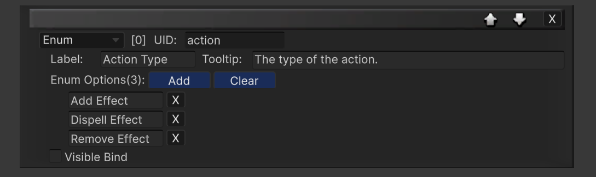
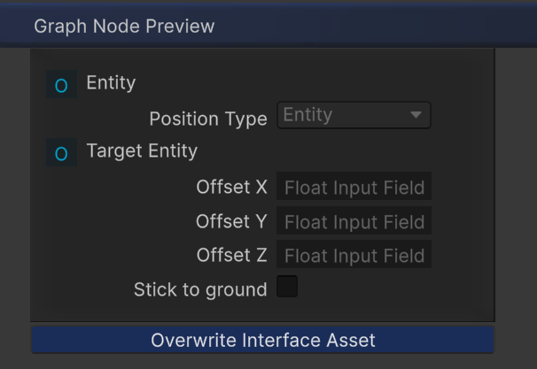

The **Custom Node Tool** is a visual editor for creating **custom node types** without manually writing boilerplate code.
It is designed to make **extension development fast, safe, and approachable**.

The tool supports three node categories:
- **Root Node**
- [Condition Node]
- [Action Node]
  
**Note:**
`All built-in nodes provided by Master Combat Core are created using this tool.`

---

### Accessing the Tool
Open the Custom Node Tool via:
- `Window > Soft Kitty > Custom Graph Interface Tool`

---

### Getting Started
#### Create a New Node
1. Enter your node type name in the **New Script** field.
2. Select the node category from the dropdown.
3. Click **Create**.
4. Wait for Unity to finish recompiling scripts. 

#### Modify an Existing Node

1. Drag an existing node script into the Existing Script slot.

2. Click Load to edit its interface and regenerate code.
```
Note:
Modifying an existing custom node interface will overwrite the generated code.
Any custom logic you added to the generated script may be lost. 
Please make sure to back up your code before clicking 'Overwrite Code' button.
```


---

### Node Interface Design

Under the **Design** section, you can add interface elements using the
**Create New Element** dropdown.

#### Available Element Types

|Type Name|Usage| Visible Bindable|
|----|----|:----:|
|Bool Variable|Toggle field for bool values|✓|
|String Variable|Text field for string values|✗|
|Float Variable|Float input field|✗|
|Int Variable|Integer input field|✗|
|Input Float|Input port for float values|✗|
|Input Entity|Input port for Entity reference|✗|
|Enum|Dropdown enum for int values|✓|
|Label|Static label text|✗|
|Separater|Visual divider line|✗|

You can add **any number of elements** to a node.


---

#### Element Properties

Each element contains the following properties:
- **UID**
A unique identifier. This is also used as the variable name in code.

- **Label**
The text displayed in the node interface.

- **Tooltip**
A mouse-hover description shown in the Graph Editor.

- **Visible Bind**
Allows this element’s visibility to be controlled by another
Visible Bindable element (such as Bool or Enum).



---

### Preview & Code Generation
#### Interface Preview
After finishing the design:

- The Preview section shows how the node will appear in the Graph Editor

- The **preview** is fully interactive

- Visibility bindings and dropdown behavior can be tested live



---

#### Code Generation

The **Code** section automatically generates:

- Variable accessors

- Initialization logic

- Base class structure

Click **Overwrite Code** to generate or update the node script.


---

### Writing Node Logic

After generation, open the created script and implement the node logic.

#### [Condition Node]

📁 Assets/SoftKitty/Shared/Scripts/CustomClass/Handler/
```csharp
public override void Update(GraphRuntimeState _runtime)
{
    // Put your condition logic here
    bool result = /* calculation */;
    SetActive(result);
}

```

---

#### [Action Node]

📁 Assets/SoftKitty/Shared/Scripts/CustomClass/Action/
```csharp
public override void Execute(GraphRuntimeState _runtime)
{
    // Put your execution logic here
}
```

---

#### Root Node

📁 Assets/SoftKitty/Shared/Scripts/CustomClass/Root/
```csharp
public override void StructureBuild()
{
    // Put your root logic here
}
```
---

### Accessing Custom Variables in Code

To access a variable created in the interface, simply call it using its UID:
```csharp
intensity(_runtime) = 10f;
```

This works for:

- Variables

- Input values

- Enums

- Entity references

---

### Why This Tool Matters

- No manual editor scripting required

- No repetitive boilerplate code

- Consistent UI and runtime behavior

- Safe, designer-friendly extensibility

- Scales cleanly with large projects

---
<!-- API LINKS -->
[Loot Pack]:/docs/master-inventory-engine/item-class/loot-pack
[Item Database Settings]:/docs/master-inventory-engine/settings
[ItemChangeCallback]:/docs/master-inventory-engine/callbacks
[ItemDropCallback]:/docs/master-inventory-engine/callbacks
[ItemUseCallback]:/docs/master-inventory-engine/callbacks
[Callbacks]:/docs/master-inventory-engine/callbacks
[LinkIcon]:/docs/master-inventory-engine/ui/item-icon
[InventoryItem]:/docs/master-inventory-engine/ui/item-icon
[ItemIcon]:/docs/master-inventory-engine/ui/item-icon
[WindowsManager]:/docs/master-inventory-engine/ui/windows-manager
[Enchantment]: /docs/master-inventory-engine/item-class/enchantment
[InventoryStack]: /docs/master-inventory-engine/item-class/inventory-stack
[InventoryData]: /docs/master-inventory-engine/item-class/item-data
[Item]: /docs/master-inventory-engine/item-class/item
[ItemObject]: /docs/master-inventory-engine/item-class/item-object
[Attribute]: /docs/core/attributes/Attribute
[AttributeData]: /docs/core/attributes/AttributeData
[AttributeObject]: /docs/core/attributes/AttributeObject
[TempAttribute]: /docs/core/attributes/TempAttribute
[Entity]: /docs/core/entities/Entity
[Entities]: /docs/core/entities/Entity
[EntityComponent]: /docs/core/entities/EntityComponent
[EntityManagerObject]: /docs/core/entities/EntityManagerObject
[OverTimeEffect]: /docs/core/over-time-effects/OverTimeEffect
[OverTimeEffectData]: /docs/core/over-time-effects/OverTimeEffectData
[OverTimeEffectObject]: /docs/core/over-time-effects/OverTimeEffectObject
[DataObject]: /docs/core/general/DataObject
[GameManager]: /docs/core/general/game-manager
[AssetLoader]: /docs/core/general/AssetLoader
[SGD_Settings]: /docs/core/general/SGD_Settings
[GraphInstance]: /docs/master-combat-core/damage-component/graphinstance
[Dynamic Variables]: /docs/master-combat-core/graph-system/dynamic-variables
[DynamicFloat]: /docs/master-combat-core/graph-system/dynamic-variables
[OverTimeEffectInstance]: /docs/master-combat-core/damage-component/over-time-effect-instance
[CombatDamage]: /docs/master-combat-core/damage-component/combat-damage
[GraphObject]: /docs/master-combat-core/graph-system/GraphObject
[CustomData]:/docs/core/CustomData
[AttributeChangeEvent]: /docs/core/attributes/AttributeData
[OverTimeEffectChangeEvent]:/docs/core/over-time-effects/OverTimeEffectData
[EntityEvent]:/docs/core/entities/Entity
[IntList]:/docs/core/CustomData
[IdIntList]:/docs/core/CustomData
[IdFloatList]:/docs/core/CustomData
[Action Node]:/docs/master-combat-core/nodes/action
[Branch Node]:/docs/master-combat-core/nodes/branch
[Condition Node]:/docs/master-combat-core/nodes/condition
[Condition Group Node]:/docs/master-combat-core/nodes/condition
[Entity Node]:/docs/master-combat-core/nodes/entity
[Trigger Node]:/docs/master-combat-core/nodes/trigger
[Variable Node]:/docs/master-combat-core/nodes/variable-math
[Math Node]:/docs/master-combat-core/nodes/variable-math
<!-- API LINKS -->