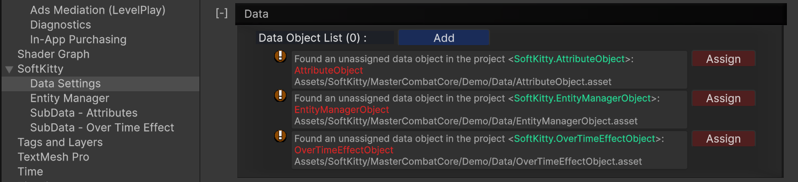

### Demo Project

**Master Combat Core** includes a **fully playable rogue-like demo** project showcasing how the system can be used to build complete gameplay mechanics.

The demo covers a wide range of common action-RPG features, including:

- Player leveling

- Action-based combat

- Combo attacks

- Shield blocking

- Projectile attacks

- Enemy AI

- Enemy leveling

- Skill learning

- Enchantments

- Buff / Debuff / Damage-Over-Time (DoT)

- Health bars

- Over-Time Effect (OTE) interface

- Damage number pop-ups

- Visual effects and sound effects

- Deep save/load system

  - Enemy states and animations are fully preserved

  - On load, all characters continue from the exact state before saving

- Loot system

- Random enemy spawning

---

### Demo Import

1. In the **`Project`** window, navigate to:
   - `Assets/SoftKitty/MasterCombatCore/Demo/HDRP_URP_Built-In`

2. Import the **demo package** that matches your project’s **`Render Pipeline`**:
   - **`HDRP_Demo.package`**
   - **`URP_Demo.package`**
   - **`Built-In_Demo.package`**

```
Note:
Please import only one of above packages.
```
3. Go to:
   `Project Settings > SoftKitty > Data Settings` and expand the **`Data`** section.
4. Click the **`Assign`** buttons of all the demo database objects to add them to your project.



---

### Interactive Tutorial

The demo also includes an **interactive in-editor walkthrough** that explains how these mechanics are implemented using **Master Combat Core**.

To access it:

1. Open the demo scene.

2. Select the GameObject named:
`<<<< Demo Introduction >>> (Click Me!)`

3. View the walkthrough directly in the Inspector.

This guided interface explains:

- How each mechanic works

- Which systems and graphs are involved

- How everything fits together in a real gameplay scenario

---