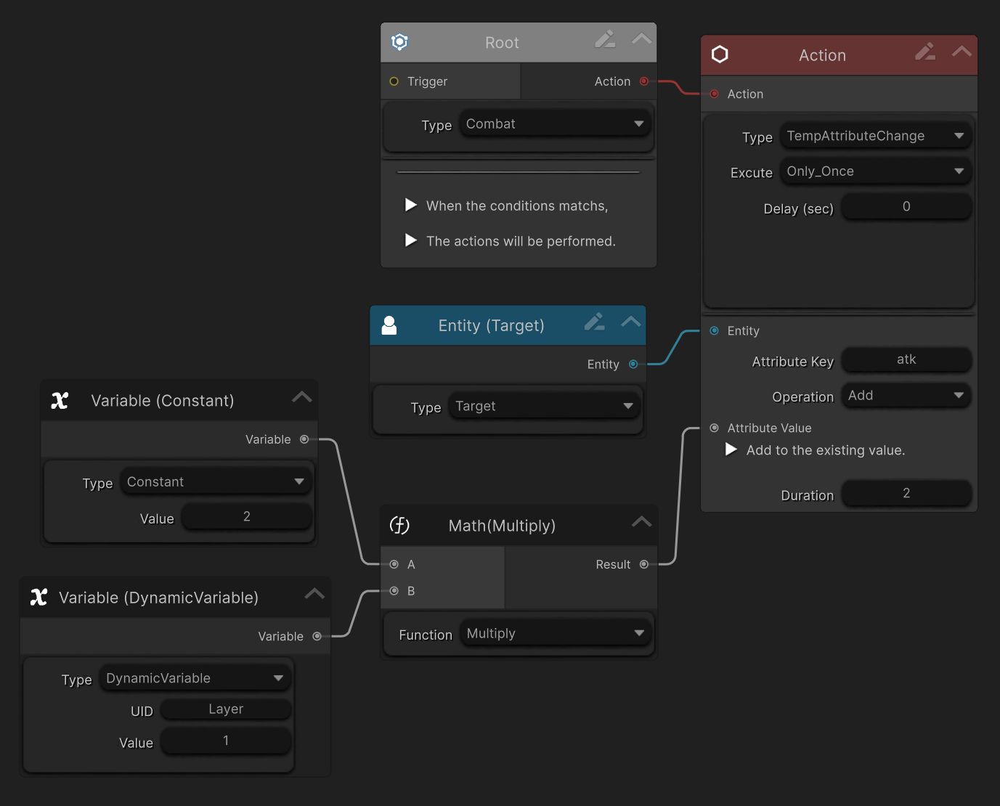

This guide walks you through creating your first buff effect using **Master Combat Core**.

### Prerequisites
Before starting, make sure:
- You already have a `player character`.
- An [EntityComponent] has been added to the player prefab (from the previous guide)
- Core [Attribute]s have been set up (e.g. hp, attack)

### Step 1 — Create the Buff Graph
1. Right-click in the Project Window and create a new [GraphObject]:
    -  `Create > Soft Kitty > Node Graph Object`
2. Double-click the asset to open it in the **Graph Editor**
3. Create two [Variable Node]s and set their type to .
4. Configure them as follows:
   |UID|Type|Default Value|
   |---|---|---|
   |N/A|Constant|2|
   |Layer|[Dynamic Variables]|1|
5. Add a [Math Node] → **Multiply**.
6. Connect both [Variable Node]s to the input ports of the `Multiply` [Math Node].

---

### Step 2 — Configure Always-On Execution

7. Remove the Trigger Node and Condition Node.
    - `Buff graphs are executed continuously by the Over-Time Effect system and do not require triggers.`

8. Create a `Target` [Entity Node] and connect it to the `Entity` input of an **`TempAttributeChange`** [Action Node].
   Make sure the type of the [Action Node] is **[TempAttribute]Change** not `AttributeChange`.

9. Connect the `Multiply` [Math Node] output to the Value input of the `AttributeChange` [Action Node].
10. Configure the [Action Node]:
    - **Attribute UID**: atk
    - **Operation**: Add
    - **Duration**: 2

    Your graph should now look like this:



---

### Step 3 — Create the Over Time Effect (OTE)

11.  Go to: 
     - `Project Settings > SoftKitty > SubData - Over Time Effect`
12. Click **`Add New OverTimeEffect`**.
13. Fill in basic information such as:
     - `Display Name`
     - `Category`
     - `Duration`
14. Set:
     - **UID**: rage
     - **Design Graph**: drag in the Buff Graph you just created
15. Enable:
     - **`Can Be Refreshed`**
     - **`Layered`**
     - Set **`Maximum Layer`** to 99

---

### Step 4 — Apply the Buff via Code

You can now apply the Buff to an entity using code:
```csharp
GameManager.GetPlayer().AddOverTimeEffect("rage", null);
```
During runtime:
- Monitor the [EntityComponent] Inspector.
- Repeatedly apply the Buff
- Observe that:
    - The effect stacks
    - Buff scales with the number of layers
    - The player’s attack increases accordingly

---

### Step 5 — Apply Buff from a Damage Graph (On Hit)

You can also apply a Buff from another Graph.
  1. Open the `Damage Graph` created in the previous guide.
  2. Add a new [Action Node].
  3. Change its type to **`OverTimeEffect`**.
  4. Set:
     - `Effect ID` to the **integer ID** of `rage`
     - Connect the `Dealer` [Entity Node] to this [Action Node]

Now, when the damage graph executes:
  - `rage` is added to the attacker on hit

---

### Result

You now have:

- A fully functional Damage-over-Time system
- Layered and refreshable effects
- Graph-driven buff logic
- Reusable buff behavior across skills, weapons, and enemies

---

### Notes & Best Practices

- [TempAttribute] for time-based modifiers applied to attributes

- The same Buff graph can be reused across multiple effects

---


<!-- API LINKS -->
[Loot Pack]:/docs/master-inventory-engine/item-class/loot-pack
[Item Database Settings]:/docs/master-inventory-engine/settings
[ItemChangeCallback]:/docs/master-inventory-engine/callbacks
[ItemDropCallback]:/docs/master-inventory-engine/callbacks
[ItemUseCallback]:/docs/master-inventory-engine/callbacks
[Callbacks]:/docs/master-inventory-engine/callbacks
[LinkIcon]:/docs/master-inventory-engine/ui/item-icon
[InventoryItem]:/docs/master-inventory-engine/ui/item-icon
[ItemIcon]:/docs/master-inventory-engine/ui/item-icon
[WindowsManager]:/docs/master-inventory-engine/ui/windows-manager
[Enchantment]: /docs/master-inventory-engine/item-class/enchantment
[InventoryStack]: /docs/master-inventory-engine/item-class/inventory-stack
[InventoryData]: /docs/master-inventory-engine/item-class/item-data
[Item]: /docs/master-inventory-engine/item-class/item
[ItemObject]: /docs/master-inventory-engine/item-class/item-object
[Attribute]: /docs/core/attributes/Attribute
[AttributeData]: /docs/core/attributes/AttributeData
[AttributeObject]: /docs/core/attributes/AttributeObject
[TempAttribute]: /docs/core/attributes/TempAttribute
[Entity]: /docs/core/entities/Entity
[Entities]: /docs/core/entities/Entity
[EntityComponent]: /docs/core/entities/EntityComponent
[EntityManagerObject]: /docs/core/entities/EntityManagerObject
[OverTimeEffect]: /docs/core/over-time-effects/OverTimeEffect
[OverTimeEffectData]: /docs/core/over-time-effects/OverTimeEffectData
[OverTimeEffectObject]: /docs/core/over-time-effects/OverTimeEffectObject
[DataObject]: /docs/core/general/DataObject
[GameManager]: /docs/core/general/game-manager
[AssetLoader]: /docs/core/general/AssetLoader
[SGD_Settings]: /docs/core/general/SGD_Settings
[GraphInstance]: /docs/master-combat-core/damage-component/graphinstance
[Dynamic Variables]: /docs/master-combat-core/graph-system/dynamic-variables
[DynamicFloat]: /docs/master-combat-core/graph-system/dynamic-variables
[OverTimeEffectInstance]: /docs/master-combat-core/damage-component/over-time-effect-instance
[CombatDamage]: /docs/master-combat-core/damage-component/combat-damage
[GraphObject]: /docs/master-combat-core/graph-system/GraphObject
[CustomData]:/docs/core/CustomData
[AttributeChangeEvent]: /docs/core/attributes/AttributeData
[OverTimeEffectChangeEvent]:/docs/core/over-time-effects/OverTimeEffectData
[EntityEvent]:/docs/core/entities/Entity
[IntList]:/docs/core/CustomData
[IdIntList]:/docs/core/CustomData
[IdFloatList]:/docs/core/CustomData
[Action Node]:/docs/master-combat-core/nodes/action
[Branch Node]:/docs/master-combat-core/nodes/branch
[Condition Node]:/docs/master-combat-core/nodes/condition
[Condition Group Node]:/docs/master-combat-core/nodes/condition
[Entity Node]:/docs/master-combat-core/nodes/entity
[Trigger Node]:/docs/master-combat-core/nodes/trigger
[Variable Node]:/docs/master-combat-core/nodes/variable-math
[Math Node]:/docs/master-combat-core/nodes/variable-math
<!-- API LINKS -->