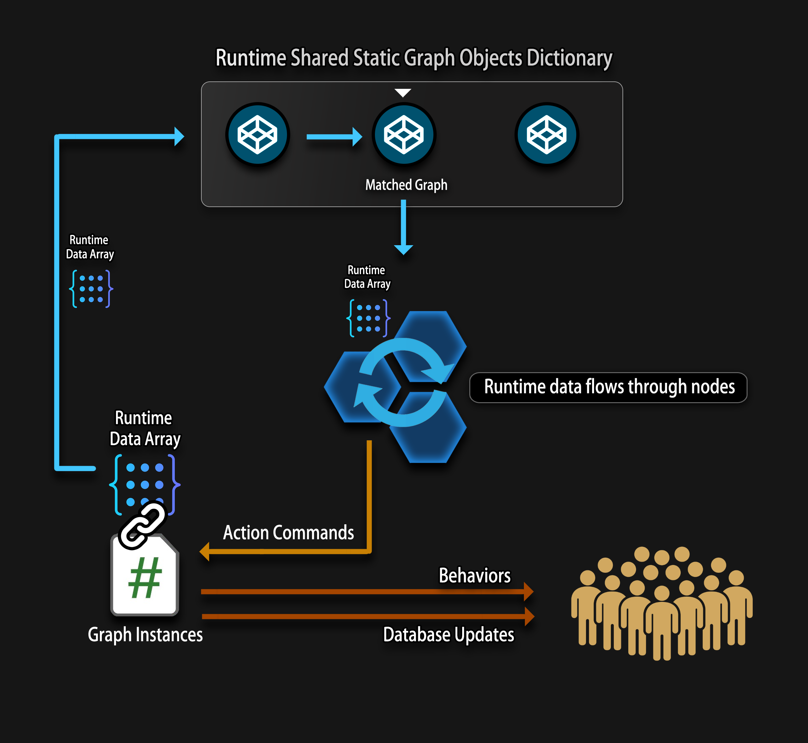

---
The diagram above illustrates how [GraphObject]s are executed at runtime using [GraphInstance]s.

At runtime, [GraphObject]s themselves are not executed directly. Instead, the system follows this flow:

---

#### 1. Graph Matching & Caching

All [GraphObject]s are stored in a **runtime shared static dictionary**.

When a GraphInstance system (such as [CombatDamage] or [OverTimeEffectInstance]) requests execution:

- The matching [GraphObject] is located.

This allows multiple entities and systems to share the same graph definition efficiently.

---

#### 2. Runtime Data Injection

Each [GraphInstance] contains a runtime data array, which contains:

- [Entity] references (Dealer, Target, etc.)

- [Dynamic Variables]

- Temporary execution data

This data array represents the **execution context** of the graph.

---

#### 3. Node Execution

The runtime data flows through the graph nodes:

- [Condition Node]s evaluate logic

- [Math Node]s and [Variable Node]s transform data

- [Action Node]s generate **action commands**

The graph itself remains immutable; only the runtime data changes.

---

#### 4. Action Commands & Effects

[Action Node]s emit **action commands**, which are handled by:

- Behavior systems

- Database update systems

These commands can:

- Modify [Entity] [AttributeData]

- Apply behaviors (damage, buffs, effects)

- Trigger gameplay reactions

---

#### 5. Results Applied to Gameplay

Finally:

- The database is updated

- Behaviors are executed

- Entities reflect the results in gameplay and visuals

The [GraphInstance] then waits for the next execution or is recycled.

---

#### Key Takeaways

- [GraphObject] = design-time blueprint

- [GraphInstance] = runtime executor

- Runtime data is isolated per execution

- Graph logic is reusable, safe, and scalable

---

<!-- API LINKS -->
[Loot Pack]:/docs/master-inventory-engine/item-class/loot-pack
[Item Database Settings]:/docs/master-inventory-engine/settings
[ItemChangeCallback]:/docs/master-inventory-engine/callbacks
[ItemDropCallback]:/docs/master-inventory-engine/callbacks
[ItemUseCallback]:/docs/master-inventory-engine/callbacks
[Callbacks]:/docs/master-inventory-engine/callbacks
[LinkIcon]:/docs/master-inventory-engine/ui/item-icon
[InventoryItem]:/docs/master-inventory-engine/ui/item-icon
[ItemIcon]:/docs/master-inventory-engine/ui/item-icon
[WindowsManager]:/docs/master-inventory-engine/ui/windows-manager
[Enchantment]: /docs/master-inventory-engine/item-class/enchantment
[InventoryStack]: /docs/master-inventory-engine/item-class/inventory-stack
[InventoryData]: /docs/master-inventory-engine/item-class/item-data
[Item]: /docs/master-inventory-engine/item-class/item
[ItemObject]: /docs/master-inventory-engine/item-class/item-object
[Attribute]: /docs/core/attributes/Attribute
[AttributeData]: /docs/core/attributes/AttributeData
[AttributeObject]: /docs/core/attributes/AttributeObject
[TempAttribute]: /docs/core/attributes/TempAttribute
[Entity]: /docs/core/entities/Entity
[Entities]: /docs/core/entities/Entity
[EntityComponent]: /docs/core/entities/EntityComponent
[EntityManagerObject]: /docs/core/entities/EntityManagerObject
[OverTimeEffect]: /docs/core/over-time-effects/OverTimeEffect
[OverTimeEffectData]: /docs/core/over-time-effects/OverTimeEffectData
[OverTimeEffectObject]: /docs/core/over-time-effects/OverTimeEffectObject
[DataObject]: /docs/core/general/DataObject
[GameManager]: /docs/core/general/game-manager
[AssetLoader]: /docs/core/general/AssetLoader
[SGD_Settings]: /docs/core/general/SGD_Settings
[GraphInstance]: /docs/master-combat-core/damage-component/graphinstance
[Dynamic Variables]: /docs/master-combat-core/graph-system/dynamic-variables
[DynamicFloat]: /docs/master-combat-core/graph-system/dynamic-variables
[OverTimeEffectInstance]: /docs/master-combat-core/damage-component/over-time-effect-instance
[CombatDamage]: /docs/master-combat-core/damage-component/combat-damage
[GraphObject]: /docs/master-combat-core/graph-system/GraphObject
[CustomData]:/docs/core/CustomData
[AttributeChangeEvent]: /docs/core/attributes/AttributeData
[OverTimeEffectChangeEvent]:/docs/core/over-time-effects/OverTimeEffectData
[EntityEvent]:/docs/core/entities/Entity
[IntList]:/docs/core/CustomData
[IdIntList]:/docs/core/CustomData
[IdFloatList]:/docs/core/CustomData
[Action Node]:/docs/master-combat-core/nodes/action
[Branch Node]:/docs/master-combat-core/nodes/branch
[Condition Node]:/docs/master-combat-core/nodes/condition
[Condition Group Node]:/docs/master-combat-core/nodes/condition
[Entity Node]:/docs/master-combat-core/nodes/entity
[Trigger Node]:/docs/master-combat-core/nodes/trigger
[Variable Node]:/docs/master-combat-core/nodes/variable-math
[Math Node]:/docs/master-combat-core/nodes/variable-math
<!-- API LINKS -->