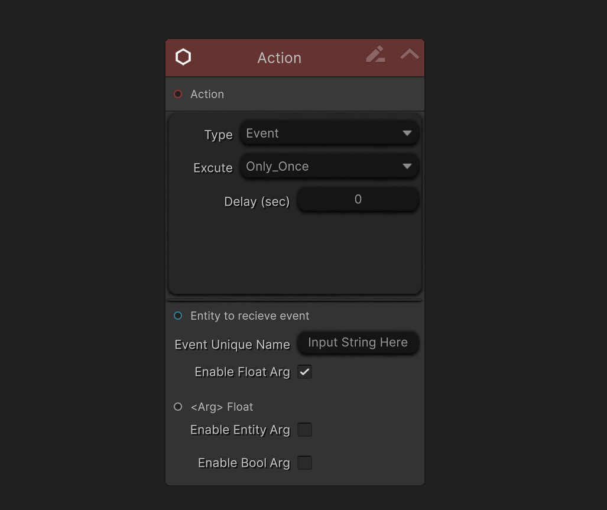

### Overview

`Action Nodes` represent executable operations in the graph system. They are responsible for performing concrete actions such as applying damage, modifying [Attribute], adding [OverTimeEffect], triggering events, or writing data changes during combat execution.

When an `Action Node` is evaluated, it executes its logic immediately based on the current execution context and input data.

---

### Purpose

`Action Nodes` are used to:

- Apply gameplay effects (damage, healing, buffs, debuffs)

- Modify [Entity] or backend data

- Trigger combat-related behaviors

- Produce the final outcome of a graph execution

They are the core nodes that produce results, rather than controlling flow or evaluating conditions.

---

### Execution Behavior

- `Action Nodes` are executed when reached during graph evaluation.

- They operate purely on backend data and do not require [Entity] instances.

- Results are written directly to the combat data context.

- Visual or presentation updates are handled separately by the [Entity] layer.

---

### Port Connection Rules
#### Input Ports

- Default `Input Port`
  - Can connect from a `Root Node`
  - Can connect from a [Branch Node]

- Additional `Input Ports`
(Availability depends on the specific `Action Node` implementation)
  - Can connect from [Variable Node]
  - Can connect from [Math Node]
  - Can connect from [Entity Node]

These input ports provide the data required for the `Action Node` to execute its logic.

---

#### Output Ports

- None
  `Action Nodes` do not expose output ports and represent the terminal step of an execution path.

---

### Common Use Cases

- Typical `Action Nodes` include:

- Deal Damage

- Modify [Attribute]

- Add or Remove [OverTimeEffect]

- Update [CustomData] values

- Trigger combat-related state changes

`Action Nodes` are usually placed at the end of an execution branch, following flow-control or condition nodes.

---

### Design Philosophy

`Action Nodes` are intentionally stateless and data-driven.

This design makes them:

- Easy to reuse across different graphs

- Safe to evaluate multiple times

- Suitable for simulation, preview, and backend-only execution

---

### Summary

- `Action Nodes` execute logic

- They do not control flow

- They do not produce outputs

- They finalize execution paths

---

<!-- API LINKS -->
[Loot Pack]:/docs/master-inventory-engine/item-class/loot-pack
[Item Database Settings]:/docs/master-inventory-engine/settings
[ItemChangeCallback]:/docs/master-inventory-engine/callbacks
[ItemDropCallback]:/docs/master-inventory-engine/callbacks
[ItemUseCallback]:/docs/master-inventory-engine/callbacks
[Callbacks]:/docs/master-inventory-engine/callbacks
[LinkIcon]:/docs/master-inventory-engine/ui/item-icon
[InventoryItem]:/docs/master-inventory-engine/ui/item-icon
[ItemIcon]:/docs/master-inventory-engine/ui/item-icon
[WindowsManager]:/docs/master-inventory-engine/ui/windows-manager
[Enchantment]: /docs/master-inventory-engine/item-class/enchantment
[InventoryStack]: /docs/master-inventory-engine/item-class/inventory-stack
[InventoryData]: /docs/master-inventory-engine/item-class/item-data
[Item]: /docs/master-inventory-engine/item-class/item
[ItemObject]: /docs/master-inventory-engine/item-class/item-object
[Attribute]: /docs/core/attributes/Attribute
[AttributeData]: /docs/core/attributes/AttributeData
[AttributeObject]: /docs/core/attributes/AttributeObject
[TempAttribute]: /docs/core/attributes/TempAttribute
[Entity]: /docs/core/entities/Entity
[Entities]: /docs/core/entities/Entity
[EntityComponent]: /docs/core/entities/EntityComponent
[EntityManagerObject]: /docs/core/entities/EntityManagerObject
[OverTimeEffect]: /docs/core/over-time-effects/OverTimeEffect
[OverTimeEffectData]: /docs/core/over-time-effects/OverTimeEffectData
[OverTimeEffectObject]: /docs/core/over-time-effects/OverTimeEffectObject
[DataObject]: /docs/core/general/DataObject
[GameManager]: /docs/core/general/game-manager
[AssetLoader]: /docs/core/general/AssetLoader
[SGD_Settings]: /docs/core/general/SGD_Settings
[GraphInstance]: /docs/master-combat-core/damage-component/graphinstance
[Dynamic Variables]: /docs/master-combat-core/graph-system/dynamic-variables
[DynamicFloat]: /docs/master-combat-core/graph-system/dynamic-variables
[OverTimeEffectInstance]: /docs/master-combat-core/damage-component/over-time-effect-instance
[CombatDamage]: /docs/master-combat-core/damage-component/combat-damage
[GraphObject]: /docs/master-combat-core/graph-system/GraphObject
[CustomData]:/docs/core/CustomData
[AttributeChangeEvent]: /docs/core/attributes/AttributeData
[OverTimeEffectChangeEvent]:/docs/core/over-time-effects/OverTimeEffectData
[EntityEvent]:/docs/core/entities/Entity
[IntList]:/docs/core/CustomData
[IdIntList]:/docs/core/CustomData
[IdFloatList]:/docs/core/CustomData
[Action Node]:/docs/master-combat-core/nodes/action
[Branch Node]:/docs/master-combat-core/nodes/branch
[Condition Node]:/docs/master-combat-core/nodes/condition
[Condition Group Node]:/docs/master-combat-core/nodes/condition
[Entity Node]:/docs/master-combat-core/nodes/entity
[Trigger Node]:/docs/master-combat-core/nodes/trigger
[Variable Node]:/docs/master-combat-core/nodes/variable-math
[Math Node]:/docs/master-combat-core/nodes/variable-math
<!-- API LINKS -->