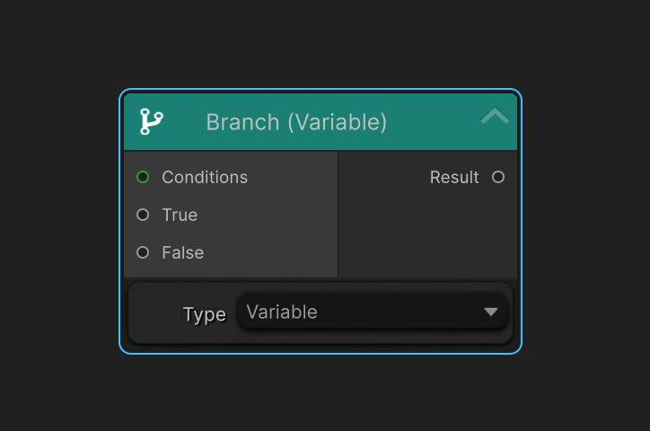

### Overview

`Branch Nodes` are flow-control nodes used to evaluate conditions and determine which execution path the graph should follow. They have a **True** input and a **False** input, along with a [condition](/docs/master-combat-core/nodes/condition) type input to determin whether forward the **True** input or **False** input.

`Branch Nodes` enable conditional logic such as comparisons, checks, and rule evaluation within the graph system.

---

### Purpose

`Branch Nodes` are used to:

- Control execution flow based on conditions
- Compare values and make decisions
- Split execution paths dynamically
- Gate Action Nodes behind logical rules

They are the primary mechanism for implementing if / else-style logic in the graph.

---

### Execution Behavior

- `Branch Nodes` are evaluated when reached during graph execution.

- They read input values and evaluate a condition.

- Based on the result, execution continues through the corresponding output port.

- `Branch Nodes` do not modify data directly.

---

### Port Connection Rules
#### Input Ports

- `Condition Type Input Port`
  - Can connect from a [Condition Node]

- `True/False Input Ports`
(Availability depends on the specific `Branch Type` implementation)
  - Can connect from [Variable Node]
  - Can connect from [Math Node]
  - Can connect from [Entity Node]
  - Can connect from a `Root Node`
  - Can connect from another `Branch Node`

These ports supply the data required to evaluate the branch condition.

---

#### Output Ports

- Outputs

  - Output ports represent possible evaluation results (for example, True / False).

  - Output port can connect to:
  (Availability depends on the specific `Branch Type` implementation)

    - `Branch Nodes`
    - [Variable Node]
    - [Math Node]
    - [Action Node]
    - [Condition Node]

Execution continues through the output port that matches the evaluation result.

---

### Common Use Cases

Typical `Branch Nodes` include:

- State or flag checks

- Cooldown or timing validation

- Custom rule evaluation

`Branch Nodes` are commonly placed between the `Root Node` and [Action Node], or chained together to form complex decision logic.

---

### Design Philosophy

`Branch Nodes` focus exclusively on decision-making.

They:

- Do not execute gameplay effects

- Do not modify backend data

This separation improves readability, reusability, and maintainability of combat graphs.

---

### Summary

- `Branch Nodes` evaluate conditions

- They control execution flow

- They do not produce gameplay effects

- They direct execution toward Branch or Action Nodes

---

<!-- API LINKS -->
[Loot Pack]:/docs/master-inventory-engine/item-class/loot-pack
[Item Database Settings]:/docs/master-inventory-engine/settings
[ItemChangeCallback]:/docs/master-inventory-engine/callbacks
[ItemDropCallback]:/docs/master-inventory-engine/callbacks
[ItemUseCallback]:/docs/master-inventory-engine/callbacks
[Callbacks]:/docs/master-inventory-engine/callbacks
[LinkIcon]:/docs/master-inventory-engine/ui/item-icon
[InventoryItem]:/docs/master-inventory-engine/ui/item-icon
[ItemIcon]:/docs/master-inventory-engine/ui/item-icon
[WindowsManager]:/docs/master-inventory-engine/ui/windows-manager
[Enchantment]: /docs/master-inventory-engine/item-class/enchantment
[InventoryStack]: /docs/master-inventory-engine/item-class/inventory-stack
[InventoryData]: /docs/master-inventory-engine/item-class/item-data
[Item]: /docs/master-inventory-engine/item-class/item
[ItemObject]: /docs/master-inventory-engine/item-class/item-object
[Attribute]: /docs/core/attributes/Attribute
[AttributeData]: /docs/core/attributes/AttributeData
[AttributeObject]: /docs/core/attributes/AttributeObject
[TempAttribute]: /docs/core/attributes/TempAttribute
[Entity]: /docs/core/entities/Entity
[Entities]: /docs/core/entities/Entity
[EntityComponent]: /docs/core/entities/EntityComponent
[EntityManagerObject]: /docs/core/entities/EntityManagerObject
[OverTimeEffect]: /docs/core/over-time-effects/OverTimeEffect
[OverTimeEffectData]: /docs/core/over-time-effects/OverTimeEffectData
[OverTimeEffectObject]: /docs/core/over-time-effects/OverTimeEffectObject
[DataObject]: /docs/core/general/DataObject
[GameManager]: /docs/core/general/game-manager
[AssetLoader]: /docs/core/general/AssetLoader
[SGD_Settings]: /docs/core/general/SGD_Settings
[GraphInstance]: /docs/master-combat-core/damage-component/graphinstance
[Dynamic Variables]: /docs/master-combat-core/graph-system/dynamic-variables
[DynamicFloat]: /docs/master-combat-core/graph-system/dynamic-variables
[OverTimeEffectInstance]: /docs/master-combat-core/damage-component/over-time-effect-instance
[CombatDamage]: /docs/master-combat-core/damage-component/combat-damage
[GraphObject]: /docs/master-combat-core/graph-system/GraphObject
[CustomData]:/docs/core/CustomData
[AttributeChangeEvent]: /docs/core/attributes/AttributeData
[OverTimeEffectChangeEvent]:/docs/core/over-time-effects/OverTimeEffectData
[EntityEvent]:/docs/core/entities/Entity
[IntList]:/docs/core/CustomData
[IdIntList]:/docs/core/CustomData
[IdFloatList]:/docs/core/CustomData
[Action Node]:/docs/master-combat-core/nodes/action
[Branch Node]:/docs/master-combat-core/nodes/branch
[Condition Node]:/docs/master-combat-core/nodes/condition
[Condition Group Node]:/docs/master-combat-core/nodes/condition
[Entity Node]:/docs/master-combat-core/nodes/entity
[Trigger Node]:/docs/master-combat-core/nodes/trigger
[Variable Node]:/docs/master-combat-core/nodes/variable-math
[Math Node]:/docs/master-combat-core/nodes/variable-math
<!-- API LINKS -->