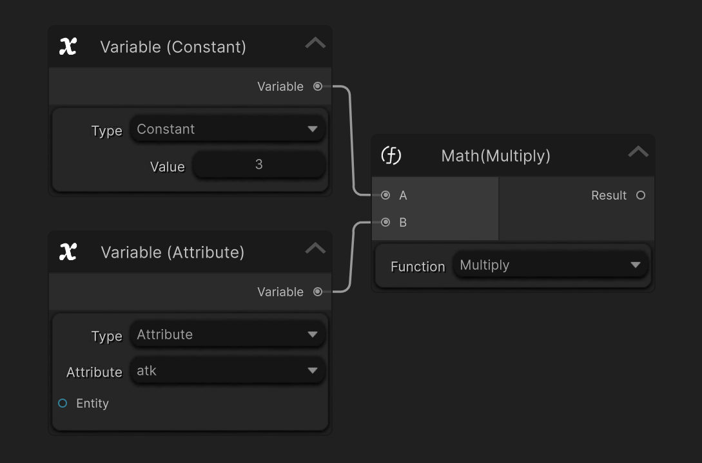

### Overview

`Variable Nodes` and `Math Nodes` are data-oriented nodes used to retrieve, calculate, and transform values within the graph system. They do not control execution flow or perform gameplay actions, but instead provide data to other nodes.

These nodes act as the `data layer` of the graph and are commonly used to supply inputs for [Branch Node], [Condition Node] and [Action Node].

---

### Purpose

`Variable` and `Math` Nodes are used to:

- Read values from data sources

- Perform calculations and value transformations

- Provide computed results to other nodes

- Support conditional logic and action execution

They enable dynamic, data-driven behavior without hardcoding values.

---

### Execution Behavior

- `Variable` and `Math` Nodes are evaluated on demand when their output values are required.

- They do not participate in execution flow directly.

- They do not modify backend data.

These nodes simply return values based on their inputs and configuration.

---

### Port Connection Rules
#### Input Ports
`Variable Nodes` & `Math Nodes` Input ports can connect from:

- [Variable Node]
  
- [Math Node]
  
- [Branch Node]
  
- [Entity Node]

Input ports provide the operands or source values used for evaluation.

#### Output Ports
Value Output Port can connect to:
- [Branch Node]

- [Action Node] (where applicable)

- [Math Node]

- [Condition Node] (where applicable)
  
Output ports always represent a computed or retrieved value.

---

### Common Use Cases

Typical `Variable` and `Math` Node use cases include:

- Reading [Attribute] values

- Fetching [CustomData] values

- Calculating damage or healing amounts

- Applying multipliers or modifiers

- Comparing values in [Branch Node]

These nodes are usually upstream of [Condition Node],[Branch Node] or [Action Node].

---

### Design Philosophy

`Variable` and `Math` Nodes are designed to be:

- Pure (no side effects)

- Reusable across different graphs

- Composable to build complex calculations

By keeping data retrieval and calculation separate from flow and execution, the system remains flexible and easy to reason about.

---

### Summary

- `Variable` & `Math` Nodes provide data

- They do not control execution flow

- They do not modify backend data

---

<!-- API LINKS -->
[Loot Pack]:/docs/master-inventory-engine/item-class/loot-pack
[Item Database Settings]:/docs/master-inventory-engine/settings
[ItemChangeCallback]:/docs/master-inventory-engine/callbacks
[ItemDropCallback]:/docs/master-inventory-engine/callbacks
[ItemUseCallback]:/docs/master-inventory-engine/callbacks
[Callbacks]:/docs/master-inventory-engine/callbacks
[LinkIcon]:/docs/master-inventory-engine/ui/item-icon
[InventoryItem]:/docs/master-inventory-engine/ui/item-icon
[ItemIcon]:/docs/master-inventory-engine/ui/item-icon
[WindowsManager]:/docs/master-inventory-engine/ui/windows-manager
[Enchantment]: /docs/master-inventory-engine/item-class/enchantment
[InventoryStack]: /docs/master-inventory-engine/item-class/inventory-stack
[InventoryData]: /docs/master-inventory-engine/item-class/item-data
[Item]: /docs/master-inventory-engine/item-class/item
[ItemObject]: /docs/master-inventory-engine/item-class/item-object
[Attribute]: /docs/core/attributes/Attribute
[AttributeData]: /docs/core/attributes/AttributeData
[AttributeObject]: /docs/core/attributes/AttributeObject
[TempAttribute]: /docs/core/attributes/TempAttribute
[Entity]: /docs/core/entities/Entity
[Entities]: /docs/core/entities/Entity
[EntityComponent]: /docs/core/entities/EntityComponent
[EntityManagerObject]: /docs/core/entities/EntityManagerObject
[OverTimeEffect]: /docs/core/over-time-effects/OverTimeEffect
[OverTimeEffectData]: /docs/core/over-time-effects/OverTimeEffectData
[OverTimeEffectObject]: /docs/core/over-time-effects/OverTimeEffectObject
[DataObject]: /docs/core/general/DataObject
[GameManager]: /docs/core/general/game-manager
[AssetLoader]: /docs/core/general/AssetLoader
[SGD_Settings]: /docs/core/general/SGD_Settings
[GraphInstance]: /docs/master-combat-core/damage-component/graphinstance
[Dynamic Variables]: /docs/master-combat-core/graph-system/dynamic-variables
[DynamicFloat]: /docs/master-combat-core/graph-system/dynamic-variables
[OverTimeEffectInstance]: /docs/master-combat-core/damage-component/over-time-effect-instance
[CombatDamage]: /docs/master-combat-core/damage-component/combat-damage
[GraphObject]: /docs/master-combat-core/graph-system/GraphObject
[CustomData]:/docs/core/CustomData
[AttributeChangeEvent]: /docs/core/attributes/AttributeData
[OverTimeEffectChangeEvent]:/docs/core/over-time-effects/OverTimeEffectData
[EntityEvent]:/docs/core/entities/Entity
[IntList]:/docs/core/CustomData
[IdIntList]:/docs/core/CustomData
[IdFloatList]:/docs/core/CustomData
[Action Node]:/docs/master-combat-core/nodes/action
[Branch Node]:/docs/master-combat-core/nodes/branch
[Condition Node]:/docs/master-combat-core/nodes/condition
[Condition Group Node]:/docs/master-combat-core/nodes/condition
[Entity Node]:/docs/master-combat-core/nodes/entity
[Trigger Node]:/docs/master-combat-core/nodes/trigger
[Variable Node]:/docs/master-combat-core/nodes/variable-math
[Math Node]:/docs/master-combat-core/nodes/variable-math
<!-- API LINKS -->