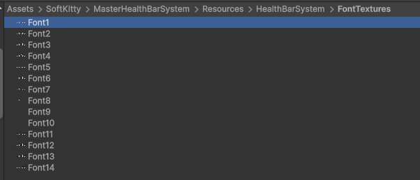
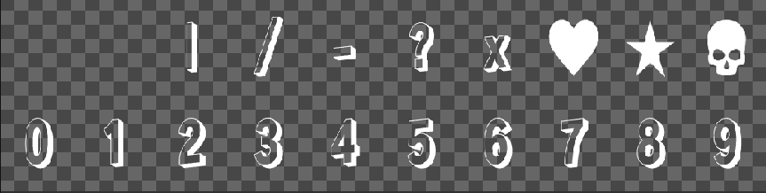

---

## Customize Font

You can create your own font texture atlas and use it for bar value text and floating combat text.
Custom fonts are loaded from the built-in `Resources` path, so once the texture is added with the correct naming convention, it becomes available in the system settings.

---

## Folder Location

Place custom font textures in:

`Assets/SoftKitty/MasterHealthBarSystem/Resources/HealthBarSystem/FontTextures/`

---

## Naming Rule

Every custom font texture must follow this naming pattern:

`Font#.png`

- `#` is the numeric ID of the font.
- Check the existing files in the folder.
- Use the next available number after the current largest ID.

For example, if the highest existing file is `Font4.png`, the next custom font should be named `Font5.png`.

---

## Texture Requirements

The font texture is a fixed-layout texture atlas.

- Width: `1024 px`
- Height: `256 px`
- Grid: `10 columns x 2 rows`
- Cell size: approximately `102 x 128 px` per cell
- In the `Texture Import Settings`, **check** `Alpha Is Transparency`, **uncheck** `Generate Mipmap`, select `Wrap Mode` to `Clamp`

The system expects every glyph to appear in a specific cell, so the layout must match the built-in format exactly.

---

## Character Layout

### Bottom Row

The bottom row stores the digits `0` to `9`, from left to right:

- `0`
- `1`
- `2`
- `3`
- `4`
- `5`
- `6`
- `7`
- `8`
- `9`

### Top Row

The top row stores symbols from left to right:

- `Not used`
- `Not used`
- `|`
- `/`
- `.`
- `?`
- `x`
- `Heart`
- `Star`
- `Skull`

This means the top row is not arranged left-to-right like the number row. Be careful to place each symbol in the expected slot.

---

## Supported Symbols

In addition to digits, the font atlas supports these symbols:

- `|`
- `/`
- `.`
- `?`
- `x`
- `Heart`
- `Star`
- `Skull`

These symbols are useful when formatting health text through the `Value Format` field in [Bar Settings].

---

## Workflow

1. Duplicate an existing font texture if you want a safe starting point.
2. Edit the atlas while preserving the original cell layout.
3. Save the new texture as `Font#.png` in the correct folder.
4. Return to the project and select the new font ID in:
   - [Bar Settings] for bar value text
   - [Floating Combat Text Settings] for popping number text

---

## Best Practices

- Keep all glyphs centered consistently inside their cells.
- Maintain strong readability at gameplay scale, not only in the texture editor.
- Avoid overly thin strokes if the font will be used on small bars.
- Test the font with long formats such as `9999/9999` to make sure the spacing still looks correct.
- If you use special icons such as `Heart` or `Skull`, verify that they remain visually balanced with the numeric glyphs.

---

## Related Settings

- Use [Bar Settings] to choose the font for bar value text.
- Use [Floating Combat Text Settings] to choose the font for floating combat text.

---

<!-- API LINKS -->
[BarSetting]: /docs/master-gpu-healthbar/settings/bar-settings
[Bar Settings]: /docs/master-gpu-healthbar/settings/bar-settings
[Floating Combat Text Settings]: /docs/master-gpu-healthbar/settings/floating-combat-text-settings
[Floating Combat Text Setting]: /docs/master-gpu-healthbar/settings/floating-combat-text-settings
[Overhead Settings]: /docs/master-gpu-healthbar/settings/overhead-settings
[Overhead Setting]: /docs/master-gpu-healthbar/settings/overhead-settings
[HealthBarObject]: /docs/master-gpu-healthbar/settings/overview
[Font]: /docs/master-gpu-healthbar/customize-font
[Bar Style]: /docs/master-gpu-healthbar/customize-healthbar
[Health Bar]: /docs/master-gpu-healthbar/assign-healthbar
[Static Bar]: /docs/master-gpu-healthbar/static-healthbar
[BarUI]: /docs/master-gpu-healthbar/api/bar-ui
[HealthBar]: /docs/master-gpu-healthbar/api/health-bar
[HealthBarCanvas]: /docs/master-gpu-healthbar/api/health-bar-canvas
[HealthBarManager]: /docs/master-gpu-healthbar/api/health-bar-manager
[EntityModule]: /docs/core/entities/EntityModule
[Attribute]: /docs/core/attributes/Attribute
[AttributeData]: /docs/core/attributes/AttributeData
[AttributeObject]: /docs/core/attributes/AttributeObject
[TempAttribute]: /docs/core/attributes/TempAttribute
[Entity]: /docs/core/entities/Entity
[Entities]: /docs/core/entities/Entity
[EntityComponent]: /docs/core/entities/EntityComponent
[EntityManagerObject]: /docs/core/entities/EntityManagerObject
[OverTimeEffect]: /docs/core/over-time-effects/OverTimeEffect
[OverTimeEffectData]: /docs/core/over-time-effects/OverTimeEffectData
[OverTimeEffectObject]: /docs/core/over-time-effects/OverTimeEffectObject
[DataObject]: /docs/core/general/DataObject
[GameManager]: /docs/core/general/game-manager
[AssetLoader]: /docs/core/general/AssetLoader
[SGD_Settings]: /docs/core/general/SGD_Settings
[GraphInstance]: /docs/master-combat-core/damage-component/graphinstance
[Dynamic Variables]: /docs/master-combat-core/graph-system/dynamic-variables
[DynamicFloat]: /docs/master-combat-core/graph-system/dynamic-variables
[OverTimeEffectInstance]: /docs/master-combat-core/damage-component/over-time-effect-instance
[CombatDamage]: /docs/master-combat-core/damage-component/combat-damage
[GraphObject]: /docs/master-combat-core/graph-system/GraphObject
[CustomData]:/docs/core/CustomData
[AttributeChangeEvent]: /docs/core/attributes/AttributeData
[OverTimeEffectChangeEvent]:/docs/core/over-time-effects/OverTimeEffectData
[EntityEvent]:/docs/core/entities/Entity
[IntList]:/docs/core/CustomData
[IdIntList]:/docs/core/CustomData
[IdFloatList]:/docs/core/CustomData
[Action Node]:/docs/master-combat-core/nodes/action
[Branch Node]:/docs/master-combat-core/nodes/branch
[Condition Node]:/docs/master-combat-core/nodes/condition
[Condition Group Node]:/docs/master-combat-core/nodes/condition
[Entity Node]:/docs/master-combat-core/nodes/entity
[Trigger Node]:/docs/master-combat-core/nodes/trigger
[Variable Node]:/docs/master-combat-core/nodes/variable-math
[Math Node]:/docs/master-combat-core/nodes/variable-math
<!-- API LINKS -->