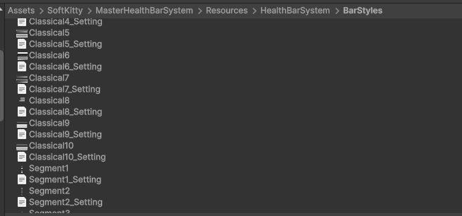
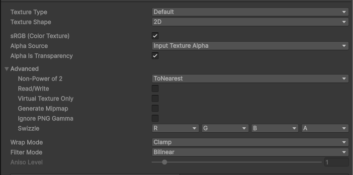
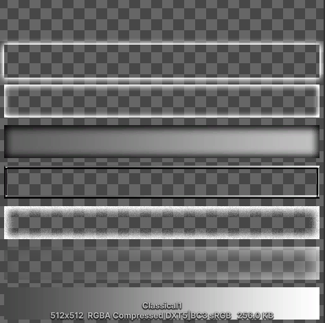
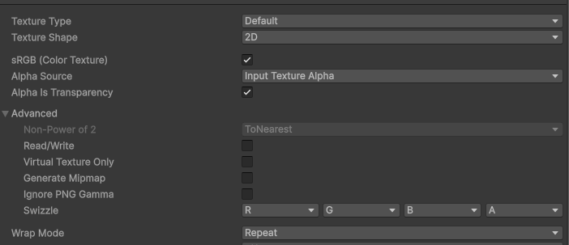
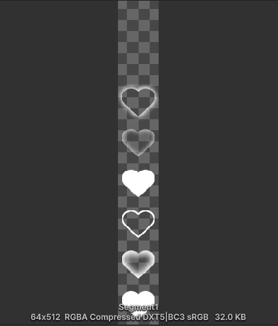
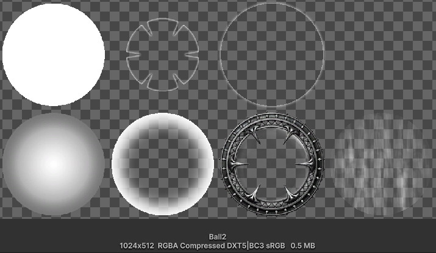

---

## Customize Health Bar

You can create your own custom bar texture atlases for all supported bar styles.
Once a texture is placed in the correct `Resources` folder and follows the expected naming and layout rules, it can be selected directly from [Bar Settings].

---

## Folder Location

Place custom bar textures in:

`Assets/SoftKitty/MasterHealthBarSystem/Resources/HealthBarSystem/BarStyles/`

---

## Naming Rules

The texture filename depends on the selected bar type:

- `Classical#.png`
- `Segment#.png`
- `Ball#.png`

`#` is the numeric ID of the texture.
Use the next available number after the highest existing file in the folder.

Examples:

- `Classical5.png`
- `Segment3.png`
- `Ball7.png`

For `Classical` and `Segment` bars, you also need a matching settings text file in the same folder:

`TextureName_Setting.txt`

Example:

`Classical5_Setting.txt`

---

## General Texture Rules

A health bar texture is a texture atlas containing multiple visual layers such as:

- frame
- background plate
- main fill bar
- overlay bar
- glow effects
- value-change effect

For all bar types, the graphics for each layer must be aligned consistently inside their cells.
This is important because the shader stacks these layers together at runtime.
If one layer is offset differently from the others, the final rendered bar will not line up correctly.

---

## Classical Bar

### Texture Specification

- Height: `512 px`
- Width: any value
- Vertical layout: `8` evenly split sections
- Section height: `64 px`
- In the `Texture Import Settings`, **check** `Alpha Is Transparency`, **uncheck** `Generate Mipmap`, select `Wrap Mode` to **`Clamp`**

The texture is split from bottom to top into these layers:

1. `Bar`
2. `Value Change Effect`
3. `Overlay Bar`
4. `Frame`
5. `Back Plate`
6. `Inner Glow Effect`
7. `Outline Effect`
8. `Unused`

The width is flexible, but the bar size you use in [Bar Settings] and [Overhead Settings] should match the texture's aspect ratio for the best visual result.

### Settings File

A classical bar requires a matching settings file containing 5 comma-separated values.

Example:

`5,2,0.25,0.01,16`

These values mean:

1. `Left padding of the bar value text`
   - Range: `0` to `Text cell count`
   - Defines where the bar value text starts.
2. `Right padding of the bar value text`
   - Range: `0` to `Text cell count`
   - Defines where the bar value text ends.
3. `Normalized left padding of the bar`
   - Range: `0` to `1`
   - Defines where the visible fill area starts inside the texture.
4. `Normalized right padding of the bar`
   - Range: `0` to `1`
   - Defines where the visible fill area ends inside the texture.
5. `Text cell count`
   - Total number of horizontal cells reserved for bar value text.
   - This also determines the maximum number of characters that can be displayed on the bar.

### Example Calculation

If the visible bar graphic starts `32 px` from the left edge of a `512 px` texture:

`32 / 512 = 0.0625`

So the normalized left padding should be `0.0625`.

---

## Segment Bar

### Texture Specification

- Width: `64 px`
- Height: `512 px`
- Vertical layout: `8` evenly split sections
- Section height: `64 px`
- In the `Texture Import Settings`, **check** `Alpha Is Transparency`, **uncheck** `Generate Mipmap`, select `Wrap Mode` to **`Repeat`**

The texture is split from bottom to top into these layers:

1. `Bar`
2. `Overlay Bar`
3. `Frame`
4. `Back Plate`
5. `Inner Glow Effect`
6. `Outline Effect`
7. `Unused`
8. `Unused`

As with other bar types, all layers must be aligned to the same graphic position inside their cells.

### Settings File

A segment bar requires a matching settings file with a single value:

- `Normalized left padding of the graphic`

Example:

If the graphic starts `8 px` from the left edge of a `64 px` texture:

`8 / 64 = 0.125`

So the settings file should contain:

`0.125`

---

## Ball Bar

### Texture Specification

- Width: `1024 px`
- Height: `512 px`
- Grid: `4 columns x 2 rows`
- Cell size: `256 x 256 px`
- In the `Texture Import Settings`, **check** `Alpha Is Transparency`, **uncheck** `Generate Mipmap`, select `Wrap Mode` to **`Clamp`**

The cells are read from left to right, top to bottom:

1. `Back Plate`
2. `Inner Glow Effect`
3. `Outline Effect`
4. `Unused`
5. `Bar`
6. `Overlay Bar`
7. `Frame`
8. `Value Change Effect`

### Settings File

Ball bars do **not** need a `_Setting.txt` file.

---

## Recommended Workflow

1. Choose the bar type you want to customize.
2. Duplicate an existing built-in texture as a template.
3. Redesign the atlas while preserving the required layout.
4. Save it using the correct name in the `BarStyles` folder.
5. If the style is `Classical` or `Segment`, create the matching `_Setting.txt` file.
6. Open [Bar Settings] and select the new style ID from the matching bar type.
7. Test the bar in preview and in gameplay to confirm alignment, text placement, and effect behavior.

---

## Design Tips

- Keep all layers perfectly aligned across the atlas.
- Test the bar at the actual runtime size, not only at full texture resolution.
- If your design has thick side borders, make sure the padding values in the settings file are correct.
- For classical bars, verify both the fill area and the text area independently.
- For segment bars, check that spacing and segment width still feel clean when repeated many times.
- For ball bars, make sure the circular fill and overlay graphics remain centered across all cells.

---

## Related Pages

- Use [Bar Settings] to choose the custom bar style.
- Use [Customize Font] if you also want to replace the value text texture.

---

<!-- API LINKS -->
[BarSetting]: /docs/master-gpu-healthbar/settings/bar-settings
[Bar Settings]: /docs/master-gpu-healthbar/settings/bar-settings
[Floating Combat Text Settings]: /docs/master-gpu-healthbar/settings/floating-combat-text-settings
[Floating Combat Text Setting]: /docs/master-gpu-healthbar/settings/floating-combat-text-settings
[Overhead Settings]: /docs/master-gpu-healthbar/settings/overhead-settings
[Overhead Setting]: /docs/master-gpu-healthbar/settings/overhead-settings
[HealthBarObject]: /docs/master-gpu-healthbar/settings/overview
[Font]: /docs/master-gpu-healthbar/customize-font
[Bar Style]: /docs/master-gpu-healthbar/customize-healthbar
[Health Bar]: /docs/master-gpu-healthbar/assign-healthbar
[Static Bar]: /docs/master-gpu-healthbar/static-healthbar
[BarUI]: /docs/master-gpu-healthbar/api/bar-ui
[HealthBar]: /docs/master-gpu-healthbar/api/health-bar
[HealthBarCanvas]: /docs/master-gpu-healthbar/api/health-bar-canvas
[HealthBarManager]: /docs/master-gpu-healthbar/api/health-bar-manager
[EntityModule]: /docs/core/entities/EntityModule
[Attribute]: /docs/core/attributes/Attribute
[AttributeData]: /docs/core/attributes/AttributeData
[AttributeObject]: /docs/core/attributes/AttributeObject
[TempAttribute]: /docs/core/attributes/TempAttribute
[Entity]: /docs/core/entities/Entity
[Entities]: /docs/core/entities/Entity
[EntityComponent]: /docs/core/entities/EntityComponent
[EntityManagerObject]: /docs/core/entities/EntityManagerObject
[OverTimeEffect]: /docs/core/over-time-effects/OverTimeEffect
[OverTimeEffectData]: /docs/core/over-time-effects/OverTimeEffectData
[OverTimeEffectObject]: /docs/core/over-time-effects/OverTimeEffectObject
[DataObject]: /docs/core/general/DataObject
[GameManager]: /docs/core/general/game-manager
[AssetLoader]: /docs/core/general/AssetLoader
[SGD_Settings]: /docs/core/general/SGD_Settings
[GraphInstance]: /docs/master-combat-core/damage-component/graphinstance
[Dynamic Variables]: /docs/master-combat-core/graph-system/dynamic-variables
[DynamicFloat]: /docs/master-combat-core/graph-system/dynamic-variables
[OverTimeEffectInstance]: /docs/master-combat-core/damage-component/over-time-effect-instance
[CombatDamage]: /docs/master-combat-core/damage-component/combat-damage
[GraphObject]: /docs/master-combat-core/graph-system/GraphObject
[CustomData]:/docs/core/CustomData
[AttributeChangeEvent]: /docs/core/attributes/AttributeData
[OverTimeEffectChangeEvent]:/docs/core/over-time-effects/OverTimeEffectData
[EntityEvent]:/docs/core/entities/Entity
[IntList]:/docs/core/CustomData
[IdIntList]:/docs/core/CustomData
[IdFloatList]:/docs/core/CustomData
[Action Node]:/docs/master-combat-core/nodes/action
[Branch Node]:/docs/master-combat-core/nodes/branch
[Condition Node]:/docs/master-combat-core/nodes/condition
[Condition Group Node]:/docs/master-combat-core/nodes/condition
[Entity Node]:/docs/master-combat-core/nodes/entity
[Trigger Node]:/docs/master-combat-core/nodes/trigger
[Variable Node]:/docs/master-combat-core/nodes/variable-math
[Math Node]:/docs/master-combat-core/nodes/variable-math
<!-- API LINKS -->