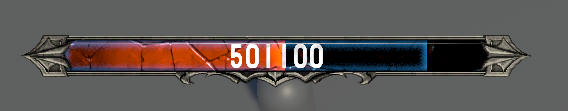
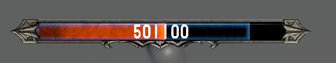
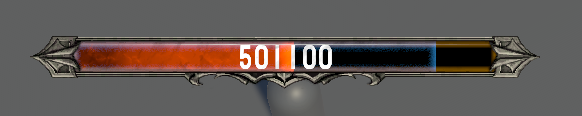
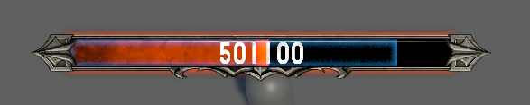

`Master GPU Health Bar` provides various visual effects for the bar, including:

- Crack effect
- Flowing aura effect
- Inner Glow
- Outline

---

## Crack Effect

Crack effect is a runtime effect of the bar.



It can be toggle On/Off during runtime via:

```csharp
public HealthBar player;
void ToggleCrack(bool _visible){
    player.ActiveCrack = _visible;
}

//or

public BarUI playerBar;
void ToggleCrack(bool _visible){
    playerBar.ActiveCrack = _visible;
}
```

You could replace the texture in:
`Assets/SoftKitty/MasterHealthBarSystem/Textures/Classical/Crack.png`

---

## Flowing Aura Effect

Flowing aura effect is a looping effect overlaid on the bar. It can not be toggle on/off during runtime, but different [BarSetting] can have different flowing aura intensity.



You can adjust the intensity of this effect in the [BarSetting].


You could replace the texture in:
`Assets/SoftKitty/MasterHealthBarSystem/Textures/Classical/Energy.png`

---

## Inner Glow

Inner glow effect is a runtime effect of the bar.



You can adjust the color of this effect in the [BarSetting].


It can be toggle On/Off during runtime via:

```csharp
public HealthBar player;
void ToggleInnerGlow(bool _visible){
    player.ActiveInnerLine = _visible;
}

//or

public BarUI playerBar;
void ToggleInnerGlow(bool _visible){
    playerBar.ActiveInnerLine = _visible;
}
```

---

## Outline

Outline effect is a runtime effect of the bar.



You can adjust the color of this effect in the [BarSetting].


It can be toggle On/Off during runtime via:

```csharp
public HealthBar player;
void ToggleOutline(bool _visible){
    player.ActiveOutline = _visible;
}

//or

public BarUI playerBar;
void ToggleOutline(bool _visible){
    playerBar.ActiveOutline = _visible;
}
```

---

<!-- API LINKS -->
[BarSetting]: /docs/master-gpu-healthbar/settings/bar-settings
[BarSettings]: /docs/master-gpu-healthbar/settings/bar-settings
[FloatingCombatTextSettings]: /docs/master-gpu-healthbar/settings/floating-combat-text-settings
[FloatingCombatTextSetting]: /docs/master-gpu-healthbar/settings/floating-combat-text-settings
[OverheadSettings]: /docs/master-gpu-healthbar/settings/overhead-settings
[OverheadSetting]: /docs/master-gpu-healthbar/settings/overhead-settings
[HealthBarObject]: /docs/master-gpu-healthbar/settings/overview
[Font]: /docs/master-gpu-healthbar/customize-font
[Bar Style]: /docs/master-gpu-healthbar/customize-healthbar
[Health Bar]: /docs/master-gpu-healthbar/assign-healthbar
[Static Bar]: /docs/master-gpu-healthbar/static-healthbar
[BarUI]: /docs/master-gpu-healthbar/api/bar-ui
[HealthBar]: /docs/master-gpu-healthbar/api/health-bar
[HealthBarCanvas]: /docs/master-gpu-healthbar/api/health-bar-canvas
[HealthBarManager]: /docs/master-gpu-healthbar/api/health-bar-manager
[EntityModule]: /docs/core/entities/EntityModule
[Attribute]: /docs/core/attributes/Attribute
[AttributeData]: /docs/core/attributes/AttributeData
[AttributeObject]: /docs/core/attributes/AttributeObject
[TempAttribute]: /docs/core/attributes/TempAttribute
[Entity]: /docs/core/entities/Entity
[Entities]: /docs/core/entities/Entity
[EntityComponent]: /docs/core/entities/EntityComponent
[EntityManagerObject]: /docs/core/entities/EntityManagerObject
[OverTimeEffect]: /docs/core/over-time-effects/OverTimeEffect
[OverTimeEffectData]: /docs/core/over-time-effects/OverTimeEffectData
[OverTimeEffectObject]: /docs/core/over-time-effects/OverTimeEffectObject
[DataObject]: /docs/core/general/DataObject
[GameManager]: /docs/core/general/game-manager
[AssetLoader]: /docs/core/general/AssetLoader
[SGD_Settings]: /docs/core/general/SGD_Settings
[GraphInstance]: /docs/master-combat-core/damage-component/graphinstance
[Dynamic Variables]: /docs/master-combat-core/graph-system/dynamic-variables
[DynamicFloat]: /docs/master-combat-core/graph-system/dynamic-variables
[OverTimeEffectInstance]: /docs/master-combat-core/damage-component/over-time-effect-instance
[CombatDamage]: /docs/master-combat-core/damage-component/combat-damage
[GraphObject]: /docs/master-combat-core/graph-system/GraphObject
[CustomData]:/docs/core/CustomData
[AttributeChangeEvent]: /docs/core/attributes/AttributeData
[OverTimeEffectChangeEvent]:/docs/core/over-time-effects/OverTimeEffectData
[EntityEvent]:/docs/core/entities/Entity
[IntList]:/docs/core/CustomData
[IdIntList]:/docs/core/CustomData
[IdFloatList]:/docs/core/CustomData
[Action Node]:/docs/master-combat-core/nodes/action
[Branch Node]:/docs/master-combat-core/nodes/branch
[Condition Node]:/docs/master-combat-core/nodes/condition
[Condition Group Node]:/docs/master-combat-core/nodes/condition
[Entity Node]:/docs/master-combat-core/nodes/entity
[Trigger Node]:/docs/master-combat-core/nodes/trigger
[Variable Node]:/docs/master-combat-core/nodes/variable-math
[Math Node]:/docs/master-combat-core/nodes/variable-math
<!-- API LINKS -->