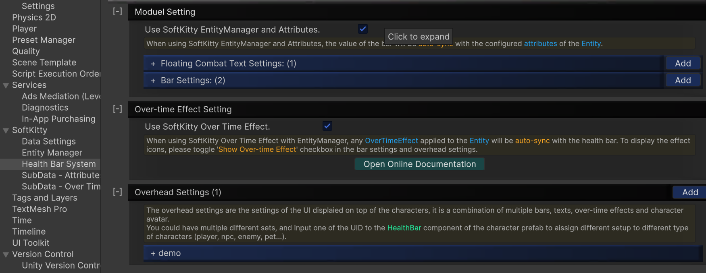
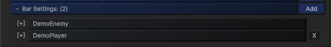
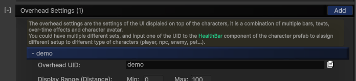
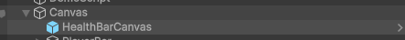
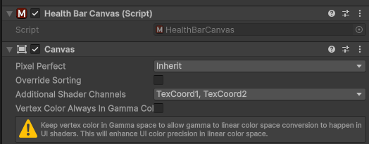
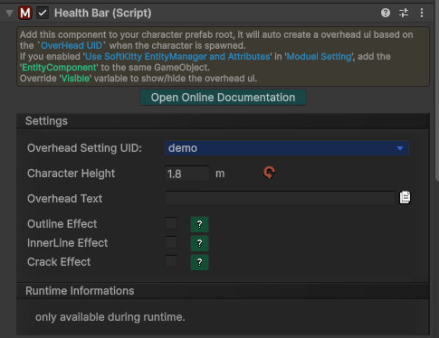
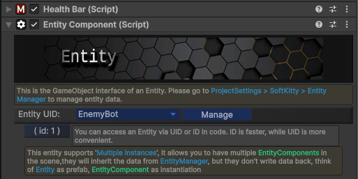

---

## Getting Started

This page gives you the fastest path to a working health bar setup.
If you have not imported and configured the package yet, complete [Installation](/docs/master-gpu-healthbar/getting-started/installation) first.

---

## Step 1 - Open Health Bar Settings

Navigate to:

`Project Settings > SoftKitty > Health Bar System`

You will configure all presets from this panel:

- `Module Setting`
- `Floating Combat Text Settings`
- `Bar Settings`
- `Over-time Effect Setting`
- `Overhead Settings`

---

## Step 2 - Choose Your Runtime Mode

### Mode A: Linked to SoftKitty Shared Data

Use this when your character data already comes from [EntityManagerObject], [AttributeObject], and [OverTimeEffectObject].

- Enable `Use SoftKitty EntityManager and Attributes` in `Module Setting`.
- Enable `Use SoftKitty Over Time Effect` in `Over-time Effect Setting`.
- Configure bar-to-attribute binding in [BarSettings].
- Add [EntityComponent] and [HealthBar] on the same character object.

See full guide: [Using with EntityManager](/docs/master-gpu-healthbar/getting-started/using-with-entitymanager)

### Mode B: Standalone Manual Values

Use this when you do not want to depend on SoftKitty shared data objects.

- Keep `Use SoftKitty EntityManager and Attributes` disabled.
- Keep `Use SoftKitty Over Time Effect` disabled.
- Drive values directly from your game code with [HealthBar].

---

## Step 3 - Assign and Preview

1. Create one or more bar presets in [BarSettings].
   - Each preset must have a unique `UID`.
   - Configure value mapping using `Current/Max/Overlay/Overlay Max Value Attribute` (only needed in Entity-linked mode).

   

---

2. Create one or more overhead presets in [OverheadSettings].
   - Each overhead preset must have a unique `Overhead UID`.
   - Set `Main Bar (idx:0)` to reference the bar preset you want to use for the primary bar.
   - Optionally configure `Sub Bars` for extra layers/resources.

   

---

3. Ensure there is exactly one [HealthBarCanvas] in your scene.
   `HealthBarCanvas` lets the system find the target UI Canvas used to render world-space [HealthBar] elements.

   

   - Add the `Canvas` component on the same GameObject as `HealthBarCanvas`.
   - In `Additional Shader Channels`, enable `TexCoord1` and `TexCoord2`.

   

   - This allows the shader to receive per-instance data through UV2/UV3 channels and helps avoid creating multiple material instances.

---

4. Add [HealthBar] to each character that should display an overhead/world-space bar.
   - Assign the correct `Overhead UID` in the [HealthBar] component.

   

---

5. Bind entity data (Entity-linked mode only).
   - Add [EntityComponent] on the same GameObject.
   - Select an `Entity UID` from your database.
   - If you are using standalone mode, do NOT add [EntityComponent] and do NOT enable `Use SoftKitty EntityManager and Attributes`.

   

---

6. Preview in Play Mode
   - Entity-linked mode: update the entity `Attribute` values and confirm the bar auto-syncs correctly.
   - Standalone mode: manually drive values via [HealthBar] `SetValue(...)` calls.

---

7. Validate optional feedback
   - Turn on/off `Show Floating Combat Text` and `Show Over-time Effect` in the relevant bar/overhead presets based on your design needs.

---

## Next Pages

- [Assign Health Bar](/docs/master-gpu-healthbar/assign-healthbar)
- [Static Bar](/docs/master-gpu-healthbar/static-healthbar)
- [BarSettings]
- [FloatingCombatTextSettings]
- [OverheadSettings]

---

<!-- API LINKS -->
[BarSetting]: /docs/master-gpu-healthbar/settings/bar-settings
[BarSettings]: /docs/master-gpu-healthbar/settings/bar-settings
[FloatingCombatTextSettings]: /docs/master-gpu-healthbar/settings/floating-combat-text-settings
[FloatingCombatTextSetting]: /docs/master-gpu-healthbar/settings/floating-combat-text-settings
[OverheadSettings]: /docs/master-gpu-healthbar/settings/overhead-settings
[OverheadSetting]: /docs/master-gpu-healthbar/settings/overhead-settings
[HealthBarObject]: /docs/master-gpu-healthbar/settings/overview
[Font]: /docs/master-gpu-healthbar/customize-font
[Bar Style]: /docs/master-gpu-healthbar/customize-healthbar
[Health Bar]: /docs/master-gpu-healthbar/assign-healthbar
[Static Bar]: /docs/master-gpu-healthbar/static-healthbar
[BarUI]: /docs/master-gpu-healthbar/api/bar-ui
[HealthBar]: /docs/master-gpu-healthbar/api/health-bar
[HealthBarCanvas]: /docs/master-gpu-healthbar/api/health-bar-canvas
[HealthBarManager]: /docs/master-gpu-healthbar/api/health-bar-manager
[EntityModule]: /docs/core/entities/EntityModule
[Attribute]: /docs/core/attributes/Attribute
[AttributeData]: /docs/core/attributes/AttributeData
[AttributeObject]: /docs/core/attributes/AttributeObject
[TempAttribute]: /docs/core/attributes/TempAttribute
[Entity]: /docs/core/entities/Entity
[Entities]: /docs/core/entities/Entity
[EntityComponent]: /docs/core/entities/EntityComponent
[EntityManagerObject]: /docs/core/entities/EntityManagerObject
[OverTimeEffect]: /docs/core/over-time-effects/OverTimeEffect
[OverTimeEffectData]: /docs/core/over-time-effects/OverTimeEffectData
[OverTimeEffectObject]: /docs/core/over-time-effects/OverTimeEffectObject
[DataObject]: /docs/core/general/DataObject
[GameManager]: /docs/core/general/game-manager
[AssetLoader]: /docs/core/general/AssetLoader
[SGD_Settings]: /docs/core/general/SGD_Settings
[GraphInstance]: /docs/master-combat-core/damage-component/graphinstance
[Dynamic Variables]: /docs/master-combat-core/graph-system/dynamic-variables
[DynamicFloat]: /docs/master-combat-core/graph-system/dynamic-variables
[OverTimeEffectInstance]: /docs/master-combat-core/damage-component/over-time-effect-instance
[CombatDamage]: /docs/master-combat-core/damage-component/combat-damage
[GraphObject]: /docs/master-combat-core/graph-system/GraphObject
[CustomData]:/docs/core/CustomData
[AttributeChangeEvent]: /docs/core/attributes/AttributeData
[OverTimeEffectChangeEvent]:/docs/core/over-time-effects/OverTimeEffectData
[EntityEvent]:/docs/core/entities/Entity
[IntList]:/docs/core/CustomData
[IdIntList]:/docs/core/CustomData
[IdFloatList]:/docs/core/CustomData
[Action Node]:/docs/master-combat-core/nodes/action
[Branch Node]:/docs/master-combat-core/nodes/branch
[Condition Node]:/docs/master-combat-core/nodes/condition
[Condition Group Node]:/docs/master-combat-core/nodes/condition
[Entity Node]:/docs/master-combat-core/nodes/entity
[Trigger Node]:/docs/master-combat-core/nodes/trigger
[Variable Node]:/docs/master-combat-core/nodes/variable-math
[Math Node]:/docs/master-combat-core/nodes/variable-math
<!-- API LINKS -->