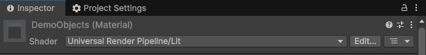
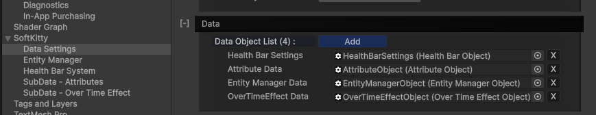
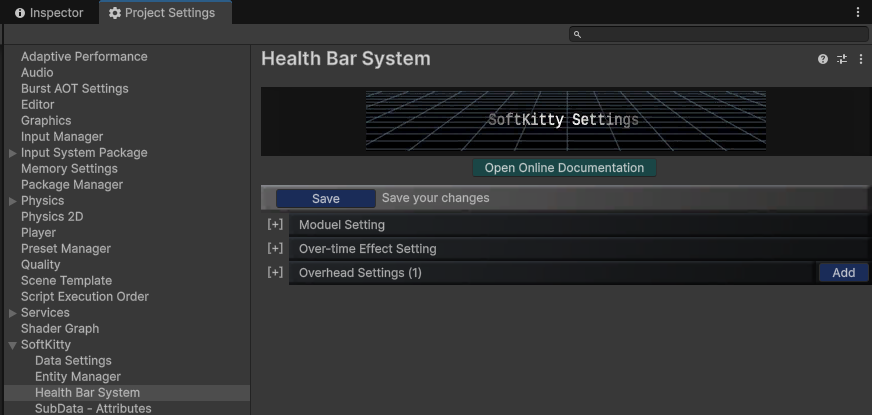

1. Download the package from **`Package Manager`** and click **`Import to Project`**.

---

2. (_Skip this if you're using URP render pipeline_) Navigate to `Assets/SoftKitty/MasterHealthBarSystem/Demo/RenderPipeline`, select `DemoObjects.mat`, change its shader to:
   - HDRP: `HDRP/Lit`
   - Built-In: `Standard`

   

---

3. Open the **`demo scene`** located at: 
   - `Assets/SoftKitty/MasterHealthBarSystem/Demo/Demo.unity`
   - Verify that the demo runs as expected.

---

4. Navigate to `Project Settings → SoftKitty → Data Settings` and expand the **`Data`** tab. If you plan to use this system with SoftKitty shared system [AttributeObject], [EntityManagerObject] and [OverTimeEffectObject], then make sure the following database objects are assigned, **otherwise remove them**:
   - `Attribute Data`
   - `Entity Manager Data`
   - `OverTimeEffect Data`

   

---

5. Navigate to `Project Settings → SoftKitty → Data Settings` and expand the **`Data`** tab. Make sure the `Health Bar Setting` database object is assigned. You can create your own new settings object via:
`Right click in the project panel > Create > Soft Kitty > Data Objects > Health Bar Settings`, then drag the asset to the **`Data`** tab to replace the current one.

---

6. The system is now ready for your project. You can start exploring the health bar settings in:
`Project Settings > SoftKitty > Health Bar System`

   

---

<!-- API LINKS -->
[BarSetting]: /docs/master-gpu-healthbar/settings/bar-settings
[BarSettings]: /docs/master-gpu-healthbar/settings/bar-settings
[FloatingCombatTextSettings]: /docs/master-gpu-healthbar/settings/floating-combat-text-settings
[FloatingCombatTextSetting]: /docs/master-gpu-healthbar/settings/floating-combat-text-settings
[OverheadSettings]: /docs/master-gpu-healthbar/settings/overhead-settings
[OverheadSetting]: /docs/master-gpu-healthbar/settings/overhead-settings
[HealthBarObject]: /docs/master-gpu-healthbar/settings/overview
[Font]: /docs/master-gpu-healthbar/customize-font
[Bar Style]: /docs/master-gpu-healthbar/customize-healthbar
[Health Bar]: /docs/master-gpu-healthbar/assign-healthbar
[Static Bar]: /docs/master-gpu-healthbar/static-healthbar
[BarUI]: /docs/master-gpu-healthbar/api/bar-ui
[HealthBar]: /docs/master-gpu-healthbar/api/health-bar
[HealthBarCanvas]: /docs/master-gpu-healthbar/api/health-bar-canvas
[HealthBarManager]: /docs/master-gpu-healthbar/api/health-bar-manager
[EntityModule]: /docs/core/entities/EntityModule
[Attribute]: /docs/core/attributes/Attribute
[AttributeData]: /docs/core/attributes/AttributeData
[AttributeObject]: /docs/core/attributes/AttributeObject
[TempAttribute]: /docs/core/attributes/TempAttribute
[Entity]: /docs/core/entities/Entity
[Entities]: /docs/core/entities/Entity
[EntityComponent]: /docs/core/entities/EntityComponent
[EntityManagerObject]: /docs/core/entities/EntityManagerObject
[OverTimeEffect]: /docs/core/over-time-effects/OverTimeEffect
[OverTimeEffectData]: /docs/core/over-time-effects/OverTimeEffectData
[OverTimeEffectObject]: /docs/core/over-time-effects/OverTimeEffectObject
[DataObject]: /docs/core/general/DataObject
[GameManager]: /docs/core/general/game-manager
[AssetLoader]: /docs/core/general/AssetLoader
[SGD_Settings]: /docs/core/general/SGD_Settings
[GraphInstance]: /docs/master-combat-core/damage-component/graphinstance
[Dynamic Variables]: /docs/master-combat-core/graph-system/dynamic-variables
[DynamicFloat]: /docs/master-combat-core/graph-system/dynamic-variables
[OverTimeEffectInstance]: /docs/master-combat-core/damage-component/over-time-effect-instance
[CombatDamage]: /docs/master-combat-core/damage-component/combat-damage
[GraphObject]: /docs/master-combat-core/graph-system/GraphObject
[CustomData]:/docs/core/CustomData
[AttributeChangeEvent]: /docs/core/attributes/AttributeData
[OverTimeEffectChangeEvent]:/docs/core/over-time-effects/OverTimeEffectData
[EntityEvent]:/docs/core/entities/Entity
[IntList]:/docs/core/CustomData
[IdIntList]:/docs/core/CustomData
[IdFloatList]:/docs/core/CustomData
[Action Node]:/docs/master-combat-core/nodes/action
[Branch Node]:/docs/master-combat-core/nodes/branch
[Condition Node]:/docs/master-combat-core/nodes/condition
[Condition Group Node]:/docs/master-combat-core/nodes/condition
[Entity Node]:/docs/master-combat-core/nodes/entity
[Trigger Node]:/docs/master-combat-core/nodes/trigger
[Variable Node]:/docs/master-combat-core/nodes/variable-math
[Math Node]:/docs/master-combat-core/nodes/variable-math
<!-- API LINKS -->