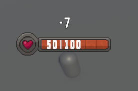

---

## Popping Text

`Popping Text` is the runtime floating combat text feedback used for damage/heal numbers.
It is configured from [Floating Combat Text Settings] and displayed by bar runtime modules.



---

## Typical Flow

1. Configure one or more floating text styles by UID.
2. Enable `Show Floating Combat Text` in [Bar Settings] when needed.
3. Tune animation curves for speed, arc, scale, and fade.

---

## PopNumberText API

`PopNumberText` spawns the floating number using a style `UID` from [Floating Combat Text Settings].

#### World-Space Health Bar (Overhead)

Call:

```csharp
HealthBar.PopNumberText(string _uid, int _num);
```

Typical usage:

```csharp
public HealthBar EnemyBar;

void DealDamage()
{
    EnemyBar.PopNumberText("FloatingCombatText0", 42);
}
```

#### Static (Screen-Space) Bar

Call:

```csharp
BarUI.PopNumberText(string _uid, int _num);
```

Typical usage:

```csharp
public BarUI PlayerBar;

void DealDamage()
{
    PlayerBar.PopNumberText("FloatingCombatText0", 42);
}
```

---

## Best Practices

- Keep visual language consistent (color = meaning).
- Limit text density in fast AOE scenarios.
- Use shorter lifetime and moderate randomness for clarity.

---

<!-- API LINKS -->
[BarSetting]: /docs/master-gpu-healthbar/settings/bar-settings
[Bar Settings]: /docs/master-gpu-healthbar/settings/bar-settings
[Floating Combat Text Settings]: /docs/master-gpu-healthbar/settings/floating-combat-text-settings
[Floating Combat Text Setting]: /docs/master-gpu-healthbar/settings/floating-combat-text-settings
[Overhead Settings]: /docs/master-gpu-healthbar/settings/overhead-settings
[Overhead Setting]: /docs/master-gpu-healthbar/settings/overhead-settings
[HealthBarObject]: /docs/master-gpu-healthbar/settings/overview
[Font]: /docs/master-gpu-healthbar/customize-font
[Bar Style]: /docs/master-gpu-healthbar/customize-healthbar
[Health Bar]: /docs/master-gpu-healthbar/assign-healthbar
[Static Bar]: /docs/master-gpu-healthbar/static-healthbar
[BarUI]: /docs/master-gpu-healthbar/api/bar-ui
[HealthBar]: /docs/master-gpu-healthbar/api/health-bar
[HealthBarCanvas]: /docs/master-gpu-healthbar/api/health-bar-canvas
[HealthBarManager]: /docs/master-gpu-healthbar/api/health-bar-manager
[EntityModule]: /docs/core/entities/EntityModule
[Attribute]: /docs/core/attributes/Attribute
[AttributeData]: /docs/core/attributes/AttributeData
[AttributeObject]: /docs/core/attributes/AttributeObject
[TempAttribute]: /docs/core/attributes/TempAttribute
[Entity]: /docs/core/entities/Entity
[Entities]: /docs/core/entities/Entity
[EntityComponent]: /docs/core/entities/EntityComponent
[EntityManagerObject]: /docs/core/entities/EntityManagerObject
[OverTimeEffect]: /docs/core/over-time-effects/OverTimeEffect
[OverTimeEffectData]: /docs/core/over-time-effects/OverTimeEffectData
[OverTimeEffectObject]: /docs/core/over-time-effects/OverTimeEffectObject
[DataObject]: /docs/core/general/DataObject
[GameManager]: /docs/core/general/game-manager
[AssetLoader]: /docs/core/general/AssetLoader
[SGD_Settings]: /docs/core/general/SGD_Settings
[GraphInstance]: /docs/master-combat-core/damage-component/graphinstance
[Dynamic Variables]: /docs/master-combat-core/graph-system/dynamic-variables
[DynamicFloat]: /docs/master-combat-core/graph-system/dynamic-variables
[OverTimeEffectInstance]: /docs/master-combat-core/damage-component/over-time-effect-instance
[CombatDamage]: /docs/master-combat-core/damage-component/combat-damage
[GraphObject]: /docs/master-combat-core/graph-system/GraphObject
[CustomData]:/docs/core/CustomData
[AttributeChangeEvent]: /docs/core/attributes/AttributeData
[OverTimeEffectChangeEvent]:/docs/core/over-time-effects/OverTimeEffectData
[EntityEvent]:/docs/core/entities/Entity
[IntList]:/docs/core/CustomData
[IdIntList]:/docs/core/CustomData
[IdFloatList]:/docs/core/CustomData
[Action Node]:/docs/master-combat-core/nodes/action
[Branch Node]:/docs/master-combat-core/nodes/branch
[Condition Node]:/docs/master-combat-core/nodes/condition
[Condition Group Node]:/docs/master-combat-core/nodes/condition
[Entity Node]:/docs/master-combat-core/nodes/entity
[Trigger Node]:/docs/master-combat-core/nodes/trigger
[Variable Node]:/docs/master-combat-core/nodes/variable-math
[Math Node]:/docs/master-combat-core/nodes/variable-math
<!-- API LINKS -->