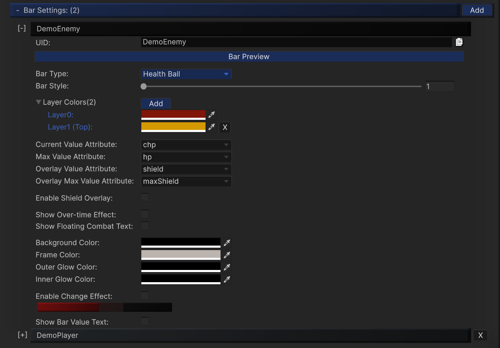

---

## Bar Settings

`Bar Settings` defines how each bar looks, where values come from, and which optional effects are enabled.
Each entry is identified by a `UID` and can be reused by overhead/static bars.

---

## Bar Types

- `Health Classical`
- `Health Ball`
- `Health Segment`

Use the type dropdown to choose the rendering style, then tune style-specific options.

---

## Attribute Binding Fields

When using EntityManager integration, map these fields to your attribute UIDs:

- `Current Value Attribute`
  - Tooltip: Attribute used as the current value of this bar (such as hp, stamina, mana).
- `Max Value Attribute`
  - Tooltip: Attribute used as the maximum value of this bar (such as hp, stamina, mana).
- `Overlay Value Attribute`
  - Tooltip: Attribute used for the overlay bar (such as shield or secondary resource).
- `Overlay Max Value Attribute`
  - Tooltip: Attribute used for the maximum value of the overlay bar (such as shield or secondary resource).
- `Max Value Attribute`
- `Overlay Value Attribute`
- `Overlay Max Value Attribute`

`Overlay` is typically used for shields or an extra value layer above the primary bar.

---

## Common Visual Controls

- `Layer Colors`
- `Background Color`
- `Frame Color`
- `Outer Glow Color`
- `Inner Glow Color`
- `Enable Shield Overlay` + `Shield Color`
- `Enable Change Effect`, `Decrease Color`, `Increase Color`

---

## Runtime Toggles

- `Show Over-time Effect`
  - To display the effect icons, please toggle 'Show Over-time Effect' checkbox in the bar settings and overhead settings (and enable `Use SoftKitty Over Time Effect` in the module settings for Entity-linked mode).

- `Show Floating Combat Text`
  - Enables the floating combat number feedback on this bar when combat events generate popping text.

---

## Text and Value Display

- `Show Bar Value Text`
- Text size/width/height (depending on style)
- `Text Color`
- `Text Font`
- `Text Alignment`
- `Value Format`

`Value Format` supports placeholder patterns such as `c|m` (`current|max`).

---

## Style-Specific Notes

### Segment Bar

Additional controls include:

- `Per Segment Health`
- `Max Segments`
- `Segment Width`
- `Segment Height`
- `Segment Spacing`
- optional back bar style/color

### Ball / Classical

Focus on color layers, glow response, value text readability, and change-effect tuning.

---

## Best Practices

- Keep UID names stable (`Enemy_Default`, `Player_Main`, etc.).
- Standardize attribute naming across your project (`hp`, `maxHp`, `shield`, `maxShield`).
- Validate readability at gameplay camera distance, not only in settings preview.

---

<!-- API LINKS -->
[BarSetting]: /docs/master-gpu-healthbar/settings/bar-settings
[BarSettings]: /docs/master-gpu-healthbar/settings/bar-settings
[FloatingCombatTextSettings]: /docs/master-gpu-healthbar/settings/floating-combat-text-settings
[FloatingCombatTextSetting]: /docs/master-gpu-healthbar/settings/floating-combat-text-settings
[OverheadSettings]: /docs/master-gpu-healthbar/settings/overhead-settings
[OverheadSetting]: /docs/master-gpu-healthbar/settings/overhead-settings
[HealthBarObject]: /docs/master-gpu-healthbar/settings/overview
[Font]: /docs/master-gpu-healthbar/customize-font
[Bar Style]: /docs/master-gpu-healthbar/customize-healthbar
[Health Bar]: /docs/master-gpu-healthbar/assign-healthbar
[Static Bar]: /docs/master-gpu-healthbar/static-healthbar
[BarUI]: /docs/master-gpu-healthbar/api/bar-ui
[HealthBar]: /docs/master-gpu-healthbar/api/health-bar
[HealthBarCanvas]: /docs/master-gpu-healthbar/api/health-bar-canvas
[HealthBarManager]: /docs/master-gpu-healthbar/api/health-bar-manager
[EntityModule]: /docs/core/entities/EntityModule
[Attribute]: /docs/core/attributes/Attribute
[AttributeData]: /docs/core/attributes/AttributeData
[AttributeObject]: /docs/core/attributes/AttributeObject
[TempAttribute]: /docs/core/attributes/TempAttribute
[Entity]: /docs/core/entities/Entity
[Entities]: /docs/core/entities/Entity
[EntityComponent]: /docs/core/entities/EntityComponent
[EntityManagerObject]: /docs/core/entities/EntityManagerObject
[OverTimeEffect]: /docs/core/over-time-effects/OverTimeEffect
[OverTimeEffectData]: /docs/core/over-time-effects/OverTimeEffectData
[OverTimeEffectObject]: /docs/core/over-time-effects/OverTimeEffectObject
[DataObject]: /docs/core/general/DataObject
[GameManager]: /docs/core/general/game-manager
[AssetLoader]: /docs/core/general/AssetLoader
[SGD_Settings]: /docs/core/general/SGD_Settings
[GraphInstance]: /docs/master-combat-core/damage-component/graphinstance
[Dynamic Variables]: /docs/master-combat-core/graph-system/dynamic-variables
[DynamicFloat]: /docs/master-combat-core/graph-system/dynamic-variables
[OverTimeEffectInstance]: /docs/master-combat-core/damage-component/over-time-effect-instance
[CombatDamage]: /docs/master-combat-core/damage-component/combat-damage
[GraphObject]: /docs/master-combat-core/graph-system/GraphObject
[CustomData]:/docs/core/CustomData
[AttributeChangeEvent]: /docs/core/attributes/AttributeData
[OverTimeEffectChangeEvent]:/docs/core/over-time-effects/OverTimeEffectData
[EntityEvent]:/docs/core/entities/Entity
[IntList]:/docs/core/CustomData
[IdIntList]:/docs/core/CustomData
[IdFloatList]:/docs/core/CustomData
[Action Node]:/docs/master-combat-core/nodes/action
[Branch Node]:/docs/master-combat-core/nodes/branch
[Condition Node]:/docs/master-combat-core/nodes/condition
[Condition Group Node]:/docs/master-combat-core/nodes/condition
[Entity Node]:/docs/master-combat-core/nodes/entity
[Trigger Node]:/docs/master-combat-core/nodes/trigger
[Variable Node]:/docs/master-combat-core/nodes/variable-math
[Math Node]:/docs/master-combat-core/nodes/variable-math
<!-- API LINKS -->