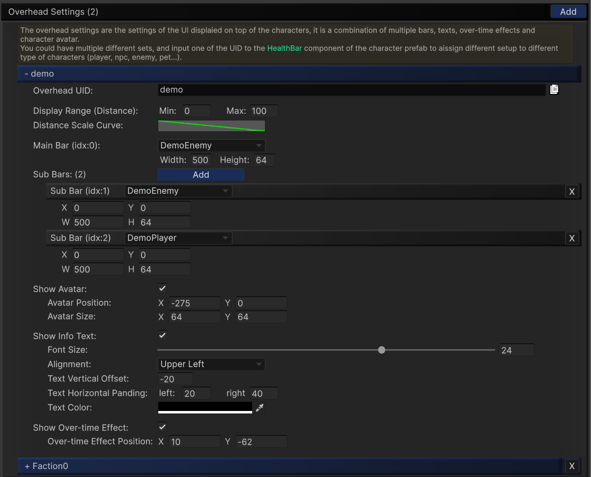

---

## Overhead Settings

`Overhead Settings` defines full UI compositions displayed above characters.
An overhead entry combines bars, text, OTE icons, avatar, and distance scaling in one reusable preset.

---

## Core Fields

- `Overhead UID`
- `Display Range (Distance)` (`Min`, `Max`)
- `Distance Scale Curve`
- `Main Bar`
- `Sub Bars` (multiple)

Each sub bar has independent `X/Y` position and `W/H` size controls.

---

## Optional Blocks

### Avatar

- `Show Avatar`
- `Avatar Position`
- `Avatar Size`

### Info Text

- `Show Info Text`
- font size, alignment, padding, vertical offset, text color

### Over-time Effect

- `Show Over-time Effect`
  - To display the effect icons, enable this checkbox and make sure `Use SoftKitty Over Time Effect` is enabled in settings (Entity-linked mode).
    Also toggle 'Show Over-time Effect' in the related bar settings so the icons can render correctly on both bar and overhead layers.
- `Over-time Effect Position`

---

## Usage Pattern

1. Create one or more overhead presets.
2. Assign `Overhead UID` in the runtime [HealthBar] component.
3. Reuse the same preset for all characters of the same archetype.

---

## Design Tips

- Use narrow distance ranges for dense scenes to reduce clutter.
- Keep player and enemy presets visually distinct.
- Reserve sub bars for secondary resources (shield, stamina, mana).

---

<!-- API LINKS -->
[BarSetting]: /docs/master-gpu-healthbar/settings/bar-settings
[BarSettings]: /docs/master-gpu-healthbar/settings/bar-settings
[FloatingCombatTextSettings]: /docs/master-gpu-healthbar/settings/floating-combat-text-settings
[FloatingCombatTextSetting]: /docs/master-gpu-healthbar/settings/floating-combat-text-settings
[OverheadSettings]: /docs/master-gpu-healthbar/settings/overhead-settings
[OverheadSetting]: /docs/master-gpu-healthbar/settings/overhead-settings
[HealthBarObject]: /docs/master-gpu-healthbar/settings/overview
[Font]: /docs/master-gpu-healthbar/customize-font
[Bar Style]: /docs/master-gpu-healthbar/customize-healthbar
[Health Bar]: /docs/master-gpu-healthbar/assign-healthbar
[Static Bar]: /docs/master-gpu-healthbar/static-healthbar
[BarUI]: /docs/master-gpu-healthbar/api/bar-ui
[HealthBar]: /docs/master-gpu-healthbar/api/health-bar
[HealthBarCanvas]: /docs/master-gpu-healthbar/api/health-bar-canvas
[HealthBarManager]: /docs/master-gpu-healthbar/api/health-bar-manager
[EntityModule]: /docs/core/entities/EntityModule
[Attribute]: /docs/core/attributes/Attribute
[AttributeData]: /docs/core/attributes/AttributeData
[AttributeObject]: /docs/core/attributes/AttributeObject
[TempAttribute]: /docs/core/attributes/TempAttribute
[Entity]: /docs/core/entities/Entity
[Entities]: /docs/core/entities/Entity
[EntityComponent]: /docs/core/entities/EntityComponent
[EntityManagerObject]: /docs/core/entities/EntityManagerObject
[OverTimeEffect]: /docs/core/over-time-effects/OverTimeEffect
[OverTimeEffectData]: /docs/core/over-time-effects/OverTimeEffectData
[OverTimeEffectObject]: /docs/core/over-time-effects/OverTimeEffectObject
[DataObject]: /docs/core/general/DataObject
[GameManager]: /docs/core/general/game-manager
[AssetLoader]: /docs/core/general/AssetLoader
[SGD_Settings]: /docs/core/general/SGD_Settings
[GraphInstance]: /docs/master-combat-core/damage-component/graphinstance
[Dynamic Variables]: /docs/master-combat-core/graph-system/dynamic-variables
[DynamicFloat]: /docs/master-combat-core/graph-system/dynamic-variables
[OverTimeEffectInstance]: /docs/master-combat-core/damage-component/over-time-effect-instance
[CombatDamage]: /docs/master-combat-core/damage-component/combat-damage
[GraphObject]: /docs/master-combat-core/graph-system/GraphObject
[CustomData]:/docs/core/CustomData
[AttributeChangeEvent]: /docs/core/attributes/AttributeData
[OverTimeEffectChangeEvent]:/docs/core/over-time-effects/OverTimeEffectData
[EntityEvent]:/docs/core/entities/Entity
[IntList]:/docs/core/CustomData
[IdIntList]:/docs/core/CustomData
[IdFloatList]:/docs/core/CustomData
[Action Node]:/docs/master-combat-core/nodes/action
[Branch Node]:/docs/master-combat-core/nodes/branch
[Condition Node]:/docs/master-combat-core/nodes/condition
[Condition Group Node]:/docs/master-combat-core/nodes/condition
[Entity Node]:/docs/master-combat-core/nodes/entity
[Trigger Node]:/docs/master-combat-core/nodes/trigger
[Variable Node]:/docs/master-combat-core/nodes/variable-math
[Math Node]:/docs/master-combat-core/nodes/variable-math
<!-- API LINKS -->