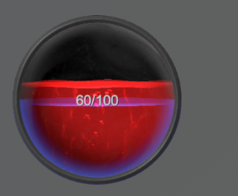

---

## Static Health Bar (Screen-Space)

Use `Static Bar` when you need a bar fixed at a UI location (for example, top-left player HP), instead of following a world-space target.



---

## 1) Add a Prefab to Canvas

From:

`Assets/SoftKitty/MasterHealthBarSystem/Prefabs`

Choose the desired bar style prefab and place it under your scene Canvas.

---

## 2) Enable Static Bar Mode

On the prefab instance, open [BarUI] and enable:

- `Static Bar`

This prevents world-to-screen tracking behavior.

---

## 3) Initialize in Script

Call `BarUI.Init(...)` in `Start`:

```csharp
public BarUI playerBar;

void Start()
{
    playerBar.Init(null, BarStyle.HealthBall, "DemoPlayer");
}
```

Method signature:

```csharp
public void Init(HealthBar _bar, BarStyle _style, string _barUid, int _index = 0, Vector2 _size = default)
```

---

## 4) Optional Entity Binding

If your project uses SoftKitty shared data, bind this static bar to an entity:

```csharp
playerBar.LinkEntity(EntityManagerObject.instance.GetEntity("player"));
```

Method signature:

```csharp
public void LinkEntity(Entity _entity)
```

---

## Common Notes

- For standalone mode, skip `LinkEntity(...)` and drive values manually.
- Keep bar UIDs aligned with entries in [Bar Settings].
- You can create separate static bars for HP, shield, boss HP, or party status.

---

<!-- API LINKS -->
[BarSetting]: /docs/master-gpu-healthbar/settings/bar-settings
[Bar Settings]: /docs/master-gpu-healthbar/settings/bar-settings
[Floating Combat Text Settings]: /docs/master-gpu-healthbar/settings/floating-combat-text-settings
[Floating Combat Text Setting]: /docs/master-gpu-healthbar/settings/floating-combat-text-settings
[Overhead Settings]: /docs/master-gpu-healthbar/settings/overhead-settings
[Overhead Setting]: /docs/master-gpu-healthbar/settings/overhead-settings
[HealthBarObject]: /docs/master-gpu-healthbar/settings/overview
[Font]: /docs/master-gpu-healthbar/customize-font
[Bar Style]: /docs/master-gpu-healthbar/customize-healthbar
[Health Bar]: /docs/master-gpu-healthbar/assign-healthbar
[Static Bar]: /docs/master-gpu-healthbar/static-healthbar
[BarUI]: /docs/master-gpu-healthbar/api/bar-ui
[HealthBar]: /docs/master-gpu-healthbar/api/health-bar
[HealthBarCanvas]: /docs/master-gpu-healthbar/api/health-bar-canvas
[HealthBarManager]: /docs/master-gpu-healthbar/api/health-bar-manager
[EntityModule]: /docs/core/entities/EntityModule
[Attribute]: /docs/core/attributes/Attribute
[AttributeData]: /docs/core/attributes/AttributeData
[AttributeObject]: /docs/core/attributes/AttributeObject
[TempAttribute]: /docs/core/attributes/TempAttribute
[Entity]: /docs/core/entities/Entity
[Entities]: /docs/core/entities/Entity
[EntityComponent]: /docs/core/entities/EntityComponent
[EntityManagerObject]: /docs/core/entities/EntityManagerObject
[OverTimeEffect]: /docs/core/over-time-effects/OverTimeEffect
[OverTimeEffectData]: /docs/core/over-time-effects/OverTimeEffectData
[OverTimeEffectObject]: /docs/core/over-time-effects/OverTimeEffectObject
[DataObject]: /docs/core/general/DataObject
[GameManager]: /docs/core/general/game-manager
[AssetLoader]: /docs/core/general/AssetLoader
[SGD_Settings]: /docs/core/general/SGD_Settings
[GraphInstance]: /docs/master-combat-core/damage-component/graphinstance
[Dynamic Variables]: /docs/master-combat-core/graph-system/dynamic-variables
[DynamicFloat]: /docs/master-combat-core/graph-system/dynamic-variables
[OverTimeEffectInstance]: /docs/master-combat-core/damage-component/over-time-effect-instance
[CombatDamage]: /docs/master-combat-core/damage-component/combat-damage
[GraphObject]: /docs/master-combat-core/graph-system/GraphObject
[CustomData]:/docs/core/CustomData
[AttributeChangeEvent]: /docs/core/attributes/AttributeData
[OverTimeEffectChangeEvent]:/docs/core/over-time-effects/OverTimeEffectData
[EntityEvent]:/docs/core/entities/Entity
[IntList]:/docs/core/CustomData
[IdIntList]:/docs/core/CustomData
[IdFloatList]:/docs/core/CustomData
[Action Node]:/docs/master-combat-core/nodes/action
[Branch Node]:/docs/master-combat-core/nodes/branch
[Condition Node]:/docs/master-combat-core/nodes/condition
[Condition Group Node]:/docs/master-combat-core/nodes/condition
[Entity Node]:/docs/master-combat-core/nodes/entity
[Trigger Node]:/docs/master-combat-core/nodes/trigger
[Variable Node]:/docs/master-combat-core/nodes/variable-math
[Math Node]:/docs/master-combat-core/nodes/variable-math
<!-- API LINKS -->