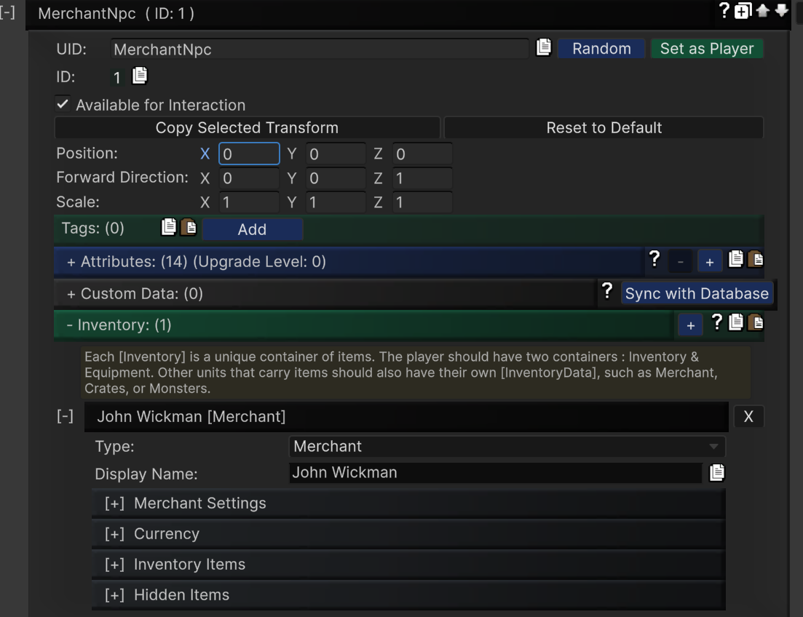

1. First of all, make sure you have Unity UI Canvas in your scene. Navigate to **`Project Settings/SoftKitty/Data Settings`** and setup the following databse:
   - [ItemObject], refer to the [Item Database Settings]
   - [AttributeObject]
   - [EntityManagerObject] 
   
---

2. Add [EntityComponent] component to of your player game object. This component is an interface of the [Entity] data, which manages [Attribute]s, [Item]s, [OverTimeEffect]s and other [CustomData] of your characters/crates.

---

3. **(Optional)** Drag the **ActionBar** prefab from the `Assets/SoftKitty/InventoryEngine/Prefabs` folder and place it under your **UI Canvas** transform. This prefab provides 10 shortcut slots with customizable key bindings for items/skills on each page, and you can set up as many pages as needed for players to switch between. The action bar also includes a progress bar at the bottom, which can be configured as a player XP bar to display experience and level, or as a player health bar. Alternatively, you can hide this bar using its **UiStyle** component. 

---

4. You can now start testing some basic functions. In your own script, use the following calls:  

```csharp
//to open the player's inventory.
GameManager.GetPlayer().GetInventory().OpenWindow()`; 
//to open the player's equipment UI.
GameManager.GetPlayer().GetEquipment().OpenWindow()`; 
//to open the crafting/enhancing/enchanting/socketing UI.
GameManager.GetPlayer().GetInventory().OpenForgeWindow(true, true, true, true, 1F,"Forge"); 
//to open the skill list.
GameManager.GetPlayer().GetInventory().OpenWindowByName("Skills", "Skills")`; 
```

---

5. Now, let's add some more interesting functions. Add an [Entity] in [EntityManagerObject] from the `Project Settings/SoftKitty/Entity Manager`, input its uid as  **MerchantNPC**, add a new 'Inventory' to it and select the `Type` as `Merchant`:


---

6. Let's add a few items to him, and setup the `Price Multiplier`, make sure `Accept all tradeable items` is checked. Don't forget add some currencies to him, otherwise he would not be able to purchase player's goods.


---

7. Now in your script, whenever you want to open the store, simply call:

```csharp
GameManager.GetEntity("MerchantNPC").GetInventory().OpenWindow();
```
Alternatively, you can add a [EntityComponent] to one of your NPC character, select its UID as **MerchantNPC**. When your player interact with it, call:
```csharp
  myNPC.GetComponent<EntityComponent>().GetInventory().OpenWindow();
```

---

8. You can create [Entity] in database for any object in your game. When the player interacts with it, call `OpenWindow()` to open the corresponding interface. The specific interface that appears depends on the **Type** setting of the [InventoryData]. In steps 4 and 5, we tested most types of [InventoryData]. Now, let's test the last one. Create an [Entity] and set its `Inventory` type as `Crate`. When the player interacts with it, call `OpenWindow()` to display the crate UI. 

---

9. If your game includes [Loot Pack] that players can obtain from defeating monsters or completing quests, you can use the **Loot Pack Settings** in **Project Settings/SoftKitty/SubData - Items**. After setup the [Loot Pack], there're two ways to drop a [Loot Pack]:
Directly drop via uid of the [Loot Pack]:

```csharp
var _loot = GameManager.DropLootPack(Vector3.zero, "TestLootPack01");//Drop a loot pack from loot packs list.
```

Add [Loot Pack] to [Entity] in the [Entity Manager], the call:

```csharp
var _loot = GameManager.GetEntity("Monster01").DropLootPack(); //Drop a loot pack from an entity.
//or
var _loot = GameManager.GetEntityInstance("Monster01").DropLootPack(); //Drop a loot pack from an entity instance.

```

 When the player interacts with the [Loot Pack], call `_loot.OpenPack()` to open the interface and allow the player to collect their rewards. 

---

10.  Check `MainMenu.cs` in **Assets/SoftKitty/InventoryEngine/ExampleScene/Scripts** to learn how to setup [Callbacks] for player uses, equips, or unequips an item. You can also learn how to save/load data, assign crafting tasks to NPCs, and manage NPC equipment and inventory.  

---

11. Now that we've walked through all the pre-made interfaces, you can easily create your own by customizing the existing prefabs in the **Assets/SoftKitty/InventoryEngine/Resources/InventoryEngine/UiWindows** folder. Adjust the settings in the **UiStyle** component on each prefab to suit your needs. Alternatively, you can write your own script by inheriting from `ItemContainer.cs`, `ContainerBase.cs`, or `HiddenContainer.cs`.

---

<!-- API LINKS -->
[Loot Pack]:/docs/master-inventory-engine/item-class/loot-pack
[Item Database Settings]:/docs/master-inventory-engine/settings
[ItemChangeCallback]:/docs/master-inventory-engine/callbacks
[ItemDropCallback]:/docs/master-inventory-engine/callbacks
[ItemUseCallback]:/docs/master-inventory-engine/callbacks
[Callbacks]:/docs/master-inventory-engine/callbacks
[LinkIcon]:/docs/master-inventory-engine/ui/item-icon
[InventoryItem]:/docs/master-inventory-engine/ui/item-icon
[ItemIcon]:/docs/master-inventory-engine/ui/item-icon
[WindowsManager]:/docs/master-inventory-engine/ui/windows-manager
[Enchantment]: /docs/master-inventory-engine/item-class/enchantment
[InventoryStack]: /docs/master-inventory-engine/item-class/inventory-stack
[InventoryData]: /docs/master-inventory-engine/item-class/item-data
[Item]: /docs/master-inventory-engine/item-class/item
[ItemObject]: /docs/master-inventory-engine/item-class/item-object
[Attribute]: /docs/core/attributes/Attribute
[AttributeData]: /docs/core/attributes/AttributeData
[AttributeObject]: /docs/core/attributes/AttributeObject
[TempAttribute]: /docs/core/attributes/TempAttribute
[Entity]: /docs/core/entities/Entity
[Entities]: /docs/core/entities/Entity
[EntityComponent]: /docs/core/entities/EntityComponent
[EntityManagerObject]: /docs/core/entities/EntityManagerObject
[OverTimeEffect]: /docs/core/over-time-effects/OverTimeEffect
[OverTimeEffectData]: /docs/core/over-time-effects/OverTimeEffectData
[OverTimeEffectObject]: /docs/core/over-time-effects/OverTimeEffectObject
[DataObject]: /docs/core/general/DataObject
[GameManager]: /docs/core/general/game-manager
[AssetLoader]: /docs/core/general/AssetLoader
[SGD_Settings]: /docs/core/general/SGD_Settings
[GraphInstance]: /docs/master-combat-core/damage-component/graphinstance
[Dynamic Variables]: /docs/master-combat-core/graph-system/dynamic-variables
[DynamicFloat]: /docs/master-combat-core/graph-system/dynamic-variables
[OverTimeEffectInstance]: /docs/master-combat-core/damage-component/over-time-effect-instance
[CombatDamage]: /docs/master-combat-core/damage-component/combat-damage
[GraphObject]: /docs/master-combat-core/graph-system/GraphObject
[CustomData]:/docs/core/CustomData
[AttributeChangeEvent]: /docs/core/attributes/AttributeData
[OverTimeEffectChangeEvent]:/docs/core/over-time-effects/OverTimeEffectData
[EntityEvent]:/docs/core/entities/Entity
[IntList]:/docs/core/CustomData
[IdIntList]:/docs/core/CustomData
[IdFloatList]:/docs/core/CustomData
[Action Node]:/docs/master-combat-core/nodes/action
[Branch Node]:/docs/master-combat-core/nodes/branch
[Condition Node]:/docs/master-combat-core/nodes/condition
[Condition Group Node]:/docs/master-combat-core/nodes/condition
[Entity Node]:/docs/master-combat-core/nodes/entity
[Trigger Node]:/docs/master-combat-core/nodes/trigger
[Variable Node]:/docs/master-combat-core/nodes/variable-math
[Math Node]:/docs/master-combat-core/nodes/variable-math
<!-- API LINKS -->