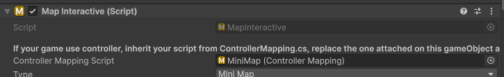

---

If your game is designed for controller, Inherit your script from `ControllerMapping.cs`, replace the one attached on the map interface prefab, and assign it to the `ControllerMappingScript` slot of the [MapInteractive] component.

Then override the below functions with your controller code:

---

#### `public virtual void OnMapInit(MapInteractive.MapTypes _type)`
When map gets enable, this function will be called.

#### `public virtual void SetVirtualCursorVisible(bool _visible)`
Set the visibility of the Virtual Cursor.

#### `public virtual void SetVirtualCursorPosition(Vector3 _pos)`
Override the position of the Virtual Cursor.

#### `public virtual void ControlVitualCursor()`
Code for control the Virtual Cursor in your way.

#### `public virtual bool isVirtualCursorOver(RectTransform _rectTrans)`
Retrieve whether a rect transform is overlapping with the Virtual Cursor

#### `public virtual Vector3 GetPointerPosition()`
Retrieve the position of the mouse pointer, if Virtual Cursor is enabled, return the position of the Virtual Cursor insteaded.

#### `public virtual bool GetZoomInKey()`
Retrieve whether the zoom in button is pressed, override your controller button press code here.

#### `public virtual bool GetZoomOutKey()`
Retrieve whether the zoom out button is pressed, override your controller button press code here.

#### `public virtual bool GetPlaceMarkerKey()`
Retrieve whether the place map marker button is pressed, override your controller button press code here.

#### `public virtual string GetPlaceMarkerKeyHint()`
Retrieve the hint text for place map marker button, override your controller button name here.

#### `public virtual bool GetRemoveMarkerKey()`
Retrieve whether the remove map marker button is pressed, override your controller button press code here.

#### `public virtual string GetRemoveMarkerKeyHint()`
Retrieve the hint text for remove map marker button, override your controller button name here.

#### `public virtual bool GetNavigateKey()`
Retrieve whether the navigate button is pressed, override your controller button press code here.

#### `public virtual string GetNavigateKeyHint()`
Retrieve the hint text for navigate button, override your controller button name here.

#### `public virtual bool GetScrollUpKey()`
Retrieve whether the scroll map up button is pressed, override your controller button press code here.

#### `public virtual bool GetScrollDownKey()`
Retrieve whether the scroll map down button is pressed, override your controller button press code here.

#### `public virtual bool GetScrollLeftKey()`
Retrieve whether the scroll map left button is pressed, override your controller button press code here.

#### `public virtual bool GetScrollRightKey()`
Retrieve whether the scroll map right button is pressed, override your controller button press code here.

---

[Map Generator]:/docs/master-map-navigation/map-generator
[Map Point]:/docs/master-map-navigation/map-point
[Navigation Path]:/docs/master-map-navigation/navigation
[Sub-Map]:/docs/master-map-navigation/sub-map
[Fog of War]:/docs/master-map-navigation/fog-of-war
[Callbacks]:/docs/master-map-navigation/callbacks
[callbacks]:/docs/master-map-navigation/callbacks
[Static Map Mode]:/docs/master-map-navigation/getting-started/static-mode
[Dynamic Map Mode]:/docs/master-map-navigation/getting-started/dynamic-mode
[MapPoint]:/docs/master-map-navigation/api/map-point
[MapManeger]:/docs/master-map-navigation/api/map-manager
[MapInteractive]:/docs/master-map-navigation/api/map-interactive
[ControllerMapping]:/docs/master-map-navigation/api/controller-support
[Scene | Map]:/docs/master-map-navigation/settings/scene-map
[General Settings]:/docs/master-map-navigation/settings/general-settings
[WorldMap Settings]:/docs/master-map-navigation/settings/world-map
[MiniMap Settings]:/docs/master-map-navigation/settings/mini-map