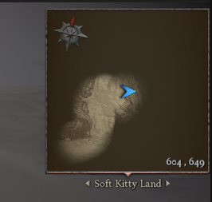
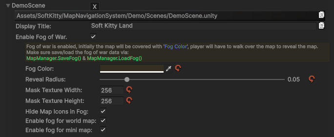

---
The **`Fog of War`** system allows you to dynamically reveal or hide areas of your map, commonly used in RPG, RTS, and exploration-based games.

It is fully integrated with the Map Navigation system and optimized for performance using GPU rendering.



---

### Requirements

The Fog of War system only works in [Static Map mode].

`Static Map` = pre-rendered map texture generated via the [Map Generator] tool.

If you are using [Dynamic Map Mode] for realtime map rendering, `Fog of War` will not function.

---

### Setup

In the [Scene | Map] settings (see screenshot), you can configure:



**Fog Color**
Controls the visual appearance of the fog. The alpha channel determines the transparency:
- `Alpha` = 1 → fully opaque (completely hidden)
- `Alpha` = 0 → fully transparent (invisible fog)

---

### Basic Usage

Fog of War works by masking parts of the map texture.

- Areas covered by fog → **hidden**
- Areas revealed → **visible**

You can control this either:

- automatically (via `MMN` logic)
- manually (via API)

---

### API Reference

Fog of War can be fully controlled via [MapManager].

#### Save / Load

```csharp
public static string SaveFog()
```

Convert the current `Fog of War` state into a JSON string.

```csharp
public static void LoadFog(string _json)
```

Restore Fog of War from a previously saved JSON string.

_Example:_

```csharp
string data = MapManager.SaveFog();
MapManager.LoadFog(data);
```

---

#### Modify Fog

```csharp
public static void AddFog(Vector3 _worldPos, float _radius)
```

Add fog at a world position.

- `_worldPos` → world space position
- `_radius` → normalized (0 ~ 1), relative to map size

```csharp
public static void RemoveFog(Vector3 _worldPos, float _radius)
```

Reveal an area (remove fog).

- `_worldPos` → world space position
- `_radius` → normalized (0 ~ 1), relative to map size

_Example:_

```csharp
// Reveal area around player
MapManager.RemoveFog(player.transform.position, 0.05f);
```

---

#### Global Control

```csharp
public static void ClearFog()
```

Reveal the entire map.

```csharp
public static void FillFog()
```

Cover the entire map with fog.


_Example:_

```csharp
// Reveal the entire map
MapManager.ClearFog();
```

---

### Performance Notes

- `Fog of War` is implemented using GPU rendering (`RenderTexture`)
- Avoid frequent full updates (_e.g._ calling `FillFog()` every frame)
- Incremental updates (`AddFog`/`RemoveFog`) are very cheap

---

[Map Generator]:/docs/master-map-navigation/map-generator
[Map Point]:/docs/master-map-navigation/map-point
[Navigation Path]:/docs/master-map-navigation/navigation
[Sub-Map]:/docs/master-map-navigation/sub-map
[Fog of War]:/docs/master-map-navigation/fog-of-war
[Callbacks]:/docs/master-map-navigation/callbacks
[callbacks]:/docs/master-map-navigation/callbacks
[Static Map Mode]:/docs/master-map-navigation/getting-started/static-mode
[Dynamic Map Mode]:/docs/master-map-navigation/getting-started/dynamic-mode
[MapPoint]:/docs/master-map-navigation/api/map-point
[MapManager]:/docs/master-map-navigation/api/map-manager
[MapInteractive]:/docs/master-map-navigation/api/map-interactive
[ControllerMapping]:/docs/master-map-navigation/api/controller-support
[Scene | Map]:/docs/master-map-navigation/settings/scene-map
[General Settings]:/docs/master-map-navigation/settings/general-settings
[WorldMap Settings]:/docs/master-map-navigation/settings/world-map
[MiniMap Settings]:/docs/master-map-navigation/settings/mini-map