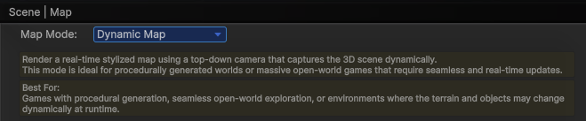

---

This mode is for **procedurally generated worlds** or **seamless, massive open-world** environments using **real-time render texture**. For scene-based games with pre-designed levels using pre-generated map textures, please jump to the [Static Map Mode] section.

---

Before diving in, here are a few key things you need to know:

- `Demo Scene Path`: Assets/SoftKitty/MapNavigationSystem/Demo/Scenes/DemoScene.unity
- `Package Settings`: Edit > Project Settings > SoftKitty > Map Navigation
- `UI Prefabs`: Assets/SoftKitty/MapNavigationSystem/Prefabs/Interface/
- `Map Creator Prefab`: Assets/SoftKitty/MapNavigationSystem/Prefabs/MapGenerator.prefab

---

#### 1. Switch to Dynamic Map mode

   - Go to MNS (Master Navigation System) settings panel: `Edit > Project Settings > SoftKitty > Map Navigation`.
   - Expand the [Scene | Map] section.
   - Select `Dynamic Map` mode.

     

---
 
#### 2. Select `RT LayerMask`(Render Texture LayerMask)

Choose the `layers` to be rendered into the map's `render texture`. Ensure that layers containing **characters** or **dynamically moving objects** are **excluded**.

---

#### 3.	Set `Render Area Size`

This determines how large the area around the player will be captured by the **top-down** `render texture` camera. 
- Larger sizes allow the player to **scroll further** on the `world map` when `Unlimited WorldMap` is unchecked. 
- A larger size also **reduces** the **frequency of minimap updates** but may have a **higher performance cost**.

  

---

#### 4.	Set `RT Size` (Render Texture Size)

The `render texture size` depends on the `Render Area Size`. For **optimal** clarity, use a **larger texture size** with a **larger render area size** (ideally _3 pixels per meter_ or higher). 


However, larger textures may cause noticeable **performance spikes** when the `minimap` updates. (The `minimap` only updates when the player moves out of the previously rendered area.)

---

#### 5.	`Unlimited WorldMap`

If your game is **massive open world**, and you want the player be able to **scroll to anywhere** instead of limited with the areas around, you can **enable this feature**. 

When enabled, players can scroll the map to **any position in the 3D world**. Ensure that in your script, your **3D scene** within [MapInteractive].`WorldMapInstance.ViewRect` is always **loaded** to match the visible map area.

---

#### 6.	Setup the `RT Camera Height` and `RT Camera Depth`

The `render texture` camera **height** must be **above the tallest objects in your scene** to avoid clipping. 
Its **depth** should **cover the lowest point in your scene** from the camera's height.

_For example_
If the highest object in your game is at 200 on the Y-axis, and the lowest point is at -50, set the `RT Camera Height` to 201 and the `RT Camera Depth` to 251.

**Avoid using unnecessarily large values**, as they may cause issues with the stylized rendering and reduce performance efficiency.

---

#### 7.	Choose `Stylized Rendering`

To enable `stylized rendering` for the `render texture`:

 - Check the "Stylized Rendering" checkbox.
 - In the "RT Material" field, select a material from:
  `Assets/SoftKitty/MapNavigationSystem/Materials/CustomRenderTexture/`.
When using these materials, ensure the `Depth Only` option (_located below the `RT Material` setting_) is also checked.


If you'd like to create your own custom `render texture` **shader**:

 - Use **Shader Graph** to create a custom shader.
 - Create a new material and assign your custom shader to it.
 - Assign the
  `Assets/SoftKitty/MapNavigationSystem/Textures/System/DynamicMapSourceRT`
  to the `InputTex` slot of the material.
 - Finally, assign your new material to the `RT Material` field.

This allows for full customization of the map's visual style.

---

#### 8.	Adding the Map UI Prefabs

Drag the following UI **prefabs** from:
`Assets/SoftKitty/MapNavigationSystem/Prefabs/Interface/`
Place them on your UI Canvas:


The `WorldMap` prefab should remain **disabled** unless you want it to be active by default when the game starts.

---

#### 9.	Adding Map Points

 - Attach the [MapPoint] component to NPCs, Monsters, or Locations in your scene:
  For Locations, it’s best to attach the [MapPoint] component to an **empty** GameObject. 
  This allows you to adjust its position without affecting the actual model.
 - Configure the [MapPoint] options as needed, pay attention to the `Visible Distance` setting:
  This controls how close the player must be for the icon to appear on the `Navigation Bar`
  interface. It does not affect the map display itself.

    

---

#### 10. Baking Navigation Path (Optional)

If you’re using the [Navigation Path] module, bake the `Unity NavMesh` for your scene:
- For **older Unity versions**:
Access the baking panel from `Window > AI > Navigation`, then use the Bake panel.
   
  
   Then use `Bake` panel to do the baking.
  
   

- For **newer Unity versions**:
Use the `NavMesh Surface` and `NavMesh Modifier` components.
Refer to Unity’s **documentation** for details:
https://docs.unity3d.com/Packages/com.unity.ai.navigation@2.0/manual/CreateNavMesh.html

---

#### 11.	Setting the Player and Camera

1)	The system needs to identify the **player transform**:
Add the following code in your player control script:

```csharp
private void Awake()
{
     MapManeger.SetPlayer(Player);
}
```

2)	Ensure your main camera has the tag **MainCamera**, or set it via code:

```csharp
private void Awake()
{
     MapManeger.SetCamera(MyCamera);
}
```
 
3)	Reference the `WorldMap` GameObject in your script, and bind a key or UI button to open it: 

```csharp
public GameObject WorldMap;
void Update()
{
    if (Input.GetKeyDown(KeyCode.Tab))WorldMap.SetActive(!WorldMap.activeSelf);
}
```

---

#### Final Steps

Run your game and test the full functionality:
- Ensure the map loads correctly.
- Confirm [Map Point], [Navigation Path], and UI interactions work as expected.


---


[Map Generator]:/docs/master-map-navigation/map-generator
[Map Point]:/docs/master-map-navigation/map-point
[Navigation Path]:/docs/master-map-navigation/navigation
[Sub-Map]:/docs/master-map-navigation/sub-map
[Fog of War]:/docs/master-map-navigation/fog-of-war
[Callbacks]:/docs/master-map-navigation/callbacks
[callbacks]:/docs/master-map-navigation/callbacks
[Static Map Mode]:/docs/master-map-navigation/getting-started/static-mode
[Dynamic Map Mode]:/docs/master-map-navigation/getting-started/dynamic-mode
[MapPoint]:/docs/master-map-navigation/api/map-point
[MapManeger]:/docs/master-map-navigation/api/map-manager
[MapInteractive]:/docs/master-map-navigation/api/map-interactive
[ControllerMapping]:/docs/master-map-navigation/api/controller-support
[Scene | Map]:/docs/master-map-navigation/settings/scene-map
[General Settings]:/docs/master-map-navigation/settings/general-settings
[WorldMap Settings]:/docs/master-map-navigation/settings/world-map
[MiniMap Settings]:/docs/master-map-navigation/settings/mini-map