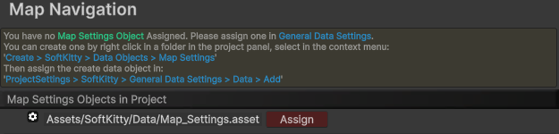

---

### HDRP render pipeline

- Import the package.

### URP render pipeline

- Import the package.
- Copy `Assets/SoftKitty/MapNavigationSystem/URP/URP.unitypackage` to some where outside your project.
- Remove everything in `MapNavigationSystem` folder from your **URP project** because they're for **HDRP** only
- Import the `URP.unitypackage` you just copied. (Read the below sections if you have other SoftKitty packages in project)

### With other SoftKitty packages in project:

- Import the package, uncheck `Assets/SoftKitty/Data/SGD_Settings.asset` when importing.
- Goto `Project Settings > SoftKitty > Map Navigation` , click on the `Assign` button.

  

---

### Demo:
- The demo scene can be found at : `Assets/SoftKitty/MapNavigationSystem/Demo/Scenes/DemoScene.unity`

---
