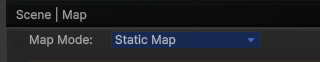
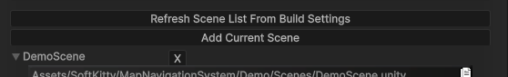
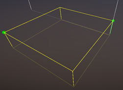
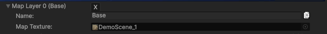
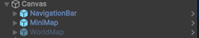
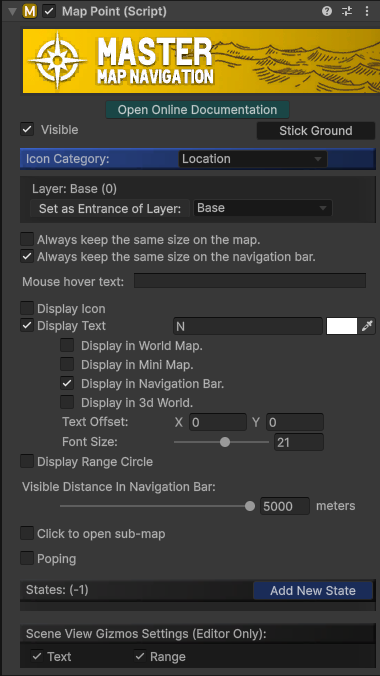

---
This section is for **scene-based games** with **pre-designed levels** using **pre-generated map textures**. For procedurally generated worlds or seamless, massive open-world environments using real-time render texture, please jump to the [Dynamic Map Mode] section.

---

Before diving in, here are a few key things you need to know:

- `Demo Scene Path`: Assets/SoftKitty/MapNavigationSystem/Demo/Scenes/DemoScene.unity
- `Package Settings`: Edit > Project Settings > SoftKitty > Map Navigation
- `UI Prefabs`: Assets/SoftKitty/MapNavigationSystem/Prefabs/Interface/
- `Map Creator Prefab`: Assets/SoftKitty/MapNavigationSystem/Prefabs/MapGenerator.prefab

---

#### 1.	Adding Your Scene to the Map System

- Open one of your game scenes.
- Go to MNS (Master Navigation System) settings panel: `Project Settings > SoftKitty > Map Navigation`.
- Expand the [Scene | Map] section.
- Select `Static Map` mode.
  
   
   
- Click `Add Current Scene` to add the current scene to the map system. 
Alternatively, you can click `Refresh Scene List From Build Settings` to add all scenes from your `Build Settings` at once.
  
   

---

#### 2.	Configuring the Map Layers

- Expand the settings for the added scene.
- (_Optional_) Click `Add New Map Layer`. This is only needed for **multi-level scenes**, such as buildings with multiple floors. For flat scenes, only one layer is needed.
- Expand the Base Layer settings:
  - **Name**: A label for your layer (_for reference only_).
  - **Map Texture**: The map background texture (_created in Step 3_).
  - **Layer Height**: For **multi-level** or interior scenes, this defines the **ceiling height** of the layer. Ensure it matches your roof height for accurate rendering.

---

#### 3.	Generating the Map Texture
Click `Open [Map Generator] Tool` at the top of the settings panel to add the [Map Generator] prefab to your scene.

---

#### 4.	Adjusting the Map Area with the Map Generator
1)	In the `Scene View`, you’ll see a **giant yellow box** representing the map area.
2)	Expand the [Map Generator] GameObject in the hierarchy, and you’ll find two child GameObjects: **TopRight** , **BottomLeft**.
Move these two points to adjust the width and length of the map area.
3)	In the inspector of the [Map Generator] GameObject: Adjust the `Height Range` value to ensure the box correctly covers the area intended for the map. Keep in mind: **The map must be square**. If your scene is narrow, align the box to the **longest side**, **leaving blank areas as needed**.

    
 
---

#### 5.	Configuring Map Generator Settings

1)	In the inspector of the [Map Generator] GameObject, you’ll find all the render settings. Most settings can remain as default, but make sure set the `Layer Mask` to include all objects you want to render on the map.
2)	Under `Map Generator`, you’ll see a GameObject called **Ocean**: If you want blank areas to appear as water, adjust the `Ocean` GameObject’s height to the **water level**; If not, simply disable the `Ocean` GameObject.
3)	To reduce render time while **testing settings**: Set `Output Size` to **1024**, click `Bake` and wait approximately a minute for rendering to finish.
4)	Once satisfied with the result: Set the **final** `Output Size` to **4096** (_recommended_), `Bake` again — this may take longer, so grab a cup of coffee while it finishes.

---

#### 6.	Assigning the Map Texture

1)	After baking, your map texture will appear in:
`Assets/SoftKitty/MapNavigationSystem/MapTextures/`
2)	The texture will **automatically** be assigned to the **current layer settings**.
   
    

3)	Go to the "Project Settings > SoftKitty > Data Settings" section and confirm that the `Ground Layer Mask` includes the correct layers used for ground and buildings in your project. 
    
    
 
--- 

#### 7.	Adding the Map UI Prefabs

Drag the following **UI prefabs** from:
`Assets/SoftKitty/MapNavigationSystem/Prefabs/Interface/`
Place them on your UI Canvas:



The **WorldMap** prefab should remain **disabled** unless you want it to be active by default when the game starts.

---

#### 8.	Adding Map Points

1)	Attach the [MapPoint] component to NPCs, Monsters, or Locations in your scene:
For Locations, it’s best to attach the [MapPoint] component to an empty GameObject. This allows you to adjust its position without affecting the actual model.
2)	Configure the [MapPoint] options as needed, pay attention to the `Visible Distance` setting:
This controls how close the player must be for the icon to appear on the Navigation Bar interface. It does not affect the map display itself.

     

---

#### 9.	Baking Navigation Path (Optional)
If you’re using the [Navigation Path] module, bake the `Unity NavMesh` for your scene:
- For **older Unity versions**:
Access the baking panel from `Window > AI > Navigation`, then use the Bake panel.
    

    Then use `Bake` panel to do the baking.

    

- For **newer Unity versions**:
Use the `NavMesh Surface` and `NavMesh Modifier` components.
Refer to Unity’s **documentation** for details:
https://docs.unity3d.com/Packages/com.unity.ai.navigation@2.0/manual/CreateNavMesh.html


---

#### 10. Setting the Player and Camera

1)	The system needs to identify the **player transform**:
Add the following code in your player control script:

```csharp
private void Awake()
{
     MapManeger.SetPlayer(Player);
}
```

2)	Ensure your main camera has the tag **MainCamera**, or set it via code:

```csharp
private void Awake()
{
     MapManeger.SetCamera(MyCamera);
}
```
 
3)	Reference the `WorldMap` GameObject in your script, and bind a key or UI button to open it: 

```csharp
public GameObject WorldMap;
void Update()
{
    if (Input.GetKeyDown(KeyCode.Tab))WorldMap.SetActive(!WorldMap.activeSelf);
}
```

---

#### Final Steps

Run your game and test the full functionality:

- Ensure the map loads correctly.
- Confirm [Map Point], [Navigation Path], and UI interactions work as expected.

---


[Map Generator]:/docs/master-map-navigation/map-generator
[Map Point]:/docs/master-map-navigation/map-point
[Navigation Path]:/docs/master-map-navigation/navigation
[Sub-Map]:/docs/master-map-navigation/sub-map
[Fog of War]:/docs/master-map-navigation/fog-of-war
[Callbacks]:/docs/master-map-navigation/callbacks
[callbacks]:/docs/master-map-navigation/callbacks
[Static Map Mode]:/docs/master-map-navigation/getting-started/static-mode
[Dynamic Map Mode]:/docs/master-map-navigation/getting-started/dynamic-mode
[MapPoint]:/docs/master-map-navigation/api/map-point
[MapManeger]:/docs/master-map-navigation/api/map-manager
[MapInteractive]:/docs/master-map-navigation/api/map-interactive
[ControllerMapping]:/docs/master-map-navigation/api/controller-support
[Scene | Map]:/docs/master-map-navigation/settings/scene-map
[General Settings]:/docs/master-map-navigation/settings/general-settings
[WorldMap Settings]:/docs/master-map-navigation/settings/world-map
[MiniMap Settings]:/docs/master-map-navigation/settings/mini-map