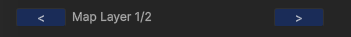
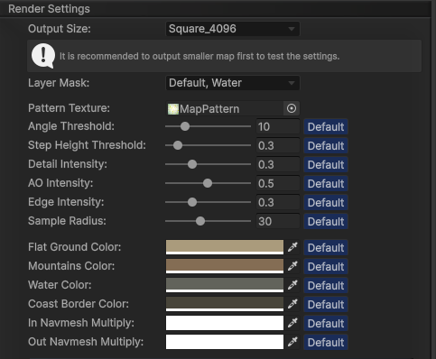
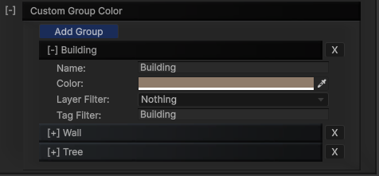
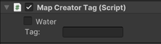
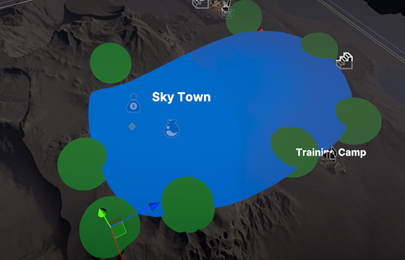

---

The `Map Generator` is a powerful tool that converts your 3D scene into a stylized 2D map texture. Below are the key points you need to know to use it effectively:

- **Layer Mask**: Only GameObjects and Terrain within the Layer Mask set in the `Map Generator` will be rendered.
- **Colliders**: Only GameObjects and Terrain with colliders will be rendered.
- **Render Area**: Only objects inside the yellow box defined by the `Map Generator` will be rendered. The yellow box (render area) is controlled by: 
  - Bottom Left and Top Right transforms. 
  - Height Range settings.

For **multi-layer scenes** (e.g., multi-story buildings), you should have multiple **`Map Generator`** prefabs in the scene, each corresponding to a specific layer. 

 
Use the `Layer Setting` to define the layer of each `Map Generator` instance and adjust its height range accordingly.

---

#### Render Settings

The `Map Generator` offers various stylization options to customize the appearance of your map. These options are self-explanatory by their name:

 
---

#### Custom Group Color:
- **Setup Custom Groups:**
You can create multiple `Custom Groups` to filter GameObjects and apply unique colors to them during rendering.

   
 
- **Filtering with Tags:**
If you prefer not to change the layer or tag of your GameObjects, you can use the **`MapCreatorTag`** component.

   
  
   Add the **`MapCreatorTag`** component to the GameObject and set the desired **Tag** string. The `Map Generator` will recognize this tag and apply the appropriate color based on the Custom Group settings.
   _Tip_: If you want a GameObject to be treated as **water**, check the `“Water”` checkbox in the `MapCreatorTag` component.

- **Ocean**

  The `Ocean` GameObject represents the ocean surface for your map. Adjust its size and water level by scaling and moving the transform.

- **Lake**

  The `Lake` GameObject can be adjusted to create water bodies like lakes or ponds.
  - Customize the lake's shape by moving the **green nodes** around it.
  - Duplicate the `Lake` GameObject to add multiple lake areas on your map.
   
 
---

[Map Generator]:/docs/master-map-navigation/map-generator
[Map Point]:/docs/master-map-navigation/map-point
[Navigation Path]:/docs/master-map-navigation/navigation
[Sub-Map]:/docs/master-map-navigation/sub-map
[Fog of War]:/docs/master-map-navigation/fog-of-war
[Callbacks]:/docs/master-map-navigation/callbacks
[callbacks]:/docs/master-map-navigation/callbacks
[Static Map Mode]:/docs/master-map-navigation/getting-started/static-mode
[Dynamic Map Mode]:/docs/master-map-navigation/getting-started/dynamic-mode
[MapPoint]:/docs/master-map-navigation/api/map-point
[MapManeger]:/docs/master-map-navigation/api/map-manager
[MapInteractive]:/docs/master-map-navigation/api/map-interactive
[ControllerMapping]:/docs/master-map-navigation/api/controller-support
[Scene | Map]:/docs/master-map-navigation/settings/scene-map
[General Settings]:/docs/master-map-navigation/settings/general-settings
[WorldMap Settings]:/docs/master-map-navigation/settings/world-map
[MiniMap Settings]:/docs/master-map-navigation/settings/mini-map