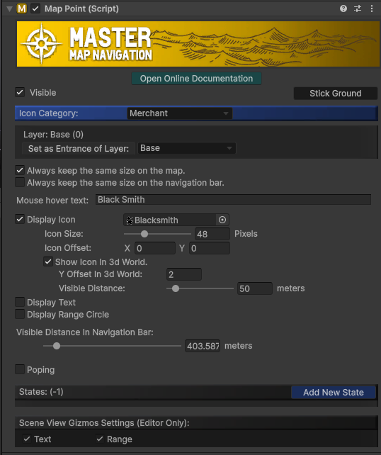
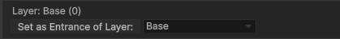
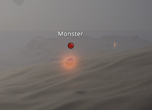

---
[MapPoint].cs is a versatile component that integrates a GameObject into the map system and manages its behavior. Any GameObject with a [MapPoint] component will appear on the `Mini Map`, `World Map`, and `Navigation Bar` based on its position in the game scene.

`Map points` can be placed manually in the scene or dynamically instantiated at runtime using prefabs. To enable or disable a `map point`'s **visibility** on the `map` and `navigation bar`, use: 

```csharp
<MapPoint>().SetVisible(bool _visible);
```



---

#### Stick Ground

Click this `button` to **snap** the GameObject to the ground level.
Useful when placing land markers to align with the terrain without manually adjusting the height.

---

#### Icon Category

Assign the `map point` to a category set up in the [General Settings].
Players can toggle the visibility of different categories in the `World Map` interface.

---

#### Layer

Determines which `map layer` this point belongs to based on its **Y-axis** position.

_Example_: 
`First floor`: height **0–3**; 
`Second floor`: height **3–6**. 
If a `map point` has a Y position of **3.5**, it will belong to the **second** floor.

---

#### Set as Entrance of Layer

Define **entrance points** for `multi-level` scenes to enable **navigation** across layers.
In buildings with `multiple floors`, the [navigation path] will lead players to the `layer entrance` first before navigating to the destination.

**Setup**:
1)	Create a map point.
2)	Use the `Set as Entrance of Layer` button and select the correct target layer from the `dropdown`.

    

---

#### Always keep the same size on the map

Prevents the map icon from scaling with zoom levels.
This setting **overrides** the general `Lock Icon Scale` option in [WorldMap Settings] and [MiniMap Settings].

---

#### Mouse Hover Text

Displays a **hint text** when the player hovers the cursor over the map icon.
Leave the text field **blank** to disable this feature.

---

#### Display Icon

Controls the visibility and appearance of the map icon.
Customizable Options: `Texture`, `Color`, `Size`, and `Offset`.

_Related Api_:
```csharp
<MapPoint>().ToggleIcon(bool _enable); //Toggle the icon visibility via script
<MapPoint>().SetIcon(Texture2D _icon);// Set the icon texture via script 
<MapPoint>().SetIconColor(Color _color);//Set the icon color via script
<MapPoint>().SetIconSize(int _pixelSize);//Set the icon pixel size via script
```

---

#### Show Icon in 3d World

if this checkbox is checked, an icon of this `map point` will be displayed on top of the 3d object like this:


---

#### Display Text

Controls the visibility and appearance of the `map text`.
Customizable Options: `Content`, `Color`, `Font Size`, and `Offset`. 
Option to display the text on the `Mini Map` or `Navigation Bar`.

_Related Api_:
```csharp
<MapPoint>().Toggletext (bool _enable); //Toggle the text visibility via script
<MapPoint>().SetText(string _text);// Set the text content via script 
<MapPoint>().SetTextColor (Color _color);//Set the text color via script
<MapPoint>().SetTextSize (int _fontSize);//Set the text font size via script
```

---

#### Display Range Circle

Displays a **circular range** around the `map point` with customizable `radius` and `color`.
Useful for marking areas, such as quest regions or item drop zones. 

_Related Api_:
```csharp
<MapPoint>(). ToggleRange (bool _enable); //Toggle the range visibility via script
<MapPoint>(). SetRangeRadius (float _radius); //set the radius of the range via script
```

---

#### States

Displays **state** icons (_e.g._, quest status or attention marks) on the top-right corner of the map icon.

_Related Api_:
```csharp
<MapPoint>().State = x ; //When set state as -1 will hide the state icon.
```

---

#### Popping

Makes the icon **pop** on the map to attract the player’s attention.

_Related Api_:

```csharp
<MapPoint>().SetPoping(bool _enable);
```

---

[Map Generator]:/docs/master-map-navigation/map-generator
[Map Point]:/docs/master-map-navigation/map-point
[Navigation Path]:/docs/master-map-navigation/navigation
[Sub-Map]:/docs/master-map-navigation/sub-map
[Fog of War]:/docs/master-map-navigation/fog-of-war
[Callbacks]:/docs/master-map-navigation/callbacks
[callbacks]:/docs/master-map-navigation/callbacks
[Static Map Mode]:/docs/master-map-navigation/getting-started/static-mode
[Dynamic Map Mode]:/docs/master-map-navigation/getting-started/dynamic-mode
[MapPoint]:/docs/master-map-navigation/api/map-point
[MapManeger]:/docs/master-map-navigation/api/map-manager
[MapInteractive]:/docs/master-map-navigation/api/map-interactive
[ControllerMapping]:/docs/master-map-navigation/api/controller-support
[Scene | Map]:/docs/master-map-navigation/settings/scene-map
[General Settings]:/docs/master-map-navigation/settings/general-settings
[WorldMap Settings]:/docs/master-map-navigation/settings/world-map
[MiniMap Settings]:/docs/master-map-navigation/settings/mini-map