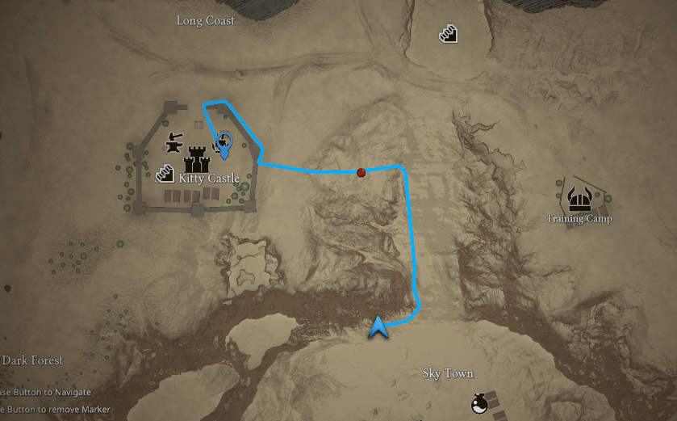
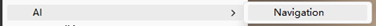
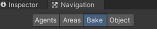

---
The `Navigation Path` module allows players to click on the map and automatically generate a path to the selected destination.

The path is calculated using Unity’s NavMesh system and is displayed on both:

- World Map
- Mini Map

The path dynamically updates as the player moves, guiding them until the destination is reached.



---

### Features

- Click-to-navigate on map
- Real-time path updating
- Works on both World Map and Mini Map
- Fully integrated with Unity NavMesh
- Simple API for manual control

---

### Setup

#### 1. Enable Navigation Path

Go to:
`Project Settings > SoftKitty > Map Navigation > World Map Settings`
Enable: `Enable Navigation Path`

---

#### 2. Configure Input

Set which mouse button starts navigation: `Start Navigation Button`

_Example:_
- `Left Click` → common for RTS-style games
- `Right Click` → common for RPG/MMO

---

#### 3. Setup NavMesh (Required)

The Navigation Path system relies on Unity’s NavMesh to calculate paths.

Bake the `Unity NavMesh` for your scene:
- For **older Unity versions**:
Access the baking panel from `Window > AI > Navigation`, then use the Bake panel.
    

    Then use `Bake` panel to do the baking.

    

- For **newer Unity versions**:
Use the `NavMesh Surface` and `NavMesh Modifier` components.
Refer to Unity’s **documentation** for details:
https://docs.unity3d.com/Packages/com.unity.ai.navigation@2.0/manual/CreateNavMesh.html

---

### Customize Path Appearance

The navigation line uses a material: 
`Assets/SoftKitty/MapNavigationSystem/Materials/Map/NavigationLine.mat`
The navigation visual prefab:
`Assets/SoftKitty/MapNavigationSystem/Resources/MapNavigationSystem/NavigationPath.prefab`

You can customize:
- Tint Color → change path color
- Texture → create different visual styles (dashed, glowing, etc.)
- Prefab  → change the icon of the destination.

---

### How It Works

- Player clicks on the map
- System converts click position → world position
- NavMesh calculates the path
- Path is rendered on the map
- Path updates as the player moves
- Navigation stops when destination is reached

---

### API Reference

Navigation can be controlled programmatically via [MapManager].

#### Start Navigation

```csharp
public static void NavigateToHere(Vector3 _worldPos)
```

Creates a navigation path from the player’s current position to a target world position.

- _worldPos → destination in world space

_Example:_

```csharp
MapManager.NavigateToHere(targetPosition);
```

#### Stop Navigation

```csharp
public static void StopNavigation()
```

Stops navigation and clears the current path.

_Example:_

```csharp
MapManager.StopNavigation();
```

---

### Performance Notes

- Path calculation uses Unity NavMesh (very efficient)
- Path updates are lightweight and suitable for real-time usage
- Avoid triggering navigation repeatedly every frame

---

[Map Generator]:/docs/master-map-navigation/map-generator
[Map Point]:/docs/master-map-navigation/map-point
[Navigation Path]:/docs/master-map-navigation/navigation
[Sub-Map]:/docs/master-map-navigation/sub-map
[Fog of War]:/docs/master-map-navigation/fog-of-war
[Callbacks]:/docs/master-map-navigation/callbacks
[callbacks]:/docs/master-map-navigation/callbacks
[Static Map Mode]:/docs/master-map-navigation/getting-started/static-mode
[Dynamic Map Mode]:/docs/master-map-navigation/getting-started/dynamic-mode
[MapPoint]:/docs/master-map-navigation/api/map-point
[MapManeger]:/docs/master-map-navigation/api/map-manager
[MapInteractive]:/docs/master-map-navigation/api/map-interactive
[ControllerMapping]:/docs/master-map-navigation/api/controller-support
[Scene | Map]:/docs/master-map-navigation/settings/scene-map
[General Settings]:/docs/master-map-navigation/settings/general-settings
[WorldMap Settings]:/docs/master-map-navigation/settings/world-map
[MiniMap Settings]:/docs/master-map-navigation/settings/mini-map