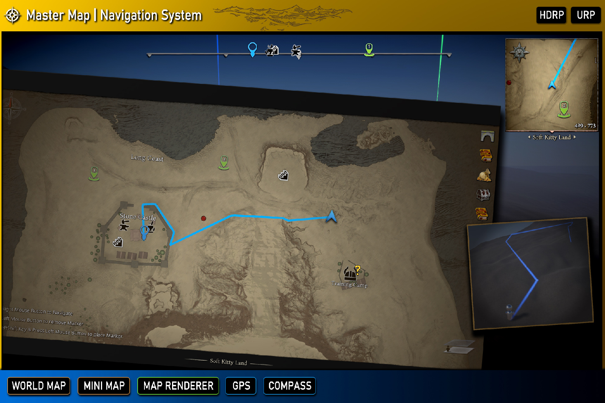

## Master Map|Navigation System

Master Map Navigation System is a comprehensive and performance-optimized solution for integrating dynamic maps, mini-maps, and map navigation systems into your Unity project. Designed to support complex environments like multi-level buildings, interiors, and perfect for RPG games, this package is easy to set up and flexible for developers.

This package is ideal for both scene-based games with pre-designed levels and dynamic worlds. For pre-designed levels up to 4000x4000 meters per scene, use the Static Map Mode to render stylized 2D maps. For procedurally generated worlds or seamless, massive open-world environments, switch to the Dynamic Map Mode with real-time render textures and customizable stylized shaders.

---

The Master Map Navigation System provides the following modules for your game: 

- **[Map Generator]**:  A powerful and easy-to-use tool that renders your 3D game scene into a stylized map texture. The map generator supports multi-level environments, such as tall buildings, and accommodates interiors with roofs seamlessly. 

- **Mini Map**:  To ensure the best performance, the Mini Map module avoids using render textures like most other packages. Instead, it converts 3D coordinates into a local 2D space to display units in the 3D world. 

  - The map uses the texture generated by the Map Generator as its background. 
  - Any object with the MapPoint component will appear as a customizable icon on the map. 
  - The [MapPoint] component also allows you to set the icon, display name, and sub-states (e.g., quest progress). 

- **World Map**:  Similar to the Mini Map but with more interactive features: 

  - Move and pan the map freely. 
  - Toggle the visibility of map icons based on their categories. 
  - Place markers to highlight specific locations or points of interest. 

- **[Navigation Path]**: When a player right-clicks (configurable in settings) on the map, the system generates a navigation path: 

  - A dynamic path line appears between the player and the target position or map icon. 
  - The path is visible on both the map and in the 3D world, dynamically updating as the player or target moves. 

- **Navigation Bar**: A horizontal bar at the top of the screen that helps players quickly find the direction of map icons: 

  - Nearby map icons and player markers are displayed on the navigation bar. 
  - When the player faces the direction of a map icon, it will appear centered on the navigation bar, providing intuitive directional guidance.

---

[Map Generator]:/docs/master-map-navigation/map-generator
[Map Point]:/docs/master-map-navigation/map-point
[Navigation Path]:/docs/master-map-navigation/navigation
[Sub-Map]:/docs/master-map-navigation/sub-map
[Fog of War]:/docs/master-map-navigation/fog-of-war
[Callbacks]:/docs/master-map-navigation/callbacks
[callbacks]:/docs/master-map-navigation/callbacks
[Static Map Mode]:/docs/master-map-navigation/getting-started/static-mode
[Dynamic Map Mode]:/docs/master-map-navigation/getting-started/dynamic-mode
[MapPoint]:/docs/master-map-navigation/api/map-point
[MapManeger]:/docs/master-map-navigation/api/map-manager
[MapInteractive]:/docs/master-map-navigation/api/map-interactive
[ControllerMapping]:/docs/master-map-navigation/api/controller-support