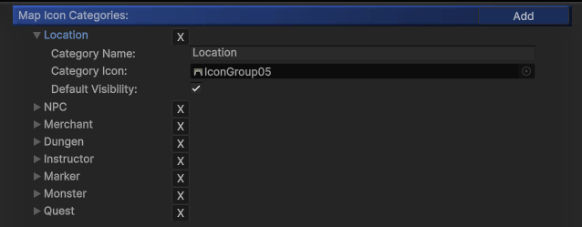
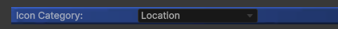
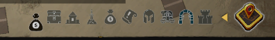
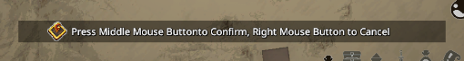
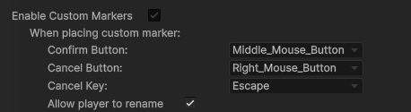
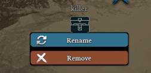

---

#### `Map Icon Categories`: 
Add or remove categories for [Map Point]s here.



In the [MapPoint] inspector, you can assign each point to a specific category.


 
---

#### `Player’s Icon`:
Set the texture for the player’s map icon. Ensure the texture is **transparent** and has **MipMaps disabled**.

---

#### Custom Markers

`Custom Marker` system is for players to be able to place different map icons on the map to mark the location they’re interested. Enable this feature will allow you to setup a list of custom markers for player to select from.

On the bottom right of the `WorldMap` UI, there is a yellow button to toggle the `custom marker` list:



After player select one of the icon in the list, a hint message will show up to indicate which buttons to press for **confirm** or **cancel**: 



The buttons can be modified below the `Enable Custom Markers` settings:


 
Players will also be able to rename the `markers` they placed by clicking the `marker`:


 
This feature can be enabled by toggle `Allow player to rename`.
 
To **save/load** `custom markers` players placed, please use the following API:
- Save: `string _json = MapManeger.ExportCustomMarkerJsonData();`
- Load: `MapManeger.ImportCustomMarkerJsonData(string _json)`


_Example Code_:

```csharp
void LoadCustomMarker()
{
    if (File.Exists("E:/MarkerText.txt")){
       string _json = File.ReadAllText("E:/MarkerText.txt", System.Text.Encoding.UTF8);
       MapManeger.ImportCustomMarkerJsonData(_json);
    }
}

void SaveCustomMarker(){
    string _json = MapManeger.ExportCustomMarkerJsonData();
    File.WriteAllText("E:/MarkerText.txt", _json, System.Text.Encoding.UTF8);
}
```

---

[Map Generator]:/docs/master-map-navigation/map-generator
[Map Point]:/docs/master-map-navigation/map-point
[Navigation Path]:/docs/master-map-navigation/navigation
[Sub-Map]:/docs/master-map-navigation/sub-map
[Fog of War]:/docs/master-map-navigation/fog-of-war
[Callbacks]:/docs/master-map-navigation/callbacks
[callbacks]:/docs/master-map-navigation/callbacks
[Static Map Mode]:/docs/master-map-navigation/getting-started/static-mode
[Dynamic Map Mode]:/docs/master-map-navigation/getting-started/dynamic-mode
[MapPoint]:/docs/master-map-navigation/api/map-point
[MapManeger]:/docs/master-map-navigation/api/map-manager
[MapInteractive]:/docs/master-map-navigation/api/map-interactive
[ControllerMapping]:/docs/master-map-navigation/api/controller-support
[Scene | Map]:/docs/master-map-navigation/settings/scene-map
[General Settings]:/docs/master-map-navigation/settings/general-settings
[WorldMap Settings]:/docs/master-map-navigation/settings/world-map
[MiniMap Settings]:/docs/master-map-navigation/settings/mini-map