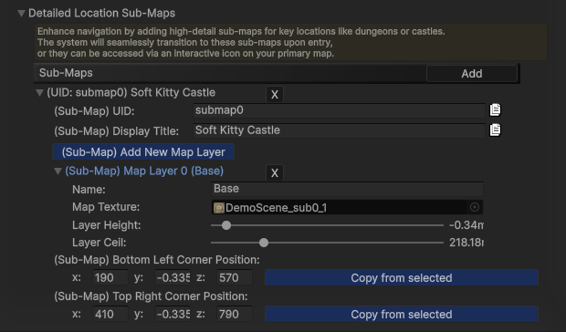
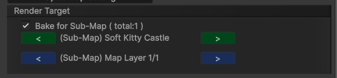
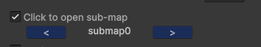

---
Sub-Maps: Detailed Location Views
---

**For [Static Map Mode] Only**

Beyond providing a main map texture for each scene height/layer, the [Static Map Mode] System offers `Sub-Maps` to display highly detailed textures for specific locations within your scene. This allows for an enhanced user experience by revealing granular detail in key areas.

---

### How Sub-Maps Work:

`Sub-Maps` are designed to automatically provide a more detailed view of specific points of interest in your game world.

#### Automatic Switching:

- When the player **enters** a defined `Sub-Map Zone` (a rectangular bounding box you configure), the Map Interface will automatically switch from the main scene map to display the detailed **sub-map texture** of that zone.
- Upon **exiting** the `Sub-Map Zone`, the Map Interface seamlessly switches back to the **main scene map texture**.

---

#### Flexible Layering: 

A key advantage of `Sub-Maps` is their independent layering. While your main map might have a single layer (height), a `Sub-Map` for an indoor location like a multi-story castle can have multiple distinct layers (_e.g._, Basement, Ground Floor, First Floor, Rooftop), each with its own detailed texture.

---

#### Map Point Linking (for Preview):

You can link a standard [Map Point] to a specific `Sub-Map` location.
When the player clicks on such a linked [Map Point] on the main map interface, the system will temporarily switch to display the detailed `sub-map` texture of that zone, offering a preview without the player needing to physically enter the zone.

---

### Setup Guide: Configuring Sub-Maps:

Follow these steps to define and configure Sub-Map zones for your scenes:

- Navigate to the [Scene | Map] section within the Map package settings in your Unity Editor.
- Locate and expand the **Detailed Location Sub-Maps** settings.
- Click the `Add New Sub-Map` button. A new `sub-map` entry will appear for the currently selected scene.
- Configure the following properties for your new `Sub-Map`:
  - **(Sub-Map) UID**: Enter a unique identifier for this Sub-Map within the current scene. This ID is used for internal referencing and linking.
  - **(Sub-Map) Display Title**: Provide a descriptive title. This title will be displayed on the Map Interface when the player is inside this Sub-Map Zone.
  - **(Sub-Map) Add New Map Layer**: Click this button to add map layers specific to this Sub-Map. Set up each layer's properties (e.g., texture resolution, scale, and offset) in the same manner as you would for main map layers.
  - **(Sub-Map) Bottom Left Corner Position**: The bottom left (-x,-z) point of the `Sub-Map` zone.
  - **(Sub-Map) Top Right Corner Position**: The top right (+x,+z) point of the `Sub-Map` zone.

    

---

### Baking Sub-Map Textures: 

Once your `Sub-Map` zones and layers are configured, you'll need to bake their detailed textures:

- Open the [Map Generator] tool.
- Locate the `Bake for Sub-Map` checkbox and enable it.
- Use the **left** and **right** arrow buttons adjacent to this checkbox to browse through the existing `Sub-Map` locations you've defined.

  

- Select the specific `Sub-Map` you wish to bake the texture for.
- Proceed to **bake the texture** for the selected `Sub-Map`'s layers, following the same process as introduced for baking main map textures.
- After baking, the generated texture will be **automatically** assigned to the corresponding layers of the selected `Sub-Map` Zone.

---

### Linking Map Points to Sub-Maps for Preview

To enable interactive previewing of `Sub-Maps` directly from the main map:

- Select the [MapPoint] component on the GameObject you wish to link.
- Locate and check the `Click to open sub-map` checkbox within the [MapPoint] settings.
- Use the **left** and **right** arrow buttons (or dropdown selector, if available) to choose the target `Sub-Map` Zone that this [MapPoint] should preview when clicked.

  

---

[Map Generator]:/docs/master-map-navigation/map-generator
[Map Point]:/docs/master-map-navigation/map-point
[Navigation Path]:/docs/master-map-navigation/navigation
[Sub-Map]:/docs/master-map-navigation/sub-map
[Fog of War]:/docs/master-map-navigation/fog-of-war
[Callbacks]:/docs/master-map-navigation/callbacks
[callbacks]:/docs/master-map-navigation/callbacks
[Static Map Mode]:/docs/master-map-navigation/getting-started/static-mode
[Dynamic Map Mode]:/docs/master-map-navigation/getting-started/dynamic-mode
[MapPoint]:/docs/master-map-navigation/api/map-point
[MapManeger]:/docs/master-map-navigation/api/map-manager
[MapInteractive]:/docs/master-map-navigation/api/map-interactive
[ControllerMapping]:/docs/master-map-navigation/api/controller-support
[Scene | Map]:/docs/master-map-navigation/settings/scene-map
[General Settings]:/docs/master-map-navigation/settings/general-settings
[WorldMap Settings]:/docs/master-map-navigation/settings/world-map
[MiniMap Settings]:/docs/master-map-navigation/settings/mini-map